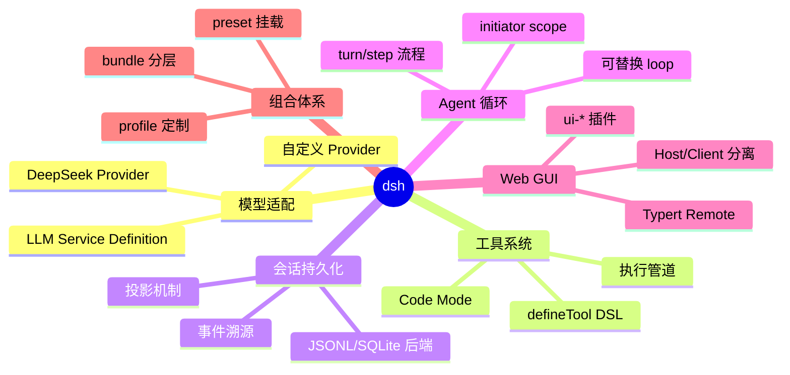
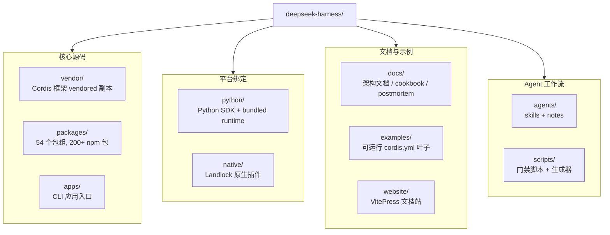

# 00 · 项目总览

> **前置阅读**：无（本系列起点）
> **下一步**：[01 · Cordis 框架基础](/01-cordis-foundation)

## 学习目标

读完本文，你应当能够：

1. 说出 DeepSeek Harness（`dsh`）的定位、核心理念与目标用户
2. 描述仓库的整体目录结构与技术栈选型
3. 列出 54 个包组的层级关系与职责划分
4. 解释"一切皆插件"在源码层面的具体含义
5. 在本地完成环境准备并跑通第一个 `dsh` 命令

---

## 一、项目定位

**DeepSeek Harness**（包名 `@deepseek-ai/dsh-root`，CLI 名 `dsh`）是 DeepSeek AI 开源的**插件化 Agent 框架**。它不是一个开箱即用的 Agent 产品，而是一套用于**构建 Agent Harness 的 SDK**——你可以把它理解成"Agent 的操作系统底座"。

### 核心理念：一切皆插件



从 LLM 适配器、工具注册表、会话日志，到 Agent 循环本身，**所有运行时行为都可以通过配置替换**。这是 `dsh` 与大多数 Agent 框架的根本区别。

### 目标用户

- 想要**深度定制 Agent 行为**的工程师（替换模型、自定义工具、改造循环逻辑）
- 想要**构建自己的 Agent 产品**的团队（基于 `dsh` 组合出特定领域的 Agent）
- 想要**研究 Agent 架构**的开发者（事件溯源、插件化、Host/Client 分离等模式）

---

## 二、技术栈

| 层面 | 选型 | 说明 |
|---|---|---|
| 语言 | TypeScript（ESM only） | `"type": "module"`，全仓无 CJS |
| 运行时 | Node.js `^22.19.0 \|\| >=24.0.0` | 见 `package.json:9` |
| 包管理 | pnpm `11.7.0`（Corepack） | workspace 模式，`linkWorkspacePackages: true` |
| 框架 | Cordis（vendored） | 类 Koishi 的插件框架，rescoped 为 `@deepseek-ai/` |
| 构建 | tsc + tsdown | tsc 产出 `lib/types`，tsdown 打包 runtime |
| 测试 | Vitest 4.x | 单测 + e2e + snapshot 三层 |
| 文档 | VitePress 1.6.4 + Mermaid | 主仓 `website/` 投影 `docs/` |
| Lint | oxlint + ESLint（Stylistic） | 双层 lint |
| 门禁 | knip + publint + jscpd | 死代码 / 包发布 / 重复代码检测 |

### 关键版本约束

```json
// package.json (节选)
{
  "name": "@deepseek-ai/dsh-root",
  "version": "0.1.0-rc.5",
  "private": true,
  "packageManager": "pnpm@11.7.0",
  "engines": { "node": "^22.19.0 || >=24.0.0" }
}
```

> **注意**：当前版本 `0.1.0-rc.5`，处于**技术预览阶段**。AGENTS.md 明确说明："With no external consumers, prefer the correct foundation over compatibility shims"——即**不保证向后兼容**，可以自由重命名、重新打包。

---

## 三、仓库目录结构



### 顶层目录速览

| 目录 | 作用 | 关键文件 |
|---|---|---|
| `vendor/` | Cordis 框架及基础库的 vendored 源码 | `vendor/README.md`（清单 + 同步流程） |
| `packages/` | `@deepseek-ai/dsh-<pkg>` 工作区 | `packages/README.md`（54 组总览） |
| `apps/` | CLI 应用入口（`dsh` bin） | `apps/cli/src/bin.ts` |
| `python/` | Python SDK 和 bundled runtime | `python/README.md` |
| `native/` | `@deepseek-ai/node-addon-landlock-run` | `native/README.md` |
| `examples/` | 可运行的 `cordis.yml` 叶子 | `examples/AGENTS.md` |
| `.agents/` | Agent 工作流和 Agent Notes | `.agents/notes/`、`.agents/skills/` |
| `docs/` | 架构、生成目录、postmortem、cookbook | `docs/architecture.md` |
| `scripts/` | 仓库门禁和生成器 | `scripts/run-gates.ts` |
| `website/` | VitePress 文档投影 | `website/.vitepress/config.ts` |

---

## 四、packages/ 包组层级

`packages/` 下按功能分为 **54 个一级目录**（包组），每个包组下包含若干 npm 包。完整层级见 `packages/README.md`，这里按职能归类：

### 4.1 核心脊柱（`core/`）

产品 API 的核心，**稳定 API**：

| 包 | 职责 |
|---|---|
| `dsh-scope` | 作用域（scope）服务，agent 挂载边界 |
| `dsh-session` | 会话事件溯源、SessionEvent、surface 层 |
| `dsh-system-prompt` | 系统提示装配（sections/contexts/tools/variables） |
| `dsh-tools` | 工具注册表、defineTool DSL、执行管道 |
| `dsh-agent` | Agent 接口、AgentRegistry、initiator scope |
| `dsh-agent-default-model` | 默认模型路由 |
| `dsh-agent-loop` | 具体的 turn/step 循环实现（**可替换**） |

### 4.2 能力接缝（Capability Seams）

按"Service Definition / Provider / Consumer"三角色组织的包组：

| 包组 | 能力 | 典型三角色 |
|---|---|---|
| `llm/` | LLM 调用 | `dsh-llm` / `dsh-llm-deepseek` / (loop 内部消费) |
| `shell/` | Shell 执行 | `dsh-shell` / `dsh-bash-local` / `dsh-tool-bash` |
| `fs/` | 文件系统 | `dsh-fs` / `dsh-fs-local` / `dsh-tool-fs` |
| `subprocess/` | 子进程 | `dsh-subprocess` / `dsh-subprocess-local` / — |
| `web/` | Web 搜索/抓取 | `dsh-web` / (providers) / `dsh-tool-web` |
| `skill/` | 技能注册 | `dsh-skill` / `dsh-skill-local` / `dsh-tool-skill` |
| `code-runtime/` | 代码执行 | `dsh-code-runtime` / `dsh-code-runtime-worker-thread` / (Code Mode) |
| `e2b/` | E2B 沙箱 | `dsh-e2b` / `dsh-subprocess-e2b` / — |

### 4.3 持久化与数据面（`session/`）

| 包 | 职责 |
|---|---|
| `dsh-session-persistence` | 持久化接缝 + coordinator |
| `dsh-session-persistence-jsonl` | JSONL 后端（zstd 压缩） |
| `dsh-session-persistence-sqlite` | SQLite 后端（`node:sqlite`） |
| `dsh-session-projection` | 投影机制（init/apply/view 纯函数） |
| `dsh-session-title` | 日志支持的会话标题 |
| `dsh-session-telemetry` | 遥测后端 |

### 4.4 Web GUI（`host/` + `client/`）

**Host/Client 物理分离**：

| 包组 | 职责 |
|---|---|
| `host/webserver` | HTTP 路由服务 |
| `host/apiproxy` | API 代理（四象限 RPC 消息模型） |
| `client/connection` | 浏览器 wire client |
| `client/ui-slots` | Slot 系统（声明合并扩展点） |
| `client/ui-layout` | 布局根（三列 shell） |
| `client/ui-conversation` | 对话主界面 |
| `client/ui-*`（29 个） | 各业务插件（tool/theme/settings/...） |

### 4.5 组合与启动

| 包组 | 职责 |
|---|---|
| `boot/` | 启动胶水（`app-boot`、`cmdline`） |
| `bundle/` | 可安装的 patch 层（`base`/`headless`/`web-app`） |
| `preset/` | agent preset（`agent-presets`） |
| `examples/` | demo bundles |

### 4.6 其他重要包组

| 包组 | 职责 |
|---|---|
| `typert/` | 类型图生成器 + 加载器 + 运行时注册表 |
| `api/` | Typert RPC 网关 + remotes BFF |
| `sdk/` | JSON-RPC 协议 + TS client + server plugin |
| `acp/` | Agent Client Protocol server（自动化） |
| `interaction/` | 人机协作（approval/commands/ask-user） |
| `hooks/` | Claude Code/Codex hook 桥接 |
| `subagent/` | 子代理能力 |
| `workflow/` | 工作流引擎（worker-thread） |
| `guard/` | 循环卫生守卫 |
| `self-modification/` | Agent 自检/挂载插件 |

---

## 五、"一切皆插件"在源码中的体现

### 5.1 Cordis 框架

`dsh` 基于 [Cordis](https://github.com/cordisjs/cordis)（类 Koishi 的插件框架）构建。Cordis 的核心思想是：

- **插件 = Service 实现**：每个插件是一个 `Service` 子类或函数插件
- **Context = 服务仓库**：所有服务通过 `ctx.<key>` 查找与提供
- **inject 声明依赖**：插件通过 `inject` 数组声明所需服务
- **typed events 通信**：通过 `ctx.on`/`ctx.emit` 类型化事件通信
- **registrations 是可逆 effect**：每个贡献通过 `ctx.effect()` 注册，返回 disposer

详见 `vendor/cordis/src/`，下篇 [01 · Cordis 框架基础](/01-cordis-foundation) 会深入讲解。

### 5.2 真实示例：SessionStore.create

```typescript
// packages/core/session/src/index.ts:836
this.ctx.effect(function* (this: SessionStore) {
  yield this.enter(session)      // 先 yield detach disposer
  this.announce(session)          // 再 announce
}.bind(this), 'sessions.create()')
```

这是一个 **generator effect**：先 yield detach 再 announce，使抛错的 `session/created` listener 回滚 attach 而非泄漏。这种"注册即 effect"的模式贯穿全仓。

### 5.3 真实示例：AgentRegistry

```typescript
// packages/core/agent/src/index.ts:289
ctx.on('internal/status', (fiber) => {
  if (fiber.state === FiberState.UNLOADING && this.hasLifecycleAncestor(fiber)) {
    this.closeInitiators()
  }
})

// :373 — setFactory 用 effect 注册 factory slot
const dispose = this.ctx.effect(() => {
  if (this.factory !== undefined) throw new Error('an agent factory is already registered')
  this.factory = { target }
  return () => { this.factory = undefined }
}, 'agents.setFactory()')
```

Agent 注册表本身也是通过 `ctx.effect` 注册的——**注册表也是插件**。

---

## 六、环境准备

### 6.1 克隆与安装

```sh
# 1. 克隆主仓
git clone https://github.com/deepseek-ai/deepseek-harness.git
cd deepseek-harness

# 2. 启用 Corepack（pnpm 11.7.0）
corepack enable
corepack prepare pnpm@11.7.0 --activate

# 3. 安装依赖
pnpm install
```

### 6.2 验证环境

```sh
# 类型检查（会先构建 host 侧 lib）
pnpm run typecheck

# 运行单元测试
pnpm run test

# 构建
pnpm run build
```

### 6.3 配置 DeepSeek API Key（可选）

真实 API 测试和 demo 需要 `DEEPSEEK_API_KEY`：

```sh
echo "DEEPSEEK_API_KEY=sk-xxxxxxxxxxxxxxxx" > .env
```

> 没有 key 时，e2e 测试会**自动跳过**（见 `docs/testing.md` 的 key policy）。

### 6.4 运行第一个 dsh 命令

```sh
# headless 模式运行一个任务（需要 DEEPSEEK_API_KEY）
pnpm dsh --profile headless "用一句话介绍你自己"

# 查看帮助
pnpm dsh --help

# 启动 Web GUI
pnpm dsh --profile web --host 127.0.0.1 --port 8080
```

---

## 七、关键文档索引

| 文档 | 路径 | 用途 |
|---|---|---|
| 仓库 Agent 指南 | `AGENTS.md` | 仓库布局、命令、约定（**必读**） |
| 架构总览 | `docs/architecture.md` | Cordis、profile/bundle、核心包、扩展点 |
| Cordis 入门 | `docs/cordis-primer.md` | 五大思想与分发模式 |
| 开发指南 | `docs/development.md` | 环境、构建、CI、TypeScript 布局 |
| 测试策略 | `docs/testing.md` | 测试分层、snapshot、CI 门禁 |
| 包组总览 | `packages/README.md` | 54 个包组的层级与职责 |
| 包级规则 | `packages/AGENTS.md` | 包级不变量、命名规则 |
| Cookbook | `docs/cookbook/` | 添加包/工具/LLM 适配器等实战指南 |
| 术语表 | `docs/glossary.md` | 核心术语（capability seam 等） |

---

## 实战练习

1. **浏览仓库结构**：在本地克隆后，运行 `ls packages/` 查看 54 个包组，挑 3 个你感兴趣的包组，阅读它们的 `README.md`。

2. **追踪一个命令**：运行 `pnpm dsh --help`，然后打开 `apps/cli/src/bin.ts` 和 `apps/cli/src/args.ts`，追踪参数解析流程。

3. **理解 vendoring**：打开 `vendor/README.md`，回答：为什么 `dsh` 要 vendor Cordis 而不是直接 `npm install`？（提示：看 `vendor/AGENTS.md` 的约束）

---

## 关键源码定位

| 内容 | 位置 |
|---|---|
| 主仓 manifest | `package.json` |
| workspace 配置 | `pnpm-workspace.yaml` |
| 包组总览 | `packages/README.md` |
| CLI 入口 | `apps/cli/src/bin.ts` |
| Cordis 核心 | `vendor/cordis/src/` |
| 架构文档 | `docs/architecture.md` |

---

## 下一步

本文建立了对 `dsh` 的整体认知。下一篇 [01 · Cordis 框架基础](/01-cordis-foundation) 将深入 Cordis 的五大思想——插件/服务/事件/effect/注入，这是理解所有后续架构的前提。
