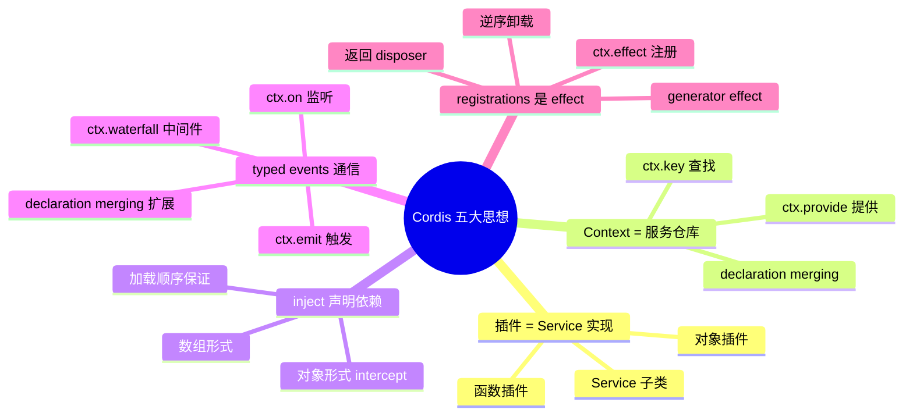
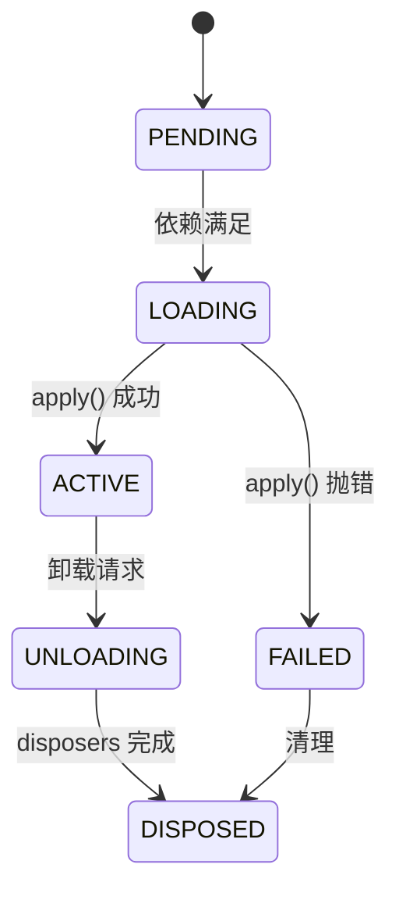

# 01 · Cordis 框架基础

> **前置阅读**：[00 · 项目总览](/00-overview)
> **下一步**：[02 · 仓库布局与构建体系](/02-project-layout)

## 学习目标

1. 理解 Cordis 的五大核心思想：插件、Context、inject、typed events、effect
2. 能区分 Service 子类插件与函数插件，并知道何时用哪种
3. 掌握 `ctx.effect()`、`ctx.on()`、`ctx.plugin()` 的用法与 disposer 语义
4. 理解 Fiber 生命周期状态机（PENDING → LOADING → ACTIVE → ...）
5. 能读懂仓库中任意插件的注册代码

---

## 一、为什么是 Cordis？

`dsh` 选择 Cordis（类 Koishi 的插件框架）而非手写插件系统，原因在于：

- **依赖注入**：通过 `inject` 声明依赖，框架保证加载顺序
- **可逆注册**：每个贡献都是 effect，卸载时自动回滚
- **类型化事件**：通过 declaration merging 扩展事件类型表
- **服务仓库**：`ctx.<key>` 统一服务查找与提供

`dsh` 将 Cordis **vendored** 到 `vendor/cordis/`，rescoped 为 `@deepseek-ai/cordis`，并 pin 到 `v4.0.1`。这意味着：

1. 不可随意编辑 `vendor/cordis/src/`（见 `vendor/AGENTS.md`）
2. 本地修改必须记录在 `vendor/README.md` 的 "Local modifications" 下
3. 所有 harness 包将 `@deepseek-ai/cordis` 声明为 `peerDependency`

---

## 二、五大核心思想



### 2.1 插件 = Service 实现

Cordis 中插件有三种入口形状（见 `vendor/cordis/src/registry.ts:92`）：

```typescript
// 形状 1：Service 子类（服务插件）
export class MyService extends Service {
  static inject = ['tools', 'session']  // 声明依赖
  constructor(ctx: Context) {
    super(ctx, 'myService')  // 注册为 ctx.myService
  }
}

// 形状 2：函数插件
export function apply(ctx: Context, config: Config) {
  ctx.effect(() => {
    // 注册逻辑
    return () => { /* cleanup */ }
  })
}
export const name = 'my-plugin'
export const inject = ['tools']

// 形状 3：对象插件
export default {
  name: 'my-plugin',
  inject: ['tools'],
  apply(ctx: Context) { /* ... */ }
}
```

**`dsh` 的约定**（见 `packages/AGENTS.md`）：

- **服务包**：default-export Service 子类
- **函数插件**：named-export `name` / `inject` / `Config` / `apply`，**无 default export**
- **不可混用**：混用会让 Loader 丢弃函数插件的 namespace（见 `docs/postmortem/0001-acp-default-export-drops-inject.md`）

### 2.2 Context = 服务仓库

`Context` 是服务查找与提供的中心（`vendor/cordis/src/context.ts:16`）。通过 **declaration merging** 扩展：

```typescript
// 在某个包的类型文件中
declare module '@deepseek-ai/cordis' {
  interface Context {
    readonly llm: LlmRuntime
    readonly tools: ToolRuntime
    readonly session: SessionStore
  }
}
```

这样 `ctx.llm`、`ctx.tools` 就有了类型。运行时通过 `ReflectService` 的 proxy handler 解析（`vendor/cordis/src/reflect.ts:135`）。

**关键区分**（来自 `packages/AGENTS.md`）：

- `ctx.<name>`：用于**已声明的注入**（topology-sensitive）
- `ctx.get(name)`：用于**可选服务**（读全局服务仓库）

```typescript
// 正确：可选服务用 ctx.get
const skill = ctx.get('skills')
if (skill) { /* ... */ }

// 正确：已声明注入用 ctx.<name>
static inject = ['tools']
// 然后用 ctx.tools
```

### 2.3 inject 声明依赖

`Inject` 类型（`vendor/cordis/src/registry.ts:19`）支持两种形式：

```typescript
// 数组形式（无 intercept config）
static inject = ['tools', 'session', 'systemPrompt']

// 对象形式（带 intercept config）
static inject = {
  tools: true,           // 必需
  shell: 'optional',     // 可选
  skills: {              // 带配置
    intercept: ['list', 'load']
  }
}
```

框架保证：**只有所有声明的依赖都可用时，插件才会加载**。这避免了手动管理加载顺序。

### 2.4 typed events 通信

Cordis 通过 declaration merging 扩展事件类型表：

```typescript
// packages/llm/llm/src/types.ts
declare module '@deepseek-ai/dsh-session/types' {
  interface SessionEventMap {
    'llm/stream': {
      /** @mode emit */
      data: StreamChunk
    }
    'llm/adapters-updated': {
      /** @mode emit */
      data: Record<string, never>
    }
  }
}
```

四种分发模式（`vendor/cordis/src/events.ts:32`）：

| 模式 | 有返回值？ | 顺序 | 用途 |
|---|---|---|---|
| `emit` | 否 | 注册顺序 | 通知 |
| `waterfall` | 否 | 注册顺序 | 中间件链（**必须调 `next()`**） |
| `parallel` | 是 | 并行 | 收集所有结果 |
| `serial` | 是 | 注册顺序 | 串行收集 |

**Waterfall 语义**（`docs/cordis-primer.md:28-34`）：

- listener 收到 `(...args, next)`
- 调 `next()` 委托给下一个 listener
- **不调 `next()` 则短路链**
- 值通过 `next()` 的返回值传播

```typescript
// 典型 waterfall 用法
ctx.waterfall('tools/pre-execute', async (exec, next) => {
  // 前置处理
  if (shouldReject(exec)) {
    return { reject: 'reason' }  // 短路
  }
  return next(exec)  // 委托
})
```

### 2.5 registrations 是 effect

**这是最重要的思想**：每个贡献都通过 `ctx.effect()` 注册，返回 disposer。

```typescript
// 基础用法
const dispose = ctx.effect(() => {
  const timer = setInterval(() => { /* ... */ }, 1000)
  return () => clearInterval(timer)  // disposer
})
// 手动卸载
dispose()
```

**Generator effect**（`vendor/cordis/src/fiber.ts:415-561`）：支持 yield 多个 disposer，**逆序卸载**：

```typescript
// packages/core/session/src/index.ts:836
ctx.effect(function* (this: SessionStore) {
  yield this.enter(session)      // disposer 1
  this.announce(session)          // 中间逻辑
  yield () => this.cleanup(session)  // disposer 2
}.bind(this), 'sessions.create()')
```

卸载时：先执行 disposer 2（cleanup），再执行 disposer 1（detach）。这保证了**注册顺序的逆序回滚**。

---

## 三、Fiber 生命周期

每个插件加载后创建一个 `Fiber`（`vendor/cordis/src/fiber.ts:184`），它是插件的运行时实例。



| 状态 | 含义 |
|---|---|
| `PENDING` | 等待依赖 |
| `LOADING` | 正在执行 `apply()` |
| `ACTIVE` | 插件运行中 |
| `FAILED` | `apply()` 抛错 |
| `UNLOADING` | 正在执行 disposers |
| `DISPOSED` | 完全清理 |

**HMR 安全**：`dsh` 要求每个 registry 贡献都通过 HMR-safety 测试（见 `docs/testing.md`）——卸载 fiber 后观察贡献是否被移除。

---

## 四、真实代码示例

### 4.1 LlmRuntime 注册 adapter

```typescript
// packages/llm/llm/src/index.ts:345
const dispose = this.ctx.effect(function* (this: LlmRuntime) {
  if (providers.length === 0) {
    throw new LlmError('an adapter must register at least one provider', 'INVALID_ADAPTER')
  }
  this.commitRoutes(owned, this.prepareRoutes(providers, adapter, owned))
  yield () => {
    released = true
    for (const provider of owned) this.adapters.delete(provider)
    owned.clear()
    this.emitAdaptersUpdated()
  }
}.bind(this), 'llm.registerAdapter()')
```

要点：
- 校验在前，注册在后
- yield 一个 disposer，卸载时清理 routes 并 emit 更新事件
- `bind(this)` 保证 generator 中的 `this` 指向 LlmRuntime

### 4.2 AgentRegistry 监听 fiber 状态

```typescript
// packages/core/agent/src/index.ts:289
ctx.on('internal/status', (fiber) => {
  if (fiber.state === FiberState.UNLOADING && this.hasLifecycleAncestor(fiber)) {
    this.closeInitiators()
  }
})
```

`ctx.on` 返回 disposer，自动注册为 fiber 的 effect。

### 4.3 ToolRuntime 监听 session 事件

```typescript
// packages/core/tools/src/invariant.ts:77
ctx.on('session/created', ...)
ctx.on('session/event', ...)
ctx.on('internal/dispatch', ...)
```

工具注册表通过监听 session 事件来维护不变量。

---

## 五、RegistryService API

`RegistryService`（`vendor/cordis/src/registry.ts:195`）提供插件管理 API：

```typescript
// 在当前 context 启动插件，返回 fiber
const fiber = ctx.plugin(MyPlugin, config)

// 注入服务（手动触发依赖检查）
ctx.inject(['tools'], () => {
  // tools 可用后执行
})

// 卸载插件
fiber.dispose()
```

`Plugin.Base`（`registry.ts:100`）的关键字段：

| 字段 | 类型 | 说明 |
|---|---|---|
| `name` | `string` | 插件名 |
| `Config` | standard-schema | 配置 schema |
| `inject` | `Inject` | 依赖声明 |
| `provide` | `string \| string[]` | 提供的服务名 |
| `intercept` | `Record<string, ...>` | 服务方法拦截 |

---

## 六、ReflectService 与 mixin

`ReflectService`（`vendor/cordis/src/reflect.ts:133`）通过 `mixin()` 将服务成员暴露到 `ctx`：

```typescript
// 构造函数中（reflect.ts:219-223）混入：
// ctx.on → ctx.events.on
// ctx.emit → ctx.events.emit
// ctx.waterfall → ctx.events.waterfall
// ctx.effect → ctx.fiber.effect
// ctx.plugin → ctx.registry.plugin
```

这就是为什么 `ctx.on` 实际上转发到 `ctx.events.on`——mixin 机制。

---

## 实战练习

1. **追踪一个 Service**：打开 `packages/llm/llm/src/index.ts`，找到 `LlmRuntime` 类的定义，回答：
   - 它 `extends` 什么？
   - `static inject` 声明了哪些依赖？
   - 构造函数中 `super(ctx, ?)` 的第二个参数是什么？

2. **找一个 generator effect**：在 `packages/core/agent/src/index.ts` 中找到 `agents.register()` 的 effect，画出它的 yield 顺序和卸载顺序。

3. **理解 declaration merging**：在 `packages/core/tools/src/types.ts` 中找到 `declare module` 块，说明它扩展了哪个接口、添加了哪些事件类型。

---

## 关键源码定位

| 内容 | 位置 |
|---|---|
| Context interface | `vendor/cordis/src/context.ts:16` |
| Service abstract class | `vendor/cordis/src/service.ts:11` |
| EventsService + DispatchMode | `vendor/cordis/src/events.ts:32` |
| Fiber + effect() | `vendor/cordis/src/fiber.ts:184`（:415 effect 方法） |
| RegistryService + Plugin | `vendor/cordis/src/registry.ts:195`（:92 Plugin 类型） |
| ReflectService + mixin | `vendor/cordis/src/reflect.ts:133`（:364 mixin） |
| Cordis 入门文档 | `docs/cordis-primer.md` |
| 真实 effect 示例 | `packages/core/session/src/index.ts:836` |
| 真实 ctx.on 示例 | `packages/core/agent/src/index.ts:289` |

---

## 下一步

本文建立了 Cordis 的心智模型。下一篇 [02 · 仓库布局与构建体系](/02-project-layout) 将讲解 `dsh` 如何在 Cordis 之上组织 200+ 个包，以及 TypeScript 双聚合（host/client）的构建布局。
