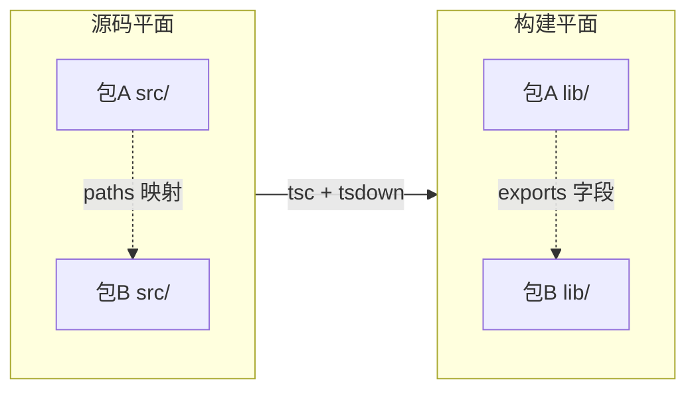
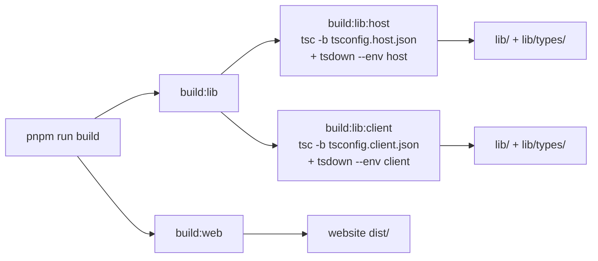

# 02 · 仓库布局与构建体系

> **前置阅读**：[00 · 项目总览](/00-overview)、[01 · Cordis 框架基础](/01-cordis-foundation)
> **下一步**：[03 · 启动与组合体系](/03-boot-and-composition)

## 学习目标

1. 理解 pnpm workspace 的组织方式与 `linkWorkspacePackages` 机制
2. 掌握 TypeScript 的"源码平面 vs 构建平面"分离原则
3. 能看懂任意包的 `package.json` exports 和 `tsconfig.json` references
4. 理解 Host/Client 双聚合（aggregate）的 typecheck 架构
5. 知道构建命令（`build:lib:host`、`build:lib:client`、`build:web`）的作用

---

## 一、pnpm Workspace

### 1.1 workspace 配置

`pnpm-workspace.yaml` 定义了所有 workspace 成员：

```yaml
packages:
  - vendor/*                    # Cordis 框架 vendored 副本
  - packages/*/*                # 54 个包组下的所有包
  - native/landlock-run         # Landlock 原生插件
  - native/landlock-run/packages/*
  - apps/*                      # CLI 应用入口
  - website                     # VitePress 文档站
  - examples                    # 可运行 demo（仅依赖解析，非构建目标）
  - python/sdk-runtime          # Python runtime deploy root

linkWorkspacePackages: true     # 本地 workspace 包互相 link

overrides:
  '@deepseek-ai/cosmokit': 'link:vendor/cosmokit'
  '@deepseek-ai/schemastery': 'link:vendor/schemastery'
```

**关键点**：

- `linkWorkspacePackages: true`：本地包通过 `workspace:^` 互相 link，不走 npm
- `overrides`：强制 `cosmokit`/`schemastery` 解析到 vendor 副本（即使有 npm 版本）
- `examples` 和 `python/sdk-runtime` 是**依赖解析成员**，但**不是构建目标**（tsdown 的 glob 显式排除）

### 1.2 包命名约定

所有 harness 包：`@deepseek-ai/dsh-<name>`

- `packages/<group>/<pkg>/` → `@deepseek-ai/dsh-<pkg>`
- Host/Client 包有前缀：`dsh-host-<dir>`、`dsh-client-<dir>`
- Vendored 包 rescoped 为 `@deepseek-ai/`，且 `private: true`

### 1.3 依赖约定

每个 harness 包的 `package.json`：

```json
{
  "type": "module",
  "peerDependencies": {
    "@deepseek-ai/cordis": "workspace:^",
    "@deepseek-ai/dsh-<dep>": "workspace:^"
  },
  "devDependencies": {
    "@deepseek-ai/cordis": "workspace:^",
    "@deepseek-ai/dsh-<dep>": "workspace:^"
  }
}
```

**`@deepseek-ai/cordis` 是每个包的 peerDependency（+ dev）**——这是硬性约定。

---

## 二、TypeScript 项目布局

### 2.1 双聚合架构

`dsh` 采用 **Host/Client 双聚合** typecheck 架构：

```mermaid
flowchart TD
    Root[tsconfig.json<br/>solution file, files: []]
    Host[tsconfig.host.json<br/>Host aggregate]
    Client[tsconfig.client.json<br/>Client aggregate]
    Base[tsconfig.base.json<br/>共享配置 + paths]

    Root --> Host
    Root --> Client
    Host --> Base
    Client --> Base

    HostPkg[packages/core/*<br/>packages/llm/*<br/>...Host 包]
    ClientPkg[packages/client/*<br/>packages/host/apiproxy/client<br/>...Client 包]

    Host --> HostPkg
    Client --> ClientPkg
```

| 文件 | 作用 |
|---|---|
| `tsconfig.json` | solution file，`files: []` 无程序，引用两个 aggregate |
| `tsconfig.base.json` | 共享配置（`strict: true`、`noImplicitAny`）+ paths 映射 |
| `tsconfig.host.json` | Host 侧 aggregate，引用所有 Host 包 |
| `tsconfig.client.json` | Client 侧 aggregate，引用所有 Client 包 |

### 2.2 源码平面 vs 构建平面

**这是最重要的约束**（见 `packages/AGENTS.md`）：

- **源码平面**：静态门禁和测试通过 tsconfig `paths` 解析到 `src`
- **构建平面**：消费构建 `lib/` 的门禁声明该依赖
- **永不混用**



### 2.3 paths 映射

`tsconfig.base.json` 的 `paths` 将所有包名映射到 `src`：

```json
{
  "paths": {
    "@deepseek-ai/cordis": ["./vendor/cordis/src"],
    "@deepseek-ai/dsh-session": ["./packages/core/session/src"],
    "@deepseek-ai/dsh-session/types": ["./packages/core/session/src/types.ts"],
    "@deepseek-ai/dsh-session/invariant": ["./packages/core/session/src/invariant.ts"],
    "@deepseek-ai/dsh-*": [
      "./packages/core/*/src",
      "./packages/llm/*/src",
      // ... 所有包组
    ]
  }
}
```

**通配符映射**：`@deepseek-ai/dsh-*` 一次性映射所有包组，新增包无需编辑 paths。

### 2.4 包级 tsconfig

每个包有自己的 `tsconfig.json`（如 `packages/core/session/tsconfig.json`）：

```json
{
  "extends": "../../../tsconfig.base.json",
  "compilerOptions": {
    "rootDir": "src",
    "outDir": "lib/types"
  },
  "include": ["src"],
  "references": [
    { "path": "../../../vendor/cordis" },
    { "path": "../../util/brand" },
    { "path": "../../llm/llm" },
    { "path": "../../core/scope" },
    { "path": "../../runtime-diagnostics/invariants" },
    { "path": "../../typert/protocol" }
  ]
}
```

**规则**（`packages/AGENTS.md`）：

- extends `tsconfig.base.json`（Client 包用 `tsconfig.base.client.json`）
- `rootDir: src`、`outDir: lib/types`
- references 每个 workspace 依赖 + `runtime-diagnostics/invariants`
- 注册到**恰好一个** aggregate（Host 或 Client）
- 只有 `api/remotes` 例外（生成契约拆分）

---

## 三、package.json exports 约定

### 3.1 标准 exports 结构

以 `packages/core/session/package.json` 为例：

```json
{
  "name": "@deepseek-ai/dsh-session",
  "type": "module",
  "main": "lib/index.js",
  "types": "lib/types/index.d.ts",
  "exports": {
    ".": {
      "types": "./lib/types/index.d.ts",
      "default": "./lib/index.js"
    },
    "./invariant": {
      "types": "./lib/types/invariant.d.ts",
      "default": "./lib/invariant.js"
    },
    "./types": {
      "types": "./lib/types/types.d.ts",
      "default": "./lib/types/types.js"
    },
    "./surface": {
      "types": "./lib/types/surface.d.ts",
      "default": "./lib/types/surface.js"
    },
    "./src/*": "./src/*",
    "./package.json": "./package.json"
  },
  "files": [
    "lib/index.js",
    "lib/invariant.js",
    "lib/types/**/*.js",
    "lib/types/**/*.d.ts"
  ]
}
```

### 3.2 exports 子路径约定

| 子路径 | 用途 |
|---|---|
| `.` | 主入口（Service 定义 + 实现） |
| `./types` | 纯类型（declaration merging 扩展点） |
| `./invariant` | 不变量检查器 |
| `./client` | Client 半入口（dual-face 包） |
| `./src/*` | 源码访问（开发时用） |
| `./package.json` | 元数据访问 |

### 3.3 dual-face 包

Host/Client 分离的包（如 `packages/host/apiproxy`）有双入口：

```json
{
  "exports": {
    ".": { "types": "./lib/types/index.d.ts", "default": "./lib/index.js" },
    "./client": { "types": "./lib/types/fetch/client.d.ts", "default": "./lib/fetch/client.js" }
  }
}
```

- `.` → Host 半（Node 环境）
- `./client` → Client 半（浏览器环境）

---

## 四、构建命令

### 4.1 构建流程



### 4.2 关键命令

```sh
# 完整构建
pnpm run build
# = build:lib + build:web
# = (build:lib:host + build:lib:client) + build:web

# Host 侧构建
pnpm run build:lib:host
# = tsc -b tsconfig.host.json && tsdown --env.DSH_BUILD_FACE host

# Client 侧构建
pnpm run build:lib:client
# = tsc -b tsconfig.client.json && tsdown --env.DSH_BUILD_FACE client

# Web 前端构建
pnpm run build:web
# = pnpm --filter @deepseek-ai/dsh-web-frontend run build

# 类型检查（先构建 host lib，再 check client contracts）
pnpm run typecheck
# = build:lib:host && typecheck:contracts-ready
```

### 4.3 tsc vs tsdown 的分工

| 工具 | 产出 | 用途 |
|---|---|---|
| `tsc` | `lib/types/*.d.ts` | 类型声明（给消费者 typecheck 用） |
| `tsdown` | `lib/*.js` | runtime 打包（给消费者执行用） |

**注意**：`tsc` 只产出 `.d.ts`，不产出 `.js`；`.js` 由 `tsdown` 打包。

---

## 五、源码目录结构约定

### 5.1 包内目录

```
packages/<group>/<pkg>/
├── package.json          # manifest
├── tsconfig.json         # 包级 TS 配置
├── README.md             # 包文档
├── src/
│   ├── index.ts          # 主入口（Service 定义 + 实现）
│   ├── types.ts          # 纯类型（declaration merging 扩展点）
│   ├── invariant.ts      # 不变量检查器
│   └── ...               # 其他源码
├── tests/                # 测试（不在 src/__tests__/）
└── lib/                  # 构建产出（gitignore）
    ├── index.js
    ├── invariant.js
    └── types/
        ├── index.d.ts
        └── ...
```

### 5.2 关键约定（`packages/AGENTS.md`）

- `src/types.ts` **只含类型**，无运行时代码
- 测试在包级 `tests/` 下，**不在** `src/__tests__/`
- 每个包拥有 `./invariant` 子路径
- `src/index.ts` default-export Service 类 或 named-export `apply`/`name`/`inject`/`Config`

### 5.3 Client 包的 `src/client/` 子目录

dual-face 包的 Client 半在 `src/client/` 下：

```
packages/client/ui-conversation/
├── src/
│   ├── index.ts          # Host 半（通常为空 apply）
│   └── client/
│       ├── index.ts      # Client 半入口
│       ├── apply.ts      # Client apply
│       └── ...           # React 组件等
```

---

## 六、门禁工具

### 6.1 hygiene 命令

```sh
pnpm run hygiene
# = rescope-vendor:check
# + knip                          # 死代码检测
# + publint                       # 包发布规范
# + constraints                   # workspace 约束
# + verify-dsh-package-licenses
# + verify-package-invariants     # 每个包的 ./invariant
# + verify-built-package-invariants
# + verify-cordis-config
# + verify-node-next-types
# + verify-runtime-closure
# + verify-vendored-links
```

### 6.2 其他重要门禁

| 命令 | 作用 |
|---|---|
| `pnpm run lint` | oxlint + ESLint |
| `pnpm run duplication` | jscpd 跨文件 TypeScript 重复检测 |
| `pnpm run test:coverage` | CI 覆盖率门禁（per-file 100%） |
| `pnpm run doc-sync` | 所有文档门禁 |
| `pnpm run verify-md-links` | Markdown 交叉链接检查 |

---

## 实战练习

1. **追踪 paths 映射**：打开 `tsconfig.base.json`，找到 `@deepseek-ai/dsh-session` 的映射，确认它指向 `src` 而非 `lib`。

2. **分析一个包的依赖**：打开 `packages/core/agent/package.json`，列出它的 `peerDependencies`，然后打开它的 `tsconfig.json`，确认 `references` 与 `peerDependencies` 一致。

3. **理解 dual-face**：打开 `packages/host/apiproxy/package.json`，找到 `exports` 中的 `./client` 子路径，然后打开对应的源码文件，看它如何为浏览器环境导出。

---

## 关键源码定位

| 内容 | 位置 |
|---|---|
| workspace 配置 | `pnpm-workspace.yaml` |
| TS 基础配置 | `tsconfig.base.json` |
| Host 聚合 | `tsconfig.host.json` |
| Client 聚合 | `tsconfig.client.json` |
| 包级 tsconfig 示例 | `packages/core/session/tsconfig.json` |
| 包 exports 示例 | `packages/core/session/package.json` |
| 包级规则 | `packages/AGENTS.md` |

---

## 下一步

本文理解了仓库的物理布局。下一篇 [03 · 启动与组合体系](/03-boot-and-composition) 将讲解 `dsh` 如何通过 `profile`/`bundle`/`patch` 三层组合出可运行的 Agent。
