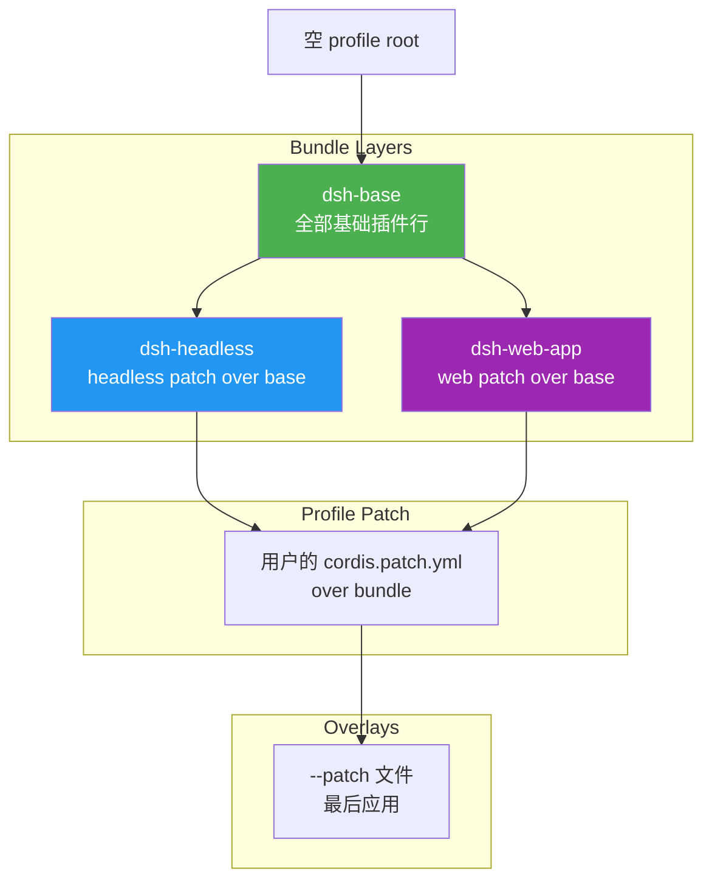
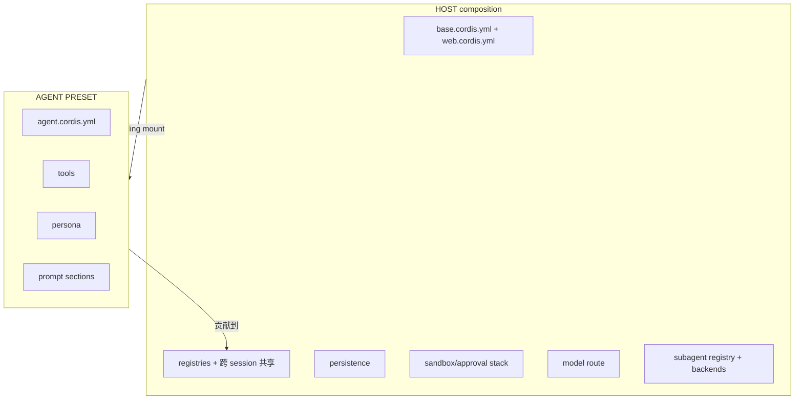
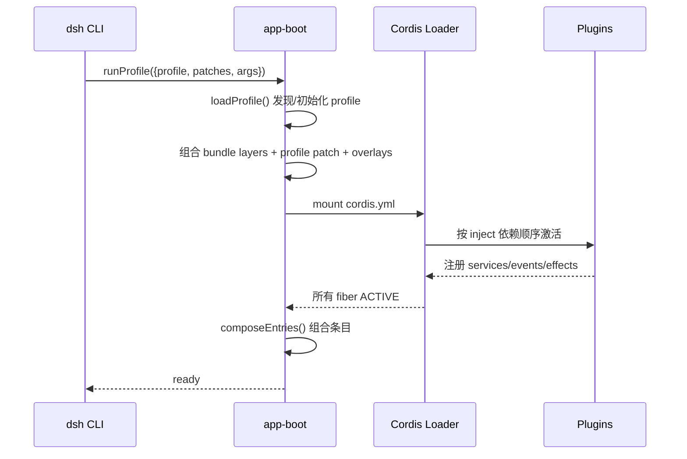

# 03 · 启动与组合体系

> **前置阅读**：[02 · 仓库布局与构建体系](/02-project-layout)
> **下一步**：[04 · 会话事件溯源](/04-session-event-sourcing)

## 学习目标

1. 理解 `dsh` CLI 的三种模式：`profile`、`plugin`、`dump-config`
2. 掌握 profile 组合顺序：bundle layers → profile patch → `--patch` overlays
3. 理解 `cordis.yml` 的 row/insert/disabled 语义
4. 能读懂 `base`/`headless`/`web-app` 三个 bundle 的 patch 关系
5. 理解 agent preset 的 standing mount 机制与两平面设计

---

## 一、CLI 入口

### 1.1 dsh 命令

```sh
# 通过 tsx ESM hook 从源码启动
pnpm dsh --profile headless "task"
# 等价于
node --import tsx/esm apps/cli/src/bin.ts --profile headless "task"
```

`apps/cli/src/bin.ts` 是入口，支持三种模式：

```typescript
// apps/cli/src/bin.ts (简化)
switch (invocation.mode) {
  case 'profile': {
    const { runProfile } = await import('./profile-boot.ts')
    await runProfile({
      dsh: invocation.dsh,
      profile: invocation.profile,
      patchFiles: invocation.patches,
      args: invocation.args,
    })
    break
  }
  case 'plugin': {
    const { runPlugin } = await import('./plugin.ts')
    process.exit(runPlugin(invocation.profile, invocation.args))
    break
  }
  case 'dump-config': {
    const { runDumpConfig } = await import('./dump-config.ts')
    runDumpConfig(invocation.profile, invocation.defaultOnly, invocation.patches)
    break
  }
  default:
    invocation satisfies never
}
```

### 1.2 三种模式

| 模式 | 用途 | 示例 |
|---|---|---|
| `profile` | 加载 profile 并运行任务 | `pnpm dsh --profile headless "task"` |
| `plugin` | 单插件管理（安装/卸载） | `pnpm dsh plugin add <pkg>` |
| `dump-config` | 打印组合后的配置（调试用） | `pnpm dsh dump-config --profile web` |

---

## 二、Profile 组合体系

### 2.1 三层组合



**组合顺序**（`packages/boot/app-boot/src/profile.ts`）：

1. **bundle layers**：`base` patch 先应用，然后 `headless` 或 `web-app` patch
2. **profile 自身 patch**：用户的 `cordis.patch.yml`
3. **`--patch` overlays**：命令行指定的额外 patch 文件

### 2.2 patch 语义

`cordis.patch.yml` 的核心语义（见 `packages/bundle/base/cordis.patch.yml` 注释）：

- **patch 替换目标 row 的整个 `config`**，而非合并
- 每个 row 重述其拥有的每个 key
- `insert` 块插入新行
- `disabled: true` 禁用 base 行（**而非删除**，因 base 是共享的）
- **row order 不影响加载语义**（激活由服务可用性驱动）

### 2.3 base bundle 示例

```yaml
# packages/bundle/base/cordis.patch.yml (节选)
- insert:
    - id: timer
      name: '@deepseek-ai/cordis-plugin-timer'

    - id: hmr
      name: '@deepseek-ai/cordis-plugin-hmr'
      config:
        root: ['.']

    - id: llm
      name: '@deepseek-ai/dsh-llm'

    - id: session
      name: '@deepseek-ai/dsh-session'

    - id: agent
      name: '@deepseek-ai/dsh-agent'

    - id: agent-default-model
      name: '@deepseek-ai/dsh-agent-default-model'
      config:
        provider: deepseek-official
        model: deepseek-v4-flash
```

每个 row 有 `id`（用于后续 patch 引用）和 `name`（npm 包名）。

### 2.4 web-app patch 示例

`web-app` patch 在 `base` 之上：

1. **surface-specific values**：替换 system-prompt persona、禁用 hmr、启用 sqlite 等
2. **web-only host rows**：`insert` 块添加 webserver、connection、api-remotes、ui-* 系列
3. **agent plane rows disabled**：禁用 tool-bash、tool-fs 等（移到 agent presets）
4. **agent-presets roster insert**：`default: standard`

```yaml
# packages/bundle/web-app/cordis.patch.yml (概念示意)
- id: hmr              # 禁用 base 的 hmr
  disabled: true

- id: session-query-sqlite  # 替换为 sqlite
  name: '@deepseek-ai/dsh-session-query-sqlite'

- insert:              # 添加 web-only 行
    - id: webserver
      name: '@deepseek-ai/dsh-host-webserver'
    - id: connection
      name: '@deepseek-ai/dsh-client-connection'
    - id: ui-conversation
      name: '@deepseek-ai/dsh-client-ui-conversation'
    # ... 更多 ui-* 插件

- id: tool-bash        # 禁用 base 的 tool-bash（移到 preset）
  disabled: true
```

---

## 三、cordis.yml 配置格式

### 3.1 完整示例

以 `examples/headless-agent/cordis.yml` 为例：

```yaml
# 用户设置文档（hot-reloaded）
- id: settings
  name: '@deepseek-ai/dsh-settings-file'

# 凭证存储
- id: credentials
  name: '@deepseek-ai/dsh-credentials-local'

# DeepSeek 适配器
- id: llm-deepseek
  name: '@deepseek-ai/dsh-llm-deepseek'
  config:
    thinking: enabled
    reasoningEffort: max
    models:
      - id: deepseek-v4-pro
        contextWindow: 128000
      - id: deepseek-v4-flash
        contextWindow: 128000

# 子进程管理
- id: subprocess
  name: '@deepseek-ai/dsh-subprocess-local'

# Bash 执行器
- id: bash
  name: '@deepseek-ai/dsh-bash-local'
  config:
    timeoutMs: 60000

# Agent spine（预创建 agent）
- id: agent-spine
  name: '@deepseek-ai/dsh-agent-spine-demo'
  config:
    agents:
      - id: main
        provider: deepseek-official
        model: deepseek-v4-flash
        cwd: !!js process.cwd()    # !!js 表达式插值
    persona: |
      You are headless-agent, a coding assistant powered by the {{model}} model.
```

### 3.2 row 字段

| 字段 | 类型 | 说明 |
|---|---|---|
| `id` | `string` | row 标识符，用于 patch 引用 |
| `name` | `string` | npm 包名 |
| `config` | `object` | 插件配置（传给 `apply(ctx, config)`） |
| `disabled` | `boolean` | 禁用此 row |
| `isolate` | `boolean` | entry-local realm（每个挂载 session 一个私有实例） |

### 3.3 `!!js` 表达式插值

`cordis.yml` 允许在 `config` 和 `disabled` 字段中使用 `!!js` 表达式：

```yaml
config:
  cwd: !!js process.cwd()                              # 访问 process
  compression: !!js "process.env.DSH_SNAPSHOT === undefined ? 'zstd' : 'none'"
```

**规则**（`docs/cordis-primer.md:38`）：

- `!!js` 只允许在 plugin `config` 和 entry `disabled` 字段下
- 其他元数据保持字面量
- Loader 在声明注入激活后、针对该 plugin context 插值
- 条件组合用 overlays，而非 `!!js`

---

## 四、Agent Preset 体系

### 4.1 两平面设计



**判据**（来自 preset 注释）：

- **发布 service 的 row** → 属于 host composition
- **该 preset 真正拥有该 service 且无 agent 外读者** → 可放在 `isolate` realm 内

### 4.2 standing mount

agent preset 通过 **standing mount** 在 scope context 下挂载（`packages/preset/agent-presets/src/mount.ts`）：

- **shipped presets**：`apps/cli/config/agent-presets/`，只读，`system` trust
- **用户 presets**：`$DSH_HOME/.agent-presets/<id>/`，与 shell 访问同等信任

### 4.3 四个 shipped presets

| preset | 定位 | 关键差异 |
|---|---|---|
| `minimal` | 固定 prompt、两工具 coding agent | persona `complete: true`、`includeRuntimeContext: false`；仅 `persistent-bash` + `str-replace-editor`；无 compaction |
| `standard` | 完整 coding agent，每进程挂载一次 | standing scope mount；shell/fs/jobs/skills/goals/plan-mode/compaction/delegation/workflows/ask-user/todo/web 全套 |
| `code` | standard + Code Mode | 增加 `tool-presentation`（mode: code），模型写 TypeScript 程序通过 `run_code` 执行 |
| `cordis` | standard + 自修改能力 | 增加 `tool-cordis`（cordis_mount 评估模型写的 JS）+ `editing-cordis-compositions` skill |

### 4.4 `isolate` realm 使用模式

`isolate: true` 表示 entry-local realm，每个挂载 session 一个私有实例：

```yaml
# standard/agent.cordis.yml (概念示意)
- id: planMode
  name: '@deepseek-ai/dsh-plan-mode'
  isolate: true              # plan state 天然 per-agent

- id: compaction
  name: '@deepseek-ai/dsh-compaction-basic'
  isolate: true              # 必须共享 realm（通过 ctx.get 读 pruner）

- id: workflowEngine
  name: '@deepseek-ai/dsh-workflow-worker-thread'
  isolate: true              # 无 agent 外读者
```

**host-plane 保留的 service**（preset 不拥有）：

- `shell-env`、`tasks` registry、`goals` service、`subagents` registry、`tokenMeter`、`skill` registry

---

## 五、boot 序列

### 5.1 boot 流程



### 5.2 关键文件

| 文件 | 作用 |
|---|---|
| `apps/cli/src/bin.ts` | CLI 入口，分发三种模式 |
| `apps/cli/src/args.ts` | 参数解析（commander） |
| `apps/cli/src/profile-boot.ts` | profile 模式启动 |
| `packages/boot/app-boot/src/index.ts` | `boot()` 入口、`composeEntries()` |
| `packages/boot/app-boot/src/profile.ts` | `loadProfile()` profile 发现/组合 |
| `packages/boot/cmdline/src/index.ts` | `CmdlineArgs`、`AppExit` 服务 |

---

## 六、examples 可运行叶子

`examples/` 下的 `cordis.yml` 是可运行的叶子配置：

| 叶子 | 用途 |
|---|---|
| `examples/headless-agent/cordis.yml` | headless agent 示例 |
| `examples/acp-agent/cordis.yml` | ACP agent 示例 |

**关键**（`examples/AGENTS.md`）：

- `examples/` 是**依赖解析成员**，但**不是构建目标**
- 每个 leaf 的 `cordis.yml` 通过 `examples/package.json` 声明的 `workspace:*` 依赖解析插件
- 测试通过 `@deepseek-ai/dsh-loader-smoke` 启动真实 Loader

---

## 实战练习

1. **打印组合配置**：运行 `pnpm dsh dump-config --profile headless`，观察组合后的完整配置。

2. **追踪一个 patch**：打开 `packages/bundle/web-app/cordis.patch.yml`，找到 `disabled: true` 的行，回答：为什么 web-app 要禁用 `tool-bash`？（提示：看两平面设计）

3. **理解 `!!js`**：在 `examples/headless-agent/cordis.yml` 中找到 `!!js` 用法，说明它在何时被求值。

---

## 关键源码定位

| 内容 | 位置 |
|---|---|
| CLI 入口 | `apps/cli/src/bin.ts` |
| 参数解析 | `apps/cli/src/args.ts` |
| profile 启动 | `apps/cli/src/profile-boot.ts` |
| boot 序列 | `packages/boot/app-boot/src/index.ts` |
| profile 加载 | `packages/boot/app-boot/src/profile.ts` |
| base bundle patch | `packages/bundle/base/cordis.patch.yml` |
| headless bundle patch | `packages/bundle/headless/cordis.patch.yml` |
| web-app bundle patch | `packages/bundle/web-app/cordis.patch.yml` |
| agent preset 挂载 | `packages/preset/agent-presets/src/mount.ts` |
| shipped presets | `apps/cli/config/agent-presets/` |
| headless 示例 | `examples/headless-agent/cordis.yml` |

---

## 下一步

本文理解了 `dsh` 的启动与组合体系。下一篇 [04 · 会话事件溯源](/04-session-event-sourcing) 将深入核心架构——所有 agent 交互状态如何以 append-only 事件日志形式持久化。
