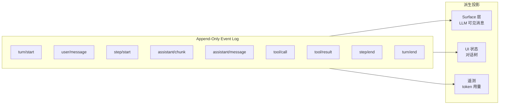

# 04 · 会话事件溯源

> **前置阅读**：[01 · Cordis 框架基础](/01-cordis-foundation)、[03 · 启动与组合体系](/03-boot-and-composition)
> **下一步**：[05 · Agent 与循环](/05-agent-and-loop)

## 学习目标

1. 理解事件溯源（Event Sourcing）在 `dsh` 中的应用
2. 掌握 `SessionEventMap` 的 declaration merging 扩展机制
3. 能区分 durable 事件与 live 事件，以及 surface-eligible 事件
4. 理解 `SESSION_FORMAT_VERSION` 的版本控制语义
5. 知道崩溃恢复（repair）机制如何保证日志一致性

---

## 一、为什么用事件溯源？

`dsh` 的所有 agent 交互状态都以 **append-only 事件日志**形式持久化。这意味着：

- **完整可重放**：从日志可重建任意时刻的会话状态
- **审计友好**：每个状态变化都有记录
- **崩溃恢复**：中断的日志可被修复为一致状态
- **派生投影**：消息历史、UI 状态、遥测都从日志派生



---

## 二、核心类型定义

### 2.1 SessionId 品牌类型

```typescript
// packages/core/session/src/types.ts:22
export type SessionId = Branded<'SessionId'>
```

使用 `Branded<B>` 防止跨边界 id 混用——这是 `dsh` 的硬性约定（"Opaque cross-boundary ids are branded"）。

### 2.2 SESSION_FORMAT_VERSION

```typescript
// packages/core/session/src/types.ts:56
export const SESSION_FORMAT_VERSION = 0
```

当前为 `0`（技术预览阶段），单调递增整数，写入每个 `SessionHeader` 并由持久化后端在加载时校验。

**版本控制语义**（`AGENTS.md`）：

- 只有**结构性变化**才 bump：header shape、`SessionEvent` envelope、核心事件语义、surface 机制
- 新增普通事件类型**不 bump**，由 `SessionEvent.ignorable` 守卫覆盖
- `dsh-session` 保持 `SESSION_FORMAT_VERSION = 0`，**无兼容性承诺**

### 2.3 SessionHeader

```typescript
// packages/core/session/src/types.ts:61-99
export interface SessionHeader {
  readonly version: number           // SESSION_FORMAT_VERSION
  readonly id: SessionId
  readonly createdAt: number
  readonly cwd: string
  readonly parentSession?: SessionId // fork 血缘
  readonly seedLength?: number       // 继承前缀长度
  readonly origin?: SessionOrigin    // 子 agent 来源
  readonly delegationDepth?: number  // 委托深度
  readonly agentPreset?: string      // agent 预设 id
}
```

不可变存储元数据，记录会话的"出生证明"。

---

## 三、SessionEventMap — 核心事件类型表

### 3.1 核心事件类型

`SessionEventMap`（`packages/core/session/src/types.ts:236-333`）定义了核心事件类型：

| 事件类型 | 数据 | 说明 |
|---------|------|------|
| `turn/start` | `{ turn: number }` | 开启 turn |
| `turn/end` | `{ turn: number; reason: TurnEndReason }` | 关闭 turn，携带结束原因 |
| `step/start` | `{ turn; step }` | 开启 step（一次模型调用 + 工具执行） |
| `step/end` | `{ turn; step }` | 关闭 step |
| `user/message` | `UserMessage` | 用户角色消息（**surface-eligible**） |
| `assistant/chunk` | `{ turn; step; chunk: StreamChunk }` | 原始流块（token 级回放保真） |
| `assistant/message` | `{ turn; step; message; usage? }` | 组装的 assistant 消息（**surface-eligible**） |
| `tool/call` | `{ turn; step; callId; name; arguments }` | 模型请求工具调用 |
| `tool/result` | `{ turn; step; message; error?; meta? }` | 工具调用结果（**surface-eligible**） |
| `todo/write` | `{ todos: TodoItem[] }` | 整列表快照，最新写入胜出 |
| `request/header` | `{ header: EpochHeader; reason }` | 请求头快照 |
| `request/context` | `RequestContext` | 路由元数据 |
| `session/end-seed` | `Record<string, never>` | 标记构造 seed 结束 |

### 3.2 SurfaceEventType — LLM 可见事件

只有 **3 种事件类型**产生 LLM 可见消息并出现在有序 surface 上：

```typescript
// packages/core/session/src/types.ts:343-346
export type SurfaceEventType = 'user/message' | 'assistant/message' | 'tool/result'
```

**关键原则**（`AGENTS.md`）："Model-visible ⟺ logged"——任何到达模型请求的内容都必须可从会话日志重建。

### 3.3 SurfaceOp — surface 放置方式

```typescript
// packages/core/session/src/types.ts:372-374
export type SurfaceOp =
  | 'append'
  | { op: 'replace'; start: number; end: number }
```

- `append`：添加到尾部
- `replace`：替换 surface 节点范围（用于 compaction）

### 3.4 SessionEvent — discriminated union

```typescript
// packages/core/session/src/types.ts:404-436
export type SessionEvent =
  | { type: 'turn/start'; seq; data; sourceEventSeqs?; surfaceOp?; ignorable? }
  | { type: 'turn/end'; seq; data; sourceEventSeqs?; surfaceOp?; ignorable? }
  | { type: 'user/message'; seq; data; sourceEventSeqs?; surfaceOp?; ignorable? }
  | ...
```

proper discriminated union over `type`，`switch (event.type)` 可窄化 `event.data`。

**条件性字段**：

- `sourceEventSeqs` 和 `surfaceOp` 只存在于 `SurfaceEventType` 变体上
- `ignorable?: true` 标记读者可安全跳过的未知事件类型

---

## 四、Declaration Merging 扩展

### 4.1 扩展机制

`SessionEventMap` 通过 `declare module` 机制扩展。每个插件拥有自己的事件类型：

```typescript
// packages/core/agent/src/types.ts:12-26
declare module '@deepseek-ai/dsh-session/types' {
  interface SessionEventMap {
    'agent/inbox/spliced': {
      /** @mode emit */
      data: InboxSplice
    }
  }
}
```

### 4.2 已知合并来源

生产代码中的合并来源（共 25 个，含测试）：

| 包 | 事件类型 | 文件 |
|---|---------|------|
| `dsh-agent` | `agent/inbox/spliced` | `packages/core/agent/src/types.ts:12` |
| `dsh-tools` | `tool/code-dispatch-start`, `tool/code-dispatch` | `packages/core/tools/src/types.ts:25` |
| `dsh-compaction` | `compaction/start`, `compaction/summary`, `compaction/end`, `compaction/prune` | `packages/compaction/compaction/src/types.ts:16` |
| `dsh-plan-mode` | `plan/mode` | `packages/plan/plan-mode/src/index.ts:46` |
| `dsh-commands` | `command/run`, `command/done` | `packages/interaction/commands/src/types.ts:76` |
| `dsh-subagent` | `subagent/descriptor` | `packages/subagent/subagent/src/descriptor.ts:28` |
| `dsh-session-title` | `session/title` | `packages/session/session-title/src/index.ts:94` |
| `dsh-hook-protocol` | `hook/invoked`, `hook/result` | `packages/hooks/hook-protocol/src/types.ts:8` |
| `dsh-tool-workflow` | `tool-workflow/run-start`, `tool-workflow/agent-start`, `tool-workflow/agent-end`, `tool-workflow/run-end` | `packages/workflow/tool-workflow/src/types.ts` |
| `dsh-command-feedback` | `command/feedback`, `command/record` | `packages/feedback/command-feedback/src/index.ts:56` |
| `dsh-user-approval` | `user/approval` | `packages/interaction/user-approval/src/index.ts:40` |

### 4.3 事件 JSDoc 约定

`AGENTS.md` 规定事件 JSDoc 需要：

- `@mode`：分发模式（`emit`/`waterfall`/`parallel`/`serial`）
- payload `@param`：每个参数的说明
- scoped keys absent from payloads 需要 `@dshScopeScan unsupported`

```typescript
declare module '@deepseek-ai/dsh-session/types' {
  interface SessionEventMap {
    'llm/stream': {
      /** @mode emit */
      data: StreamChunk
    }
    'llm/adapters-updated': {
      /** @mode emit */
      data: Record<string, never>
    }
  }
}
```

---

## 五、Durable vs Live 事件

### 5.1 区分

| 类型 | 持久化 | 用途 | 示例 |
|---|---|---|---|
| **durable** | 是，写入日志 | 重建会话状态 | `turn/start`、`user/message`、`tool/result` |
| **live** | 否，仅内存 | 实时通知 | `llm/adapters-updated`、`internal/status` |

### 5.2 SessionEventMap 成员默认 required-on-read

`AGENTS.md` 规定：

> A `SessionEventMap` member is required-on-read by default — builds that do not know its type refuse the log unless the event carries the envelope's `ignorable: true`.

这意味着：

- 新增事件类型时，旧版本的 reader 会**拒绝**该日志
- 除非事件携带 `ignorable: true`，表示读者可安全跳过
- 只有结构性变化才 bump `SESSION_FORMAT_VERSION`

---

## 六、请求头折叠

### 6.1 canonicalHeader

```typescript
// packages/core/session/src/request-header.ts:21-31
export function canonicalHeader(header: EpochHeader): EpochHeader {
  // 空 system prompt 和空 tool list 变为 absent 字段
  return {
    ...header,
    systemPrompt: header.systemPrompt === '' ? undefined : header.systemPrompt,
    tools: header.tools.length === 0 ? undefined : header.tools,
  }
}
```

### 6.2 foldRequestHeader

将 header 事件折叠为最新快照，纯离线重建路径：

```typescript
// packages/core/session/src/request-header.ts:65-71
export function foldRequestHeader(
  events: readonly SessionEvent[],
  from?: EpochHeader
): EpochHeader | undefined {
  let state = from
  for (const event of events) {
    if (event.type === 'request/header') state = canonicalHeader(event.data.header)
  }
  return state
}
```

---

## 七、不变量验证

### 7.1 SessionTrace

```typescript
// packages/core/session/src/invariant.ts:23-30
export class SessionTrace {
  lastSeq = -1
  openTurn: number | undefined
  openStep: number | undefined
  nextTurn = 0
  nextStep = 0
  pendingCalls = new Map<CallId, true>()
}
```

每个 session 的关系日志检查簿记。

### 7.2 validateEvent

`validateEvent`（`invariant.ts:55-166`）验证候选事件而不修改已提交的 trace：

| 检查 | 规则 |
|---|---|
| `seq` 递增 | 必须严格递增（`invariant.ts:60-62`） |
| `turn/start` | 不能在开放 turn 中（`invariant.ts:73-82`） |
| `step/start` | 必须在开放 turn 中且无开放 step（`invariant.ts:94-106`） |
| `tool/call` | 必须在开放 step 中（`invariant.ts:122-126`） |
| `tool/result` | 必须有先前的 `tool/call`（`invariant.ts:127-144`） |
| `todo/write`、`request/header`、`request/context` | 必须在开放 turn 中（`invariant.ts:150-157`） |

---

## 八、崩溃恢复

### 8.1 interruptedTurnClosers

`interruptedTurnClosers`（`packages/core/session/src/repair.ts:27-133`）为中断的 session log 生成**确定性合成事件**，关闭开放的 tail turn：

1. 未匹配的 `tool/call` 先收到错误结果
2. 然后是开放的 `step/end`
3. 最后是中断的 `turn/end`

### 8.2 恢复码

```typescript
// packages/core/session/src/repair.ts:13
const TOOL_NOT_STARTED = 'tool-not-started'  // 工具调用在记录开始前被中断

// :16
const TOOL_OUTCOME_UNKNOWN = 'tool-outcome-unknown'  // 工具调用结果未持久化
```

---

## 九、持久化后端

### 9.1 JSONL 后端

**文件**：`packages/session/session-persistence-jsonl/src/index.ts`

- append-only file per session
- zstd 压缩支持（`ZSTD_MAGIC = 0xFD2FB528`）
- Win32 原子发布（`MoveFileExW` with write-through）
- path sanitization（SessionId 是 unvalidated branded string，必须编码）

**格式**（`format.ts`）：

```typescript
export type JsonlCompression = 'zstd' | 'none'

export interface HeaderLine {
  type: 'session'
  version: number           // SESSION_FORMAT_VERSION
  id: SessionId
  createdAt: number
  cwd: string
  parentSession?: SessionId
  seedLength?: number
  origin?: SessionOrigin
  delegationDepth?: number
  agentPreset?: string
}
```

### 9.2 SQLite 后端

**文件**：`packages/session/session-persistence-sqlite/src/index.ts`

- `node:sqlite` `DatabaseSync`
- header + event → rows
- `envelopeBindings()` 序列化 surface metadata

**Schema 版本**（`schema.ts:20`）：

```typescript
export const SCHEMA_VERSION = 15
```

SQLite 使用**单调 `SCHEMA_VERSION`**，与 `SESSION_FORMAT_VERSION` 独立。

---

## 十、Session 服务入口

### 10.1 SessionStore

`packages/core/session/src/index.ts` 提供 Session 服务：

- append-only 日志写入
- surface 投影
- 事件分发

### 10.2 generator effect 示例

```typescript
// packages/core/session/src/index.ts:836
this.ctx.effect(function* (this: SessionStore) {
  yield this.enter(session)      // 先 yield detach disposer
  this.announce(session)          // 再 announce
}.bind(this), 'sessions.create()')
```

**要点**：generator effect 中先 yield detach 再 announce，使抛错的 `session/created` listener 回滚 attach 而非泄漏。

---

## 实战练习

1. **追踪一个事件**：打开 `packages/core/session/src/types.ts`，找到 `SessionEventMap`，列出所有核心事件类型，标注哪些是 `SurfaceEventType`。

2. **理解 declaration merging**：在 `packages/compaction/compaction/src/types.ts` 中找到 `declare module` 块，说明它扩展了哪些事件类型。

3. **追踪崩溃恢复**：打开 `packages/core/session/src/repair.ts`，阅读 `interruptedTurnClosers`，回答：如果一个 `tool/call` 没有对应的 `tool/result`，恢复时会生成什么事件？

---

## 关键源码定位

| 内容 | 位置 |
|---|---|
| SessionId 品牌类型 | `packages/core/session/src/types.ts:22` |
| SESSION_FORMAT_VERSION | `packages/core/session/src/types.ts:56` |
| SessionHeader | `packages/core/session/src/types.ts:61-99` |
| SessionEventMap | `packages/core/session/src/types.ts:236-333` |
| SurfaceEventType | `packages/core/session/src/types.ts:343-346` |
| SurfaceOp | `packages/core/session/src/types.ts:372-374` |
| SessionEvent union | `packages/core/session/src/types.ts:404-436` |
| 请求头折叠 | `packages/core/session/src/request-header.ts:65-71` |
| 不变量验证 | `packages/core/session/src/invariant.ts:55-166` |
| 崩溃恢复 | `packages/core/session/src/repair.ts:27-133` |
| SessionStore.create | `packages/core/session/src/index.ts:836` |
| JSONL 后端 | `packages/session/session-persistence-jsonl/src/index.ts` |
| SQLite 后端 | `packages/session/session-persistence-sqlite/src/index.ts` |
| SQLite SCHEMA_VERSION | `packages/session/session-persistence-sqlite/src/schema.ts:20` |

---

## 下一步

本文理解了会话事件溯源机制。下一篇 [05 · Agent 与循环](/05-agent-and-loop) 将讲解 Agent 接口、turn/step 循环流程，以及 initiator scope 概念。
