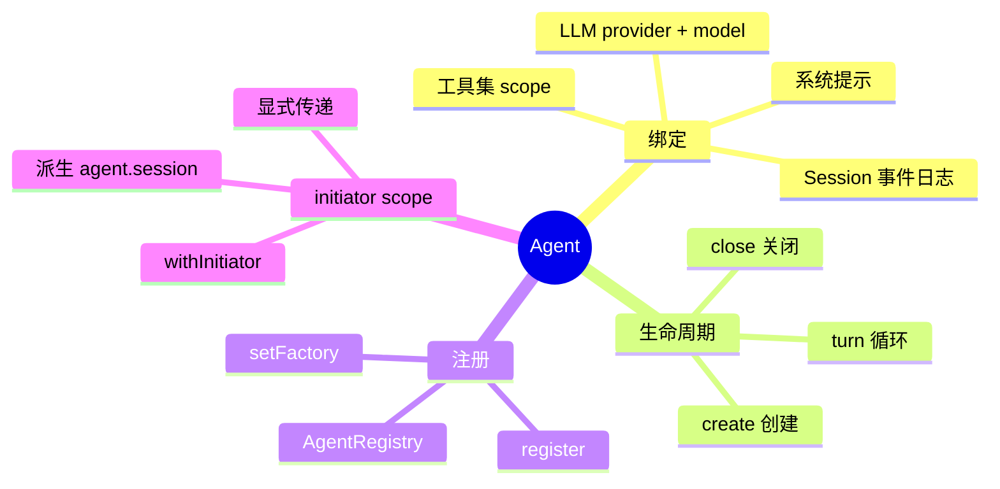
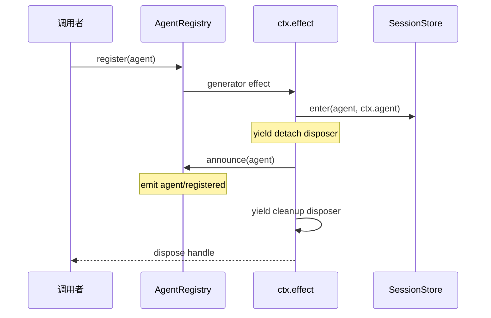
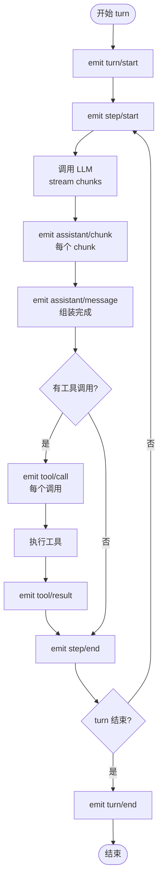

# 05 · Agent 与循环

> **前置阅读**：[04 · 会话事件溯源](/04-session-event-sourcing)
> **下一步**：[06 · 系统提示装配](/06-system-prompt-assembly)

## 学习目标

1. 理解 Agent 接口与 AgentRegistry 的注册机制
2. 掌握 turn/step 循环的完整流程
3. 理解 initiator scope 概念及其重要性
4. 知道 `dsh-agent-loop` 是可替换的
5. 能追踪一次完整的模型调用 + 工具执行流程

---

## 一、Agent 接口

### 1.1 Agent 是什么

Agent 是 `dsh` 中**一个会话的运行时句柄**。它绑定：

- 一个 `Session`（事件日志）
- 一个 LLM provider + model
- 一组工具（通过 scope 继承）
- 一个系统提示（通过 system-prompt 装配）



### 1.2 AgentRegistry

**文件**：`packages/core/agent/src/index.ts`

AgentRegistry 是 Agent 的注册表，本身也是通过 `ctx.effect` 注册的——**注册表也是插件**。

```typescript
// packages/core/agent/src/index.ts:289
ctx.on('internal/status', (fiber) => {
  if (fiber.state === FiberState.UNLOADING && this.hasLifecycleAncestor(fiber)) {
    this.closeInitiators()
  }
})

// :373 — setFactory 用 effect 注册 factory slot
const dispose = this.ctx.effect(() => {
  if (this.factory !== undefined) throw new Error('an agent factory is already registered')
  this.factory = { target }
  return () => { this.factory = undefined }
}, 'agents.setFactory()')

// :451 — register 用 generator effect
const dispose = this.ctx.effect(function* (this: AgentRegistry) {
  yield this.enter(agent, this.ctx.agent)
  this.announce(agent)
}.bind(this), 'agents.register()')
```

### 1.3 注册流程



---

## 二、Initiator Scope

### 2.1 概念

**initiator scope** 是 `dsh` 的核心架构概念（见 `packages/AGENTS.md`）：

> Under `ctx.agents.withInitiator()`, recover the Agent at each orchestration entry, derive `agent.session`, and let operation-local helpers close over it.

**问题**：在 Cordis 中，`ctx` 是共享的，但 Agent 是 per-session 的。如何在任意代码位置知道"当前正在服务哪个 Agent"？

**解决方案**：`withInitiator()` 设置一个 scope，在 scope 内可以通过 `ctx.agent` 恢复当前 Agent。

### 2.2 使用模式

```typescript
// 在 agent-loop 或工具执行中
ctx.agents.withInitiator(agent, () => {
  // 在这个 scope 内：
  // - ctx.agent 恢复为当前 agent
  // - agent.session 派生当前 session
  // - 操作局部 helpers 可以 close over agent
  
  const session = agent.session
  // ... 执行操作
})
```

### 2.3 显式传递原则

`packages/AGENTS.md` 规定：

> Keep `Agent` and `Session` explicit at lifecycle, session-log, service, authority, worker/process, persistence, and wire interfaces; do not widen a leaf helper from `Session` to `Context` merely to hide a parameter.

即：在**生命周期、会话日志、服务、权限、worker/进程、持久化、wire 接口**处保持 `Agent` 和 `Session` 显式传递；不要为了隐藏参数而把 leaf helper 从 `Session` 扩展到 `Context`。

---

## 三、Turn/Step 循环

### 3.1 循环结构



### 3.2 Turn 与 Step

| 概念 | 含义 | 事件 |
|---|---|---|
| **turn** | 一轮用户输入到 Agent 完成响应 | `turn/start` → `turn/end` |
| **step** | 一次模型调用 + 工具执行 | `step/start` → `step/end` |

一个 turn 可以包含**多个 step**（模型调用工具后再次调用模型）。

### 3.3 TurnEndReason

`turn/end` 携带 `reason`，表示 turn 结束的原因：

- 模型停止调用工具（正常完成）
- 达到最大 step 数
- 用户中断
- 错误

---

## 四、Agent Loop 实现

### 4.1 dsh-agent-loop

**文件**：`packages/core/agent-loop/src/index.ts`

`dsh-agent-loop` 是**具体的 turn/step 循环实现**，**可替换**。

`AGENTS.md` 规定：

> **Plugins, not loop changes**: new behavior goes on documented extension points; changing `agent-loop` requires updating docs/architecture.md.

即：新行为应该通过**文档化的扩展点**实现，而不是修改 `agent-loop`。如果确实要改 `agent-loop`，必须更新 `docs/architecture.md`。

### 4.2 循环入口

```typescript
// 概念示意（实际代码在 packages/core/agent-loop/src/index.ts）
async function runTurn(agent: Agent, userMessage: UserMessage): Promise<void> {
  const session = agent.session
  
  // 1. 记录用户消息
  session.append({ type: 'user/message', data: userMessage })
  
  // 2. 开启 turn
  session.append({ type: 'turn/start', data: { turn: session.nextTurn } })
  
  // 3. 循环 step
  while (true) {
    const step = session.nextStep
    session.append({ type: 'step/start', data: { turn, step } })
    
    // 4. 装配系统提示 + 消息历史
    const systemPrompt = await ctx.systemPrompt.assemble(agent)
    const messages = session.deriveMessages()
    
    // 5. 调用 LLM
    const result = await ctx.llm.stream({
      model: agent.model,
      systemPrompt,
      messages,
      tools: agent.tools,
    })
    
    // 6. 记录 chunks 和组装消息
    for await (const chunk of result.stream) {
      session.append({ type: 'assistant/chunk', data: { turn, step, chunk } })
    }
    session.append({ type: 'assistant/message', data: { turn, step, message: result.message, usage: result.usage } })
    
    // 7. 处理工具调用
    if (result.message.toolCalls.length === 0) {
      session.append({ type: 'step/end', data: { turn, step } })
      break  // turn 结束
    }
    
    for (const call of result.message.toolCalls) {
      session.append({ type: 'tool/call', data: { turn, step, callId: call.id, name: call.name, arguments: call.arguments } })
      const toolResult = await ctx.tools.execute(call, agent)
      session.append({ type: 'tool/result', data: { turn, step, message: toolResult } })
    }
    
    session.append({ type: 'step/end', data: { turn, step } })
  }
  
  // 8. 关闭 turn
  session.append({ type: 'turn/end', data: { turn, reason: 'completed' } })
}
```

---

## 五、Inbox 增量投影

### 5.1 Inbox

**文件**：`packages/core/agent/src/inbox.ts`

`Inbox` 类增量投影 durable inbox 事件。

```typescript
// packages/core/agent/src/types.ts:10
export type InboxTarget = 'next' | 'pending'
```

### 5.2 agent/inbox/spliced 事件

```typescript
// packages/core/agent/src/types.ts:12-26
declare module '@deepseek-ai/dsh-session/types' {
  interface SessionEventMap {
    'agent/inbox/spliced': {
      /** @mode emit */
      data: InboxSplice
    }
  }
}
```

当 inbox 有新消息拼接时触发，用于实时通知。

---

## 六、Runtime Context

### 6.1 RuntimeContext

**文件**：`packages/core/agent/src/runtime-context.ts`

`RuntimeContext` 跟踪最后保留的 runtime-context 快照。

**构造函数**（`runtime-context.ts:34-56`）：

1. 从 session 事件末尾向前扫描，找到最后一个 `request/context` 事件
2. 注册 `request/context` listener 跟踪后续变化

### 6.2 project 方法

```typescript
// runtime-context.ts:64-75
project(): RequestContext | undefined {
  // 仅当值不同时创建未提交快照
  // undefined 表示无当前 runtime context
}
```

---

## 七、Fused Dispatcher

### 7.1 概念

`dsh` 使用 **fused dispatcher** 模式：agent subject 与 scope carrier 耦合，防止分歧。

### 7.2 assembleContextFor

```typescript
// packages/core/agent/src/dispatch.ts:174-176
export function assembleContextFor(agent: Agent, signal?: AbortSignal): AssembleContext {
  return { agent, scope: agent, ...signal === undefined ? {} : { signal } }
}
```

agent 和 scope 一起设置，确保 prompt assembly context 的 agent 和 scope 始终一致。

### 7.3 事件分发

`dispatch.ts` 实现了 `emit`/`serial`/`waterfall` 三种分发模式：

- `emit`（`dispatch.ts:63`）：fire-and-forget 通知
- `serial`（`dispatch.ts:70`）：Cordis `serial`
- `waterfall`（`dispatch.ts:81`）：around-middleware

---

## 八、Agent 不变量

### 8.1 AgentInvariant

**文件**：`packages/core/agent/src/invariant.ts`

注册 manifest name 并检查 agent 相关的事件/数据关系。

### 8.2 HMR 安全

`packages/AGENTS.md` 规定：

> Registry contributions prove disposal through the HMR-safety test: dispose the fiber and observe removal.

即：每个 registry 贡献都必须通过 HMR-safety 测试——卸载 fiber 后观察贡献是否被移除。

---

## 实战练习

1. **追踪注册流程**：打开 `packages/core/agent/src/index.ts`，找到 `AgentRegistry.register()`，画出 generator effect 的 yield 顺序和卸载顺序。

2. **理解 initiator scope**：在 `packages/core/agent-loop/src/index.ts` 中找到 `withInitiator` 的使用，说明它为什么是必要的。

3. **追踪一个 turn**：假设用户发送 "hello"，画出从 `user/message` 到 `turn/end` 的完整事件序列。

---

## 关键源码定位

| 内容 | 位置 |
|---|---|
| AgentRegistry | `packages/core/agent/src/index.ts` |
| ctx.on internal/status | `packages/core/agent/src/index.ts:289` |
| setFactory effect | `packages/core/agent/src/index.ts:373` |
| register generator effect | `packages/core/agent/src/index.ts:451` |
| InboxTarget | `packages/core/agent/src/types.ts:10` |
| agent/inbox/spliced | `packages/core/agent/src/types.ts:12-26` |
| RuntimeContext | `packages/core/agent/src/runtime-context.ts:34-56` |
| assembleContextFor | `packages/core/agent/src/dispatch.ts:174-176` |
| Agent Loop | `packages/core/agent-loop/src/index.ts` |
| Agent 不变量 | `packages/core/agent/src/invariant.ts` |

---

## 下一步

本文理解了 Agent 与循环机制。下一篇 [06 · 系统提示装配](/06-system-prompt-assembly) 将讲解系统提示如何从 sections/contexts/tools/variables 装配而成。
