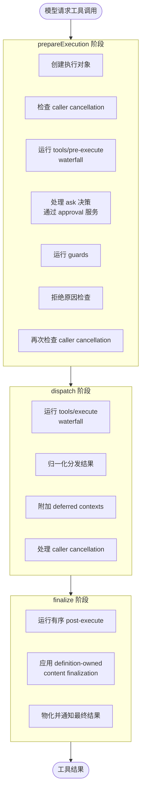

# 07 · 工具注册表与执行管道

> **前置阅读**：[06 · 系统提示装配](/06-system-prompt-assembly)
> **下一步**：[08 · Code Mode 机制](/08-code-mode)

## 学习目标

1. 掌握 `defineTool` DSL 的完整 API
2. 理解工具注册表的 scope 继承与可见性解析
3. 能画出 pre/guard/around/post/result 执行管道的完整流程
4. 知道工具的 UI 呈现意图（generic/terminal/diff/locations）
5. 理解 JSON Schema 验证机制

---

## 一、ToolRuntime 服务

### 1.1 服务定义

**文件**：`packages/core/tools/src/index.ts`

`ToolRuntime` 是工具注册表服务，暴露 `ctx.tools`。

```typescript
// Config
export interface Config {
  mode?: ToolPresentationMode  // 'native' | 'code' | 'sdk'
}

export type ToolPresentationMode = 'native' | 'code' | 'sdk'
```

### 1.2 核心能力

- 工具注册与注销
- scope 继承的可见性解析
- 执行管道（pre/guard/around/post/result）
- JSON Schema 参数验证
- UI 呈现意图

---

## 二、defineTool DSL

### 2.1 ToolDefinition 接口

```typescript
// packages/core/tools/src/index.ts:222
export interface ToolDefinition {
  // 1. 输出声明
  readonly output: ToolOutputDefinition
  
  // 2. 执行函数
  execute(args, ctx): Promise<ToolResult>
  
  // 3. 可选：工具调用超时预算
  timeoutMs?(args): number
  
  // 4. 可选：纯同步分类器，判断与兄弟工具的重叠
  isCallable?(args): boolean
  
  // 5. 可选：UI 呈现 — pending 状态
  presentCall?(args): ToolCallView
  
  // 6. 可选：UI 呈现 — completed 状态
  presentResult?(args, result): ToolResultView
}
```

### 2.2 ToolOutputDefinition

```typescript
// packages/core/tools/src/index.ts:212-219
export interface ToolOutputDefinition {
  readonly schema: JsonSchemaNode          // 输出 schema
  render(args: unknown, value: JsonValue): ContentBlock[]  // 渲染输出
  presentationMeta?(args: unknown, value: JsonValue): JsonValue  // 额外元数据
}
```

### 2.3 defineTool 用法

```typescript
// packages/core/tools/src/schema.ts:545
import { defineTool } from '@deepseek-ai/dsh-tools'

const myTool = defineTool({
  name: 'my_tool',
  description: 'Does something useful',
  parameters: {
    type: 'object',
    properties: {
      input: { type: 'string', description: 'The input' }
    },
    required: ['input']
  },
  output: {
    schema: { type: 'string' },
    render: (args, value) => [{ type: 'text', text: String(value) }]
  },
  async execute(args, ctx) {
    const { input } = args
    // ... 执行逻辑
    return { value: result }
  },
  presentCall(args) {
    return { kind: 'generic', title: `Running my_tool(${args.input})` }
  },
  presentResult(args, result) {
    return { kind: 'generic', title: 'Completed', body: String(result.value) }
  }
})
```

---

## 三、执行管道

### 3.1 管道阶段



### 3.2 关键函数

| 函数 | 位置 | 作用 |
|---|---|---|
| `execute` | `index.ts:1342` | 主入口 |
| `createExecution` | `index.ts:1364-1451` | 创建执行对象，处理 mode collapse |
| `prepareExecution` | `index.ts:1463-1507` | 运行 pre-execute + guard |
| `dispatchScheduledExecution` | `index.ts:1569-1599` | 运行 around-dispatch + body |
| `dispatchToolBody` | `index.ts:1532-1560` | 分发注册的 body |
| `finalizeScheduledExecution` | `index.ts:1609-1621` | 运行 post-execute + finalization |
| `finishScheduledExecution` | `index.ts:1631-1646` | 仅 finalization，无 post-execute |

### 3.3 prepareExecution 详细流程

```typescript
// packages/core/tools/src/index.ts:1463-1507 (概念示意)
async function prepareExecution(exec: Execution): Promise<PreparedExecution> {
  // 1. 创建执行对象
  // 2. 检查 caller cancellation
  if (exec.callerSignal.aborted) throw new AbortedError()
  
  // 3. 运行 tools/pre-execute waterfall
  const preResult = await ctx.waterfall('tools/pre-execute', exec, async (e, next) => {
    return next(e)  // 默认委托
  })
  
  // 4. 处理 ask 决策（通过 approval 服务）
  if (preResult.ask) {
    const decision = await ctx.approval.request(preResult.ask)
    if (decision.rejected) return { rejected: decision.reason }
  }
  
  // 5. 运行 guards（monotonic）
  for (const guard of guards) {
    const result = guard(exec)
    if (result.rejected) return { rejected: result.reason }
  }
  
  // 6. 拒绝原因检查
  if (preResult.rejected) return { rejected: preResult.reason }
  
  // 7. 再次检查 caller cancellation
  if (exec.callerSignal.aborted) throw new AbortedError()
  
  return { prepared: exec }
}
```

### 3.4 dispatchToolBody — Cancellation 语义

```typescript
// packages/core/tools/src/index.ts:1532-1560
// Cancellation 永不放弃 body：启动的 promise 在其结果变为 ABORTED 前达到 quiescence
```

**关键**：工具 body 一旦启动，cancellation 不会中断它，而是等待它完成并标记为 `ABORTED`。

---

## 四、调度器符号 API

### 4.1 TOOL_RUNTIME_SCHEDULER

```typescript
// packages/core/tools/src/index.ts:466
const TOOL_RUNTIME_SCHEDULER: unique symbol

// :451-460
export interface ToolRuntimeScheduler {
  prepare(exec): Promise<PreparedExecution>   // 物化输入，运行 pre/guard
  dispatch(exec): Promise<ToolResult>          // 仅运行 around/body
  finalize(exec, result): Promise<void>        // 运行 post + finalization
  finish(exec, result): Promise<void>          // 仅 finalization，无 post
}
```

symbol-keyed 调度器视图，保持 pre/post policy 有序同时重叠分发。

---

## 五、可见性解析

### 5.1 view 函数

```typescript
// packages/core/tools/src/index.ts:1152-1193
// 在一个层遍历中解析一个 scope 需要的每个注册表事实
// 限制过滤 scope 继承的内容，从不过滤 scope 自己注册的内容
```

### 5.2 resolveExecution

```typescript
// packages/core/tools/src/index.ts:1221-1226
// 解析可能执行的 definition，在拥有它的操作边界应用 mode collapse
```

### 5.3 Mode Collapse

```typescript
// packages/core/tools/src/index.ts:1324-1326
private collapses(name: string, scope: ScopeKey | undefined, nested: boolean): boolean {
  return !nested && this.modeFor(scope) === 'code' && name !== RUN_CODE_NAME
}
```

`code` mode 下，模型直接调用只能命名 `run_code`，其他工具调用会被 collapse 拒绝。子分发（`nested: true`）绕过 collapse。

---

## 六、JSON Schema 验证

### 6.1 JsonSchemaNode

**文件**：`packages/core/tools/src/json-schema.ts`

```typescript
// json-schema.ts:31-56
// 强制的 JSON Schema 子集
export type JsonSchemaNode =
  | { type: 'object'; properties?: ...; required?: ...; additionalProperties?: ... }
  | { type: 'array'; items?: ... }
  | { type: 'string' | 'number' | 'integer' | 'boolean' | 'null' }
  | { oneOf: JsonSchemaNode[] }
  | { enum: [...] }
  | { const: ... }
  // + 注解字段
```

### 6.2 验证函数

| 函数 | 作用 |
|---|---|
| `assertSupportedJsonSchema` | 断言 raw schema 只使用强制子集 |
| `validateJsonSchemaValue` | 验证候选值 against schema，返回违规列表 |
| `JsonSchemaError` | raw schema 超出强制子集时抛出 |

---

## 七、工具 UI 呈现意图

### 7.1 ToolCallView / ToolResultView

**文件**：`packages/core/tools/src/presentation.ts`

```typescript
export type ToolCallKind = 'generic' | 'terminal' | 'diff' | 'locations'

export interface ToolCallView {
  kind: ToolCallKind
  title: string
  // ... kind-specific 字段
}

export interface ToolResultView {
  kind: ToolCallKind
  title: string
  body?: string
  // ... kind-specific 字段
}
```

### 7.2 呈现意图说明

| Kind | 用途 | 示例 |
|---|---|---|
| `generic` | 通用文本呈现 | 大多数工具 |
| `terminal` | 终端输出呈现 | `bash` 工具 |
| `diff` | 文件差异呈现 | `str_replace_editor` |
| `locations` | 文件位置呈现 | `read` 工具 |

### 7.3 FileLocation / FileDiff

```typescript
export interface FileLocation {
  path: string
  lineStart?: number
  lineEnd?: number
}

export interface FileDiff {
  path: string
  oldContent: string
  newContent: string
}
```

`AGENTS.md` 规定：

> **A tool's UI render intent is part of its design**, decided up front (`generic`/`terminal`/`diff`, `locations`); presentation methods are pure functions of `args`.

即：UI 呈现意图是工具设计的一部分，**预先决定**；呈现方法是 `args` 的纯函数。

---

## 八、执行管道事件

### 8.1 SessionEventMap 声明合并

```typescript
// packages/core/tools/src/types.ts:25-57
declare module '@deepseek-ai/dsh-session/types' {
  interface SessionEventMap {
    'tool/code-dispatch-start': {
      /** @mode emit */
      data: CodeDispatchStartEventData
    }
    'tool/code-dispatch': {
      /** @mode emit */
      data: CodeDispatchEventData
    }
  }
}
```

### 8.2 其他事件

| 事件 | 模式 | 说明 |
|---|---|---|
| `tools/changed` | `emit` | 工具注册/注销或 scoped 限制变化 |

---

## 九、完整工具示例

```typescript
// 完整的工具定义示例
import { defineTool } from '@deepseek-ai/dsh-tools'

export const myTool = defineTool({
  name: 'search_files',
  description: 'Search for files matching a pattern',
  parameters: {
    type: 'object',
    properties: {
      pattern: { type: 'string', description: 'Glob pattern' },
      cwd: { type: 'string', description: 'Working directory' }
    },
    required: ['pattern']
  },
  output: {
    schema: {
      type: 'array',
      items: { type: 'string' }
    },
    render: (args, value) => [{
      type: 'text',
      text: (value as string[]).join('\n')
    }]
  },
  timeoutMs: () => 30_000,
  async execute(args, ctx) {
    const { pattern, cwd = '.' } = args
    const results = await searchGlob(pattern, cwd)
    return { value: results }
  },
  presentCall(args) {
    return {
      kind: 'generic',
      title: `Searching for ${args.pattern}`
    }
  },
  presentResult(args, result) {
    const files = result.value as string[]
    return {
      kind: 'locations',
      title: `Found ${files.length} files`,
      locations: files.map(path => ({ path }))
    }
  }
})
```

---

## 实战练习

1. **追踪执行管道**：打开 `packages/core/tools/src/index.ts`，找到 `prepareExecution`，列出它运行的每个阶段。

2. **理解 mode collapse**：找到 `collapses` 函数，说明在 `code` mode 下，模型直接调用 `bash` 工具会发生什么。

3. **分析一个真实工具**：打开 `packages/todo/tool-todo/src/index.ts`，找到 `todo_write` 工具的定义，分析它的 parameters、output、execute、presentCall、presentResult。

---

## 关键源码定位

| 内容 | 位置 |
|---|---|
| ToolRuntime 服务 | `packages/core/tools/src/index.ts` |
| ToolDefinition | `packages/core/tools/src/index.ts:222` |
| ToolOutputDefinition | `packages/core/tools/src/index.ts:212-219` |
| defineTool DSL | `packages/core/tools/src/schema.ts:545` |
| execute 主入口 | `packages/core/tools/src/index.ts:1342` |
| prepareExecution | `packages/core/tools/src/index.ts:1463-1507` |
| dispatchScheduledExecution | `packages/core/tools/src/index.ts:1569-1599` |
| dispatchToolBody | `packages/core/tools/src/index.ts:1532-1560` |
| finalizeScheduledExecution | `packages/core/tools/src/index.ts:1609-1621` |
| TOOL_RUNTIME_SCHEDULER | `packages/core/tools/src/index.ts:466` |
| view 可见性解析 | `packages/core/tools/src/index.ts:1152-1193` |
| collapses | `packages/core/tools/src/index.ts:1324-1326` |
| JsonSchemaNode | `packages/core/tools/src/json-schema.ts:31-56` |
| ToolCallView/ToolResultView | `packages/core/tools/src/presentation.ts` |
| 工具事件类型 | `packages/core/tools/src/types.ts:25-57` |

---

## 下一步

本文理解了工具注册表与执行管道。下一篇 [08 · Code Mode 机制](/08-code-mode) 将讲解 `run_code` transport 和 TypeScript SDK codegen 机制。
