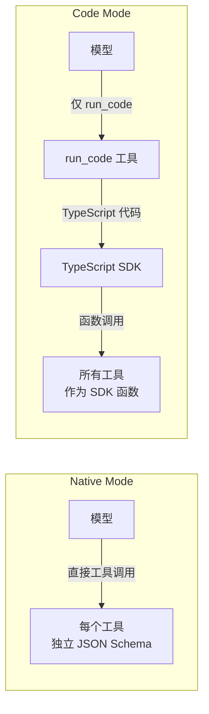
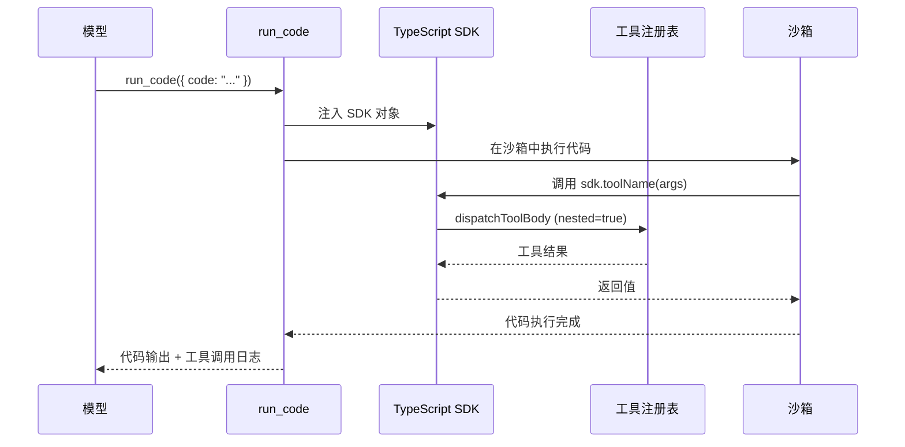

# 08 · Code Mode 机制

> **前置阅读**：[07 · 工具注册表与执行管道](/07-tool-registry-and-pipeline)
> **下一步**：[09 · 能力缝模式](/09-capability-seams-pattern)

## 学习目标

1. 理解 Code Mode 与 Native Mode 的区别
2. 掌握 `run_code` transport 的工作原理
3. 知道 TypeScript SDK 是如何从工具 schema 生成的
4. 理解 mode collapse 在工具执行中的作用
5. 能配置一个 Code Mode 的 profile

---

## 一、两种工具呈现模式

`dsh` 支持两种工具呈现模式（`ToolPresentationMode`）：



| 模式 | 模型调用方式 | 工具暴露方式 | 适用场景 |
|---|---|---|---|
| `native` | 每个工具独立 JSON 调用 | 独立 tool schema | 简单 agent、教学 |
| `code` | 仅调用 `run_code` | TypeScript SDK 函数 | 复杂编排、代码优先 |

---

## 二、Code Mode 的优势

### 2.1 为什么需要 Code Mode

`AGENTS.md` 提到 `dsh` 是 "code-first agent harness"。Code Mode 的优势：

1. **组合性**：模型可以编写循环、条件、错误处理逻辑
2. **类型安全**：TypeScript SDK 提供完整类型签名
3. **可读性**：代码比嵌套 JSON 调用更易理解
4. **调试性**：代码执行有明确的栈和错误

### 2.2 Code Mode 的限制

- 模型**只能直接调用** `run_code`
- 其他工具调用会被 **mode collapse** 拒绝
- 工具通过 SDK 函数在代码内调用

---

## 三、run_code Transport

### 3.1 run_code 工具

**文件**：`packages/core/tools/src/index.ts`

`run_code` 是 Code Mode 下模型唯一能直接调用的工具。

```typescript
// packages/core/tools/src/index.ts:855-863
const CODE_ONLY_INSTRUCTION = 
  '`run_code` is the only tool you can call directly — ' +
  'a tool call naming any other tool fails. ' +
  'Reach every tool the SDK declares below from inside the program.'
```

### 3.2 run_code 的参数

```typescript
// 概念示意
const runCodeTool = defineTool({
  name: 'run_code',
  description: 'Execute TypeScript code with access to the tool SDK',
  parameters: {
    type: 'object',
    properties: {
      code: { type: 'string', description: 'TypeScript code to execute' }
    },
    required: ['code']
  },
  // ...
})
```

### 3.3 执行流程



### 3.4 nested 分发

注意上图中 `dispatchToolBody` 调用时 `nested=true`。这绕过了 mode collapse：

```typescript
// packages/core/tools/src/index.ts:1324-1326
private collapses(name: string, scope: ScopeKey | undefined, nested: boolean): boolean {
  return !nested && this.modeFor(scope) === 'code' && name !== RUN_CODE_NAME
}
```

- `nested: false`（模型直接调用）：`code` mode 下非 `run_code` 工具被 collapse
- `nested: true`（SDK 内调用）：不 collapse，允许调用任何工具

---

## 四、TypeScript SDK 生成

### 4.1 renderToolsSdk

**文件**：`packages/core/tools/src/ts-types.ts:273-293`

`renderToolsSdk` 从工具 schema 生成 TypeScript 类型声明：

```typescript
// packages/core/tools/src/ts-types.ts:273-293
export function renderToolsSdk(tools: ToolSchema[]): string {
  // 1. 收集所有工具的 schema
  // 2. 为每个工具生成 TypeScript 函数签名
  // 3. 生成完整的 SDK 声明
  return [
    '// Auto-generated tool SDK',
    'export interface ToolSdk {',
    ...tools.map(t => renderToolFunction(t)),
    '}',
    ''
  ].join('\n')
}
```

### 4.2 生成的 SDK 示例

假设注册了 `read` 和 `bash` 工具，生成的 SDK 类似：

```typescript
// Auto-generated tool SDK
export interface ToolSdk {
  /** Read a file from the filesystem.
   * @param path - Absolute path to the file
   * @param offset - Line number to start reading from (1-indexed)
   * @param limit - Maximum number of lines to read
   */
  read(args: {
    path: string
    offset?: number
    limit?: number
  }): Promise<{
    content: string
    lineCount: number
  }>

  /** Execute a bash command.
   * @param command - The command to execute
   * @param timeout - Timeout in milliseconds
   */
  bash(args: {
    command: string
    timeout?: number
  }): Promise<{
    stdout: string
    stderr: string
    exitCode: number
  }>
}
```

### 4.3 SDK section

```typescript
// packages/core/tools/src/index.ts:875-892
const sdkSection = {
  name: 'tools:sdk',
  order: ...,  // 在 per-tool guidance 之后
  render: (ctx) => {
    if (!isCodeMode(ctx)) return undefined  // 非 Code Mode 跳过
    const schemas = collectToolSchemas(ctx)
    return renderToolsSdk(schemas)
  }
}
```

SDK section 只在 Code Mode 下渲染，将生成的 SDK 注入系统提示。

---

## 五、Code Mode 配置

### 5.1 在 cordis.yml 中配置

```yaml
# examples/headless-agent/cordis.yml (示意)
plugins:
  '@deepseek-ai/dsh-tools':
    config:
      mode: code  # 启用 Code Mode
```

### 5.2 base bundle 的 patch

**文件**：`packages/bundle/base/cordis.patch.yml`

`base` bundle 是所有 profile 的共享基础。patch 替换整个 config 而非合并。

### 5.3 四个 shipped presets

| Preset | 用途 | 默认 mode |
|---|---|---|
| `minimal` | 最小可用 | `native` |
| `standard` | 标准配置 | `native` |
| `code` | Code Mode | `code` |
| `cordis` | 完整 Cordis | `code` |

---

## 六、Code Mode 的事件

### 6.1 tool/code-dispatch-start

```typescript
// packages/core/tools/src/types.ts:25-57
'tool/code-dispatch-start': {
  /** @mode emit */
  data: CodeDispatchStartEventData
}
```

代码分发开始时触发。

### 6.2 tool/code-dispatch

```typescript
'tool/code-dispatch': {
  /** @mode emit */
  data: CodeDispatchEventData
}
```

代码分发完成时触发，记录代码执行结果和工具调用日志。

---

## 七、Code Mode 与系统提示

### 7.1 Code Mode 的系统提示结构

在 Code Mode 下，系统提示包含：

1. **persona**（order 0-49）
2. **code-only collapse**（order 99）：声明 `run_code` 是唯一可直接调用的工具
3. **per-tool guidance**（order 100-199）：每个工具的使用指南
4. **tools:sdk**（order 后）：生成的 TypeScript SDK

### 7.2 模型看到的系统提示（简化）

```
You are a helpful assistant...

`run_code` is the only tool you can call directly — 
a tool call naming any other tool fails. 
Reach every tool the SDK declares below from inside the program.

## Tool guidance

### read
Read a file from the filesystem...

### bash
Execute a bash command...

## Tool SDK

// Auto-generated tool SDK
export interface ToolSdk {
  read(args: { path: string; offset?: number; limit?: number }): Promise<{ content: string; lineCount: number }>
  bash(args: { command: string; timeout?: number }): Promise<{ stdout: string; stderr: string; exitCode: number }>
}
```

---

## 八、Code Mode 的执行示例

### 8.1 模型生成的代码

模型可能生成如下代码：

```typescript
// 读取文件
const file = await sdk.read({ path: '/tmp/data.txt' })

// 解析内容
const lines = file.content.split('\n')
const results = []

// 循环处理每一行
for (const line of lines) {
  if (line.startsWith('TODO:')) {
    // 调用 bash 工具
    const result = await sdk.bash({ command: `echo "Processing: ${line}"` })
    results.push(result.stdout)
  }
}

// 返回结果
return { processed: results.length, output: results }
```

### 8.2 执行结果

`run_code` 返回：

- 代码的返回值
- 工具调用日志（每个 `sdk.toolName()` 调用）
- 标准 output（如果有 `console.log`）

---

## 九、Code Mode 的安全考虑

### 9.1 沙箱执行

代码在沙箱中执行，限制：

- 文件系统访问（通过 fs capability policy）
- 子进程执行（通过 subprocess capability）
- 网络访问（通过 web capability）

### 9.2 工具权限

Code Mode 不绕过工具权限：

- `pre-execute` waterfall 仍然运行
- guards 仍然检查
- approval 仍然需要（如果配置）

---

## 实战练习

1. **找到 run_code 工具**：打开 `packages/core/tools/src/index.ts`，找到 `RUN_CODE_NAME` 常量和 `run_code` 工具定义。

2. **追踪 SDK 生成**：打开 `packages/core/tools/src/ts-types.ts`，阅读 `renderToolsSdk`，理解它如何从 schema 生成 TypeScript。

3. **配置 Code Mode**：创建一个最小的 `cordis.yml`，启用 Code Mode，列出需要的最小插件集。

4. **理解 collapse**：在 `packages/core/tools/src/index.ts` 中找到 `collapses` 函数，说明 `nested: true` 和 `nested: false` 的区别。

---

## 关键源码定位

| 内容 | 位置 |
|---|---|
| ToolPresentationMode | `packages/core/tools/src/index.ts` |
| CODE_ONLY_INSTRUCTION | `packages/core/tools/src/index.ts:855-863` |
| sdkSection | `packages/core/tools/src/index.ts:875-892` |
| collapses 函数 | `packages/core/tools/src/index.ts:1324-1326` |
| renderToolsSdk | `packages/core/tools/src/ts-types.ts:273-293` |
| tool/code-dispatch 事件 | `packages/core/tools/src/types.ts:25-57` |
| base bundle patch | `packages/bundle/base/cordis.patch.yml` |
| headless-agent 示例 | `examples/headless-agent/cordis.yml` |

---

## 下一步

本文理解了 Code Mode 机制。下一篇 [09 · 能力缝模式](/09-capability-seams-pattern) 将讲解 Service Definition / Service Provider / Consumer 三角色模式。
