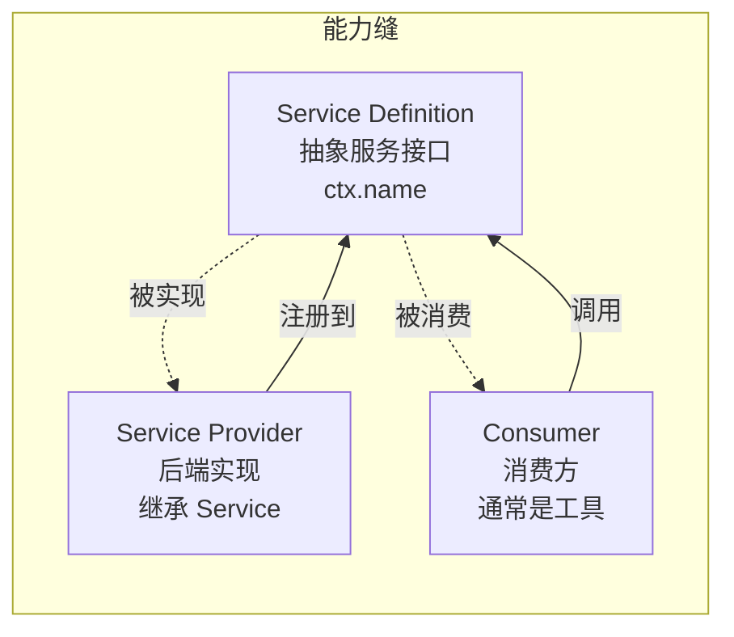
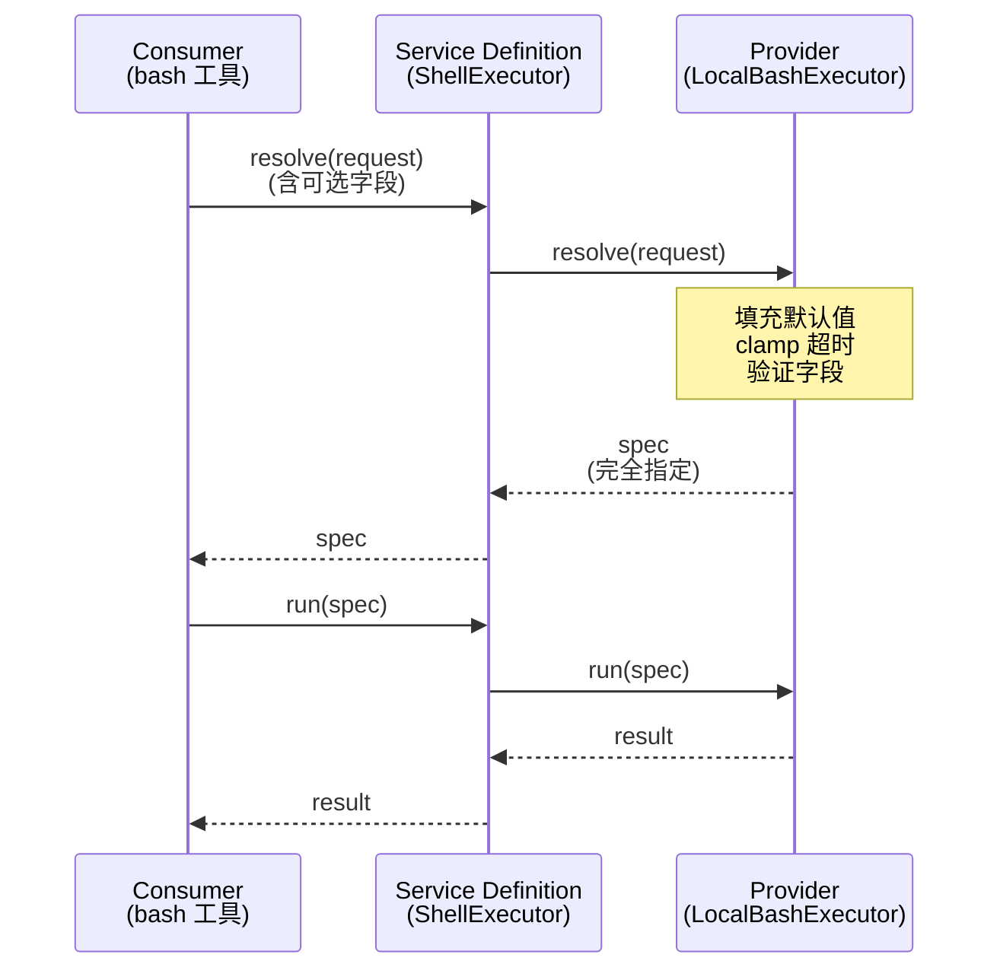
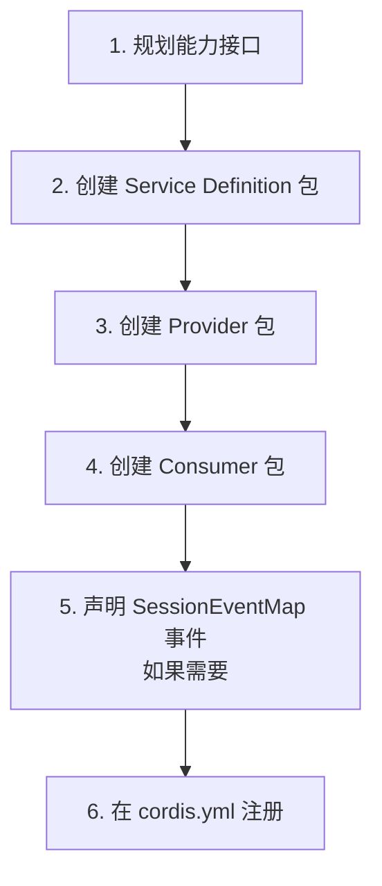

# 09 · 能力缝模式

> **前置阅读**：[08 · Code Mode 机制](/08-code-mode)
> **下一步**：[10 · LLM 能力与 DeepSeek 适配器](/10-llm-and-deepseek-adapter)

## 学习目标

1. 理解能力缝（capability seam）的三角色模式
2. 掌握 Service Definition / Service Provider / Consumer 的职责划分
3. 知道 `dsh` 中 10 个能力缝的完整布局
4. 理解 request/spec split 模式（以 shell 为模板）
5. 能设计一个新的能力缝

---

## 一、什么是能力缝

### 1.1 定义

**来源**：`docs/glossary.md:7-9`

能力缝（capability seam）= 一个可交换能力的**完整三角色组合**：



### 1.2 三角色职责

| 角色 | 职责 | 文件位置 | 示例 |
|---|---|---|---|
| **Service Definition** | 声明抽象服务接口，拥有 `ctx.<key>` | `packages/<group>/<capability>/src/` | `ShellExecutor extends Service` |
| **Service Provider** | 继承 Service Definition，实现后端 | `packages/<group>/<capability>-<provider>/src/` | `LocalBashExecutor` |
| **Consumer** | 通过 `ctx.<key>` 调用能力 | `packages/<group>/tool-<capability>/src/` | `bash` 工具 |

### 1.3 AGENTS.md 规则

> **A capability seam comprises Service Definition / Service Provider / Consumer roles.** It is complete, never one role; split only when roles evolve independently.

即：能力缝**必须完整**，不能只有一两个角色；只有当角色**独立演化**时才拆分到不同包。

---

## 二、10 个能力缝总览

| 能力缝 | ctx 键 | Service Definition | Provider 示例 | Consumer |
|---|---|---|---|---|
| **shell** | `ctx.shell` | `ShellExecutor` | `LocalBashExecutor` | `bash` 工具 |
| **subprocess** | `ctx.subprocess` | `SubprocessRuntime` | `LocalSubprocessRuntime` | （间接，shell/fs） |
| **fs** | `ctx.fs` | `FileSystem` | `LocalFileSystem` | `read`/`write`/`edit` 工具 |
| **llm** | `ctx.llm` | `LlmRuntime` | `DeepSeekAdapter` | `agent-loop` |
| **web** | `ctx.web` | `WebRuntime` | `web-search-deepseek` | `web_search`/`web_fetch` 工具 |
| **lsp** | `ctx.lsp` | `Lsp` | `lsp-stdio` | `lsp` 工具 |
| **compaction** | `ctx.compaction` | `CompactionEngine` | `compaction-basic` | `/compact` 命令 |
| **subagent** | `ctx.subagents` | `SubagentRuntime` | `subagent-spawn-in-process` | `subagent` 工具 |
| **workflow** | `ctx.workflowEngine` | `WorkflowEngine` | `workflow-worker-thread` | `workflow` 工具 |
| **skill** | `ctx.skills` | `SkillService` | `skill-filesystem` | `skill` 工具 |

---

## 三、Service Definition 模式

### 3.1 抽象类继承 Service

```typescript
// packages/shell/shell/src/index.ts:65-101
export abstract class ShellExecutor extends Service {
  constructor(ctx: Context) { super(ctx, 'shell') }  // 注册为 ctx.shell
  
  get sandboxMode(): SandboxMode | undefined { return undefined }
  
  abstract resolve(request: ShellExecRequest): ShellExecSpec   // 行 85
  abstract run(spec: ShellExecSpec): Promise<ShellRunResult>   // 行 93
  abstract start(spec: ShellExecSpec): ShellProcess            // 行 100
}
```

### 3.2 关键特征

1. **继承 `Service`**：Cordis 的 `Service` 基类，构造时注册 `ctx.<name>`
2. **抽象方法**：定义 Provider 必须实现的接口
3. **可选方法**：提供默认实现（如 `sandboxMode` 返回 `undefined`）
4. **无 Config**：Service Definition 本身通常无 Config，各 Provider 自定义

### 3.3 FS Service Definition 示例

```typescript
// packages/fs/fs/src/index.ts:86-250
export abstract class FileSystem extends Service {
  constructor(ctx: Context) { super(ctx, 'fs') }
  
  get sandboxMode(): SandboxMode | undefined { return undefined }  // 行 103
  abstract resolve(path, opts?): Promise<FsTarget>                 // 行 116
  abstract stat(target, signal?): Promise<FsInfo | undefined>      // 行 152
  abstract readText(target, signal?): Promise<string>              // 行 176
  abstract writeText(target, content, expected?, signal?, sandboxPolicy?): Promise<FsWriteOutcome>  // 行 222
  abstract editText(target, edit, expected?, signal?, sandboxPolicy?): Promise<FsEditOutcome>      // 行 243
  // ... 更多方法
}
```

---

## 四、Service Provider 模式

### 4.1 继承 Service Definition

```typescript
// packages/shell/bash-local/src/index.ts:102-137
export class LocalBashExecutor extends ShellExecutor {
  static inject = ['subprocess']                              // 行 103，依赖其他能力
  static Config: z<Config> = z.object({                       // 行 105-112
    cwd: z.string(),
    timeoutMs: z.number().default(120_000),
    maxTimeoutMs: z.number().default(600_000),
    maxOutputBytes: z.number().default(64_000),
    // ...
  })
  
  // 实现 resolve()
  resolve(request: ShellExecRequest): ShellExecSpec { ... }
  
  // 实现 run()
  run(spec: ShellExecSpec): Promise<ShellRunResult> { ... }
  
  // 实现 start()
  start(spec: ShellExecSpec): ShellProcess { ... }
}
```

### 4.2 关键特征

1. **`static inject`**：声明依赖的其他能力（如 `['subprocess']`）
2. **`static Config`**：Provider 自己的配置 schema（zod）
3. **实现所有抽象方法**：提供具体后端逻辑
4. **通过 `ctx.effect()` 注册**：注册为插件

### 4.3 Sandbox Provider 继承

```typescript
// packages/shell/bash-sandbox/src/index.ts:44
export class SandboxBashExecutor extends LocalBashExecutor {
  static override inject = ['subprocess', 'sandbox', 'sandboxPolicy']  // 行 45
  
  override get sandboxMode(): SandboxMode | undefined {
    return this.ctx.sandboxPolicy.defaultMode  // 行 75-77
  }
  
  override resolve(request: ShellExecRequest): ShellExecSpec {
    // stamp 默认 policy（行 84-86）
  }
  
  // run()/start() 通过 ctx.sandbox.confine() 包装 argv
}
```

---

## 五、Consumer 模式

### 5.1 通过 ctx 调用能力

```typescript
// packages/shell/tool-bash/src/index.ts:31
export const inject = ['tools', 'shell', 'systemPrompt', 'shellEnv']

// 行 380-383 — request/spec split 调用
const result = await ctx.shell.run(ctx.shell.resolve({
  ...request,
  signal: exec.signal,
}))
```

### 5.2 关键特征

1. **`inject` 声明依赖**：包含 Service Definition 的 ctx 键
2. **通过 `ctx.<name>` 调用**：不直接引用 Provider
3. **通常是 model-facing 工具**：注册到 `ctx.tools`

---

## 六、Request/Spec Split 模式

### 6.1 概念

**AGENTS.md 规则**：

> **Explicit > implicit at package boundaries**: defaulting is an explicit `resolve(request): Spec` step in the owning implementation, never a hidden `?? default` inside `run()` (the `dsh-shell` request/spec split is the template).

### 6.2 模式结构



### 6.3 shell 的 resolve 实现

```typescript
// packages/shell/bash-local/src/index.ts:146-171
resolve(request: ShellExecRequest): ShellExecSpec {
  const timeoutMs = clampTimeout(
    request.timeoutMs, this.config.timeoutMs, this.config.maxTimeoutMs, 'bash-local: request.timeoutMs')
  const stdoutMaxBytes = request.stdoutMaxBytes ?? this.config.maxOutputBytes
  return {
    command: request.command,
    workdir: request.workdir ?? this.config.cwd ?? process.cwd(),  // 默认值
    timeoutMs,                                                      // 已 cap
    stdoutMaxBytes,
    ...request.signal ? { signal: request.signal } : {},
    ...request.stdin !== undefined ? { stdin: request.stdin } : {},
    ...request.env !== undefined ? { env: request.env } : {},
    ...request.dshEnv !== undefined ? { dshEnv: request.dshEnv } : {},
    sandboxPolicy: request.sandboxPolicy,  // 透传
  }
}
```

### 6.4 为什么需要 request/spec split

1. **显式默认值**：默认值在 `resolve()` 中明确填充，不在 `run()` 中隐藏
2. **验证时机**：在 `resolve()` 阶段验证和 clamp，`run()` 收到的是合法 spec
3. **可测试**：可以单独测试 `resolve()` 的默认值逻辑
4. **可替换**：不同 Provider 可以有不同的默认值策略

### 6.5 subprocess 的引用

```typescript
// packages/subprocess/subprocess/src/types.ts:70-73
// 注释：this seam applies no defaults... 
// the `dsh-shell` request/spec split is the owning template
```

subprocess 明确引用 shell 为模板，但**seam 本身不应用默认值**——所有部署相关选择在 caller 的 config。

---

## 七、能力缝与 Session 事件

### 7.1 哪些能力缝声明 SessionEventMap 事件

| 能力缝 | 声明 SessionEventMap 事件 | 事件示例 |
|---|---|---|
| **llm** | 是 | `llm/stream`（waterfall）、`llm/adapters-updated`（emit） |
| **compaction** | 是 | `compaction/start`、`compaction/summary`、`compaction/prune`、`compaction/end` |
| **subagent** | 是 | `subagent/start`、`subagent/end` |
| **workflow** | 是 | `workflow/start`、`workflow/phase`、`workflow/narration`、`workflow/agent-start`、`workflow/agent-end`、`workflow/end` |
| **shell** | **否** | 通过 `tool/call`/`tool/result` 进入 session log |
| **subprocess** | **否** | 底层能力，不直接产生 session log |
| **fs** | **否** | 使用 cordis `Events`（`fs/write-intent` 等），非 session log |

### 7.2 cordis Events vs SessionEventMap

| 特征 | cordis `Events` | `SessionEventMap` |
|---|---|---|
| 作用域 | 进程内事件总线 | 持久化会话日志 |
| 持久化 | 否 | 是（durable） |
| 重建 | 不可重建 | 可从日志重建 |
| 示例 | `fs/write-intent`、`fs/observed` | `tool/call`、`llm/stream` |

**关键**：能力缝的**模型可见输出**必须通过 `SessionEventMap` 事件进入 session log（"Model-visible ⟺ logged" 原则）。

---

## 八、设计新能力缝

### 8.1 步骤



### 8.2 Service Definition 模板

```typescript
// packages/mygroup/mycapability/src/index.ts
import { Service, Context } from '@deepseek-ai/cordis'

export abstract class MyCapability extends Service {
  constructor(ctx: Context) { super(ctx, 'myCapability') }
  
  abstract resolve(request: MyRequest): MySpec
  abstract run(spec: MySpec): Promise<MyResult>
}
```

### 8.3 Provider 模板

```typescript
// packages/mygroup/mycapability-local/src/index.ts
import { MyCapability } from '@deepseek-ai/dsh-mycapability'

export const name = 'mycapability-local'
export const inject = ['myCapability']  // 或更多依赖

export class LocalMyCapability extends MyCapability {
  static Config = z.object({
    defaultValue: z.string().default('hello'),
  })
  
  resolve(request: MyRequest): MySpec { ... }
  async run(spec: MySpec): Promise<MyResult> { ... }
}

export function apply(ctx: Context) {
  ctx.effect(() => {
    // 注册 provider
  }, 'mycapability-local')
}
```

### 8.4 Consumer 模板

```typescript
// packages/mygroup/tool-mycapability/src/index.ts
import { defineTool } from '@deepseek-ai/dsh-tools'

export const name = 'tool-mycapability'
export const inject = ['tools', 'myCapability']

export function apply(ctx: Context) {
  const myTool = defineTool({
    name: 'my_tool',
    description: '...',
    parameters: { ... },
    output: { ... },
    async execute(args, exec) {
      const spec = ctx.myCapability.resolve({ ...args })
      const result = await ctx.myCapability.run(spec)
      return { value: result }
    }
  })
  ctx.tools.register(myTool)
}
```

---

## 实战练习

1. **追踪 shell 能力缝**：打开以下三个文件，理解三角色关系：
   - `packages/shell/shell/src/index.ts`（Service Definition）
   - `packages/shell/bash-local/src/index.ts`（Provider）
   - `packages/shell/tool-bash/src/index.ts`（Consumer）

2. **分析 request/spec split**：在 `packages/shell/bash-local/src/index.ts:146-171` 中，列出 `resolve()` 填充的每个默认值。

3. **对比 sandbox provider**：打开 `packages/shell/bash-sandbox/src/index.ts`，说明它如何继承 `LocalBashExecutor` 并添加沙箱逻辑。

---

## 关键源码定位

| 内容 | 位置 |
|---|---|
| 能力缝定义 | `docs/glossary.md:7-9` |
| 能力缝规则 | `packages/AGENTS.md` |
| ShellExecutor | `packages/shell/shell/src/index.ts:65-101` |
| LocalBashExecutor | `packages/shell/bash-local/src/index.ts:102-137` |
| shell resolve 实现 | `packages/shell/bash-local/src/index.ts:146-171` |
| shell Consumer 调用 | `packages/shell/tool-bash/src/index.ts:380-383` |
| SubprocessRuntime | `packages/subprocess/subprocess/src/index.ts:102-140` |
| subprocess 引用 shell 模板 | `packages/subprocess/subprocess/src/types.ts:70-73` |
| FileSystem | `packages/fs/fs/src/index.ts:86-250` |
| LlmRuntime | `packages/llm/llm/src/index.ts:284-928` |
| CompactionEngine | `packages/compaction/compaction/src/index.ts` |
| SubagentRuntime | `packages/subagent/subagent/src/index.ts` |
| WorkflowEngine | `packages/workflow/workflow/src/index.ts` |
| SkillService | `packages/skill/skill/src/index.ts` |

---

## 下一步

本文理解了能力缝模式。下一篇 [10 · LLM 能力与 DeepSeek 适配器](/10-llm-and-deepseek-adapter) 将深入讲解 LLM Service Definition 和 DeepSeek provider 的实现。
