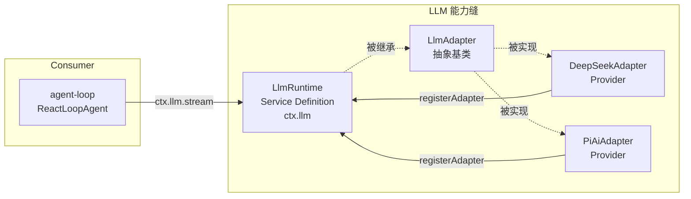

# 10 · LLM 能力与 DeepSeek 适配器

> **前置阅读**：[09 · 能力缝模式](/09-capability-seams-pattern)
> **下一步**：[11 · Shell 与 Subprocess 能力](/11-shell-and-subprocess)

## 学习目标

1. 掌握 LLM Service Definition 的完整接口
2. 理解 `LlmAdapter` 抽象类与 `StreamChunk` 协议
3. 知道 `BlockAssembler` 如何将 chunk 组装为 message
4. 理解 DeepSeek provider 的 SSE 流式实现
5. 能注册一个自定义 LLM adapter

---

## 一、LLM 能力缝概览



---

## 二、LlmRuntime Service Definition

### 2.1 核心类

**文件**：`packages/llm/llm/src/index.ts:284-928`

```typescript
export abstract class LlmRuntime extends Service {
  constructor(ctx: Context) { super(ctx, 'llm') }
  // ...
}
```

### 2.2 核心方法

| 方法 | 行号 | 作用 |
|---|---|---|
| `registerAdapter(providers, adapter)` | 338-367 | 注册 adapter 到 provider 路由 |
| `registerConfigurableProviders(entries)` | 431-484 | 声明可配置 provider 目录 |
| `registerModelDiscovery(settingsNs, discover)` | 504-521 | 注册模型发现回调 |
| `discoverModels(settingsNs, request)` | 532-559 | 查询 provider 端点广告的模型 |
| `listProviders()` | 419-421 | 列出已注册 provider 路由 |
| `listModels(provider)` | 581-608 | 列出某 provider 的模型 |
| `resolveModelInfo(provider, model, signal?)` | 619-625 | 解析精确模型元数据 |
| `resolveCallConfig(config, signal?)` | 730-732 | 校验 call config |
| `prepareCall(config, signal?)` | 779-814 | 返回 `PreparedLlmCall` |
| `stream(options)` | 913-915 | 流式模型调用入口 |

### 2.3 PreparedLlmCall

```typescript
// packages/llm/llm/src/index.ts:155-172
// 一次性 dispatch 句柄，绑定 registration
interface PreparedLlmCall {
  config: LlmCallConfig
  retryPolicy: ResolvedRetryPolicy | undefined
  context?: unknown
  adapterDefaults: unknown
  stream(options: GenerateOptions): AsyncIterable<StreamChunk>  // 一次性
}
```

**关键**：`PreparedLlmCall` 是一次性的，`dispatched` 标志防止重用。

### 2.4 注册的 SessionEventMap 事件

```typescript
// packages/llm/llm/src/types.ts:23
'llm/adapters-updated': { ... }  // emit，provider 拓扑变化通知

// packages/llm/llm/src/index.ts:64
'llm/stream': { ... }  // waterfall，围绕每次流式模型调用
```

**`llm/stream` waterfall**：listener 必须调 `next()` 委托到 adapter stream。

---

## 三、LlmAdapter 抽象类

### 3.1 接口

**文件**：`packages/llm/llm/src/index.ts:180-233`

```typescript
export abstract class LlmAdapter {
  providerInfo(provider): LlmProviderInfo { return { id, name: provider } }
  providerRetryPolicy(provider): ResolvedRetryPolicy | undefined { return undefined }
  listModels(provider): Promise<readonly LlmModelInfo[]> { return [] }
  resolveModel(provider, model, signal?): Promise<LlmResolvedModelInfo> { ... }
  
  abstract stream(options: GenerateOptions): AsyncIterable<StreamChunk>  // 唯一必需方法
}
```

### 3.2 StreamChunk 协议

**文件**：`packages/llm/llm/src/types.ts:291-303`

```typescript
type StreamChunk =
  | { type: 'block-start'; index: number; blockType: ContentBlockType }
  | { type: 'text-delta'; index: number; text: string }
  | { type: 'reasoning-delta'; index: number; text: string }
  | { type: 'tool-call-delta'; index: number; id: CallId; name?: string; argumentsDelta: string }
  | { type: 'block-end'; index: number; block: ContentBlock }
  | { type: 'usage'; usage: TokenUsage }
  | { type: 'finish'; reason: FinishReason; replayState?: unknown }
```

### 3.3 ContentBlock

```typescript
// packages/llm/llm/src/types.ts:99-110
// merge-extensible
type ContentBlock =
  | { type: 'text'; text: string }
  | { type: 'reasoning'; text: string }
  | { type: 'image'; ... }
  | { type: 'tool-call'; ... }
  | { type: 'tool-result'; ... }
```

### 3.4 Message

**文件**：`packages/llm/llm/src/message.ts:129-138`

```typescript
interface Message {
  readonly id: MessageId
  readonly role: 'system' | 'user' | 'assistant'
  readonly content: ContentBlock[]
  readonly source: MessageSource  // user | plugin | model | tool
}
```

特化：
- `UserMessage`（`message.ts:141`）
- `AssistantMessage`（`message.ts:146-149`，`source: ModelMessageSource`）
- `ToolResultMessage`（`message.ts:152-156`，`content: [ToolResultBlock]`）

### 3.5 FinishReason

```typescript
// packages/llm/llm/src/types.ts:116-125
type FinishReason =
  | { kind: 'stop' }
  | { kind: 'tool-calls' }
  | { kind: 'max-tokens' }
  | { kind: 'aborted'; failure: ... }
  | { kind: 'error'; failure: ... }
```

### 3.6 TokenUsage

```typescript
// packages/llm/llm/src/types.ts:135-141
interface TokenUsage {
  inputTokens: number   // DISJOINT（cache 单独计）
  outputTokens: number
  cacheReadTokens?: number
  cacheWriteTokens?: number
  reasoningTokens?: number
}
```

---

## 四、BlockAssembler

### 4.1 作用

**文件**：`packages/llm/llm/src/assembler.ts:36-164`

`BlockAssembler` 将 `StreamChunk` 流增量组装为 `AssistantMessage`。这是 agent-loop 的**唯一组装算法**。

### 4.2 push(chunk)

```typescript
// packages/llm/llm/src/assembler.ts:47-94
push(chunk: StreamChunk): void {
  switch (chunk.type) {
    case 'block-start':  // 创建 partial block（行 49-58）
    case 'text-delta':   // 累积 text（行 60-66），已 closed 的 block 忽略 straggler
    case 'reasoning-delta':  // 累积 reasoning text
    case 'tool-call-delta':  // 累积 id/name/arguments（行 67-74）
    case 'block-end':   // 设 authoritative block，first close wins（行 75-82）
    case 'usage':       // 缓存（行 83-91）
    case 'finish':      // 缓存
  }
}
```

### 4.3 blocks()

```typescript
// packages/llm/llm/src/assembler.ts:134-139
blocks(): ContentBlock[] {
  // 按 stream order 组装
  // max-tokens finish 时丢弃 tool-call block
}
```

### 4.4 容错机制

- **delta-only protocols**：容忍无 `block-start`/`block-end` 的协议
- **closed block 的 straggler delta**：被忽略
- **max-tokens**：丢弃 `tool-call` block（不完整的工具调用）

---

## 五、DeepSeek Provider 实现

### 5.1 包结构

```
packages/llm/llm-deepseek/src/
├── index.ts       # provider 注册插件
├── adapter.ts     # DeepSeekAdapter extends LlmAdapter
├── translate.ts   # wire chunk → StreamChunk 映射
├── serialize.ts   # Message → WireMessage 序列化
├── sse.ts         # SSE 字节流解析
└── types.ts       # wire 格式类型
```

### 5.2 DeepSeekAdapter

**文件**：`packages/llm/llm-deepseek/src/adapter.ts:158-345`

```typescript
export class DeepSeekAdapter extends LlmAdapter {
  // 构造（行 159-161）
  constructor(options: DeepSeekAdapterOptions) { ... }
  
  // providerInfo（行 163-165）
  providerInfo(provider) { return { id: provider, name: 'DeepSeek' } }
  
  // resolveModel（行 175-212）
  resolveModel(provider, model, signal?) {
    // 从 catalog 查找，返回 contextWindow/defaultMaxTokens/reasoning.efforts
  }
  
  // stream（行 214-269）—— 核心流式入口
  async *stream(options: GenerateOptions): AsyncIterable<StreamChunk> {
    // 1. 每次调用重新 resolve connection facts + apiKey（行 220-222）
    //    in-flight stream 不受配置变化影响
    // 2. 组合 abort signal + idle watchdog（行 223-227，默认 300s）
    // 3. 通过 watchdog.next(iterator) 驱动 request() generator
    // 4. 错误分类（行 246-258）
    // 5. finally：abort consumer + 关闭 iterator
  }
  
  // request（行 271-345）—— 私有
  private async *request(options): AsyncIterable<StreamChunk> {
    // 1. serializeRequest()
    // 2. 构建 headers（Authorization, attribution, user-id, session-id）
    // 3. fetch(`${baseURL}/chat/completions`, ...)
    // 4. 非 2xx 处理：httpErrorCode() 映射
    // 5. yield* translate(parseSse(response.body, onComment))
  }
}
```

### 5.3 错误分类

```typescript
// packages/llm/llm-deepseek/src/adapter.ts:138-149
function httpErrorCode(status, detail): string {
  if (status === 401 || status === 403) return 'AUTH'
  if (isQuotaExceededError(detail)) return QUOTA_EXCEEDED_CODE
  if (status === 429) return 'RATE_LIMIT'
  if (status === 400) {
    if (isContextWindowExceededError(detail)) return CONTEXT_WINDOW_EXCEEDED_CODE
    return 'INVALID_REQUEST'
  }
  if (status >= 500) return 'SERVER'
  return `HTTP_${status}`
}
```

### 5.4 translate.ts — wire → StreamChunk

**文件**：`packages/llm/llm-deepseek/src/translate.ts:86-185`

```typescript
async function* translate(payloads): AsyncIterable<StreamChunk> {
  // 状态：nextIndex, textBlock, reasoningBlock, toolBlocks Map, pendingFinish, pendingUsage
  
  for await (const payload of payloads) {
    if (payload === '[DONE]') {
      // flush 所有 block-end → usage → finish
      // 空响应检测：stop finish + 0 blocks → EMPTY_RESPONSE error
      return
    }
    
    // JSON parse 失败 → MALFORMED_RESPONSE
    
    for (const choice of payload.choices) {
      const delta = choice.delta
      
      // reasoning_content（行 132-140）
      if (delta.reasoning_content) {
        // emit block-start + reasoning-delta
      }
      
      // content（行 142-150）
      if (delta.content) {
        // emit block-start + text-delta
      }
      
      // tool_calls（行 152-170）
      if (delta.tool_calls) {
        // 按 call.index 复用 block
        // emit block-start + tool-call-delta
      }
      
      // finish_reason（行 172-174）
      if (choice.finish_reason) {
        pendingFinish = mapFinishReason(choice.finish_reason)
      }
    }
    
    // usage（行 179）
    if (payload.usage) {
      pendingUsage = mapUsage(payload.usage)
    }
  }
  
  // 流末无 [DONE] → STREAM_CLOSED
}
```

### 5.5 mapFinishReason

```typescript
// packages/llm/llm-deepseek/src/translate.ts:31-43
function mapFinishReason(reason): FinishReason {
  switch (reason) {
    case 'stop': return { kind: 'stop' }
    case 'tool_calls': return { kind: 'tool-calls' }
    case 'length': return { kind: 'max-tokens' }
    default: return { kind: 'error', failure: { message: `model stopped: ${reason}`, code: reason.toUpperCase() } }
  }
}
```

### 5.6 mapUsage — cache 计数

```typescript
// packages/llm/llm-deepseek/src/translate.ts:53-62
function mapUsage(usage): TokenUsage {
  // DeepSeek prompt_tokens 含 cache hit，需减去得到 disjoint inputTokens
  const cacheRead = usage.prompt_tokens_details?.cached_tokens ?? usage.prompt_cache_hit_tokens
  return {
    inputTokens: usage.prompt_tokens - (cacheRead ?? 0),  // 减去 cache
    outputTokens: usage.completion_tokens,
    ...cacheRead !== undefined ? { cacheReadTokens: cacheRead } : {},
    ...reasoning !== undefined ? { reasoningTokens: reasoning } : {},
  }
}
```

### 5.7 serialize.ts — Message → WireMessage

**文件**：`packages/llm/llm-deepseek/src/serialize.ts`

```typescript
// serializeRequest()（行 151-187）
function serializeRequest(options, defaults): WireRequest {
  return {
    model: options.model,
    messages: [system, ...serializeMessages(options.messages)],
    stream: true,
    stream_options: { include_usage: true },
    // 可选：thinking, reasoning_effort, tools, temperature, max_tokens, stop
  }
}

// serializeAssistant()（行 71-102）
function serializeAssistant(message): WireAssistantMessage {
  return {
    role: 'assistant',
    content: text ?? '',  // 空字符串而非 null（行 95）
    // null 会被某些 gateway 拒绝，且会 brick 后续 turn
    ...reasoning ? { reasoning_content: reasoning } : {},  // 仅在 tool-call turn 回传
    ...toolCalls ? { tool_calls: toolCalls } : {},
  }
}
```

**关键**：
- `content` 空字符串而非 `null`（某些 gateway 拒绝 null）
- `reasoning_content` 仅在 tool-call turn 回传（省 token）

### 5.8 sse.ts — SSE 解析

```typescript
// packages/llm/llm-deepseek/src/sse.ts:28-39
async function* parseSse(stream, onComment?): AsyncIterable<string> {
  // 用 eventsource-parser 的 EventSourceParserStream 处理 framing
  // yield 每个 event 的 data
  // [DONE] 后 return
  // EOF 前无 [DONE] → STREAM_CLOSED
  // comment 通过 onComment 回调（用于 watchdog pulse）
}
```

---

## 六、Provider 注册插件

### 6.1 index.ts

**文件**：`packages/llm/llm-deepseek/src/index.ts`

```typescript
export const name = 'llm-deepseek'
export const inject = ['llm']  // 行 41-42

const PROVIDER = 'deepseek-official'  // 行 47

export const Config = z.object({  // 行 62-81
  apiKeyEnv: z.string().default('DEEPSEEK_API_KEY'),
  baseURL: z.string().optional(),
  thinking: z.enum(['disabled', 'enabled']).optional(),
  reasoningEffort: z.enum(['off', 'high', 'max']).optional(),
  maxTokens: z.number().optional(),
  defaultContextWindow: z.number().optional(),
  models: z.record(...).optional(),
  streamIdleTimeoutMs: z.number().optional(),
  retryPolicy: z.object(...).optional(),
})

export function apply(ctx: Context) {
  // 1. options() thunk（行 204-222）：缓存 last good config
  // 2. resolveApiKey()（行 225-246）：优先 ctx.get('credentials')，否则 ambient env
  // 3. registerConfigurableProviders()（行 251-253）
  // 4. registerAdapter([PROVIDER], adapter)（行 256）
  // 5. ensureRegistrationFacts()（行 258-268）：retry policy 变化时原子重注册
  // 6. installSettingsSection()（行 270-275）
}
```

### 6.2 resolveAdapterOptions

```typescript
// packages/llm/llm-deepseek/src/index.ts:161-198
// 唯一显式 resolve 步骤
// baseURL fallback 顺序：config → $DEEPSEEK_BASE_URL → PUBLIC_BASE_URL
```

---

## 七、agent-loop 如何调用 LLM

### 7.1 ReactLoopAgent.step()

**文件**：`packages/core/agent-loop/src/agent.ts:332-401`

```typescript
async step(signal): Promise<StepResult> {
  // 1. 构建请求（行 340-342）
  const { request, preparedCall } = this.buildRequest()
  
  // 2. 创建 assembler（行 343）
  const assembler = new BlockAssembler()
  
  // 3. 获取 stream（行 345）
  const stream = preparedCall?.stream(request) ?? this.loopCtx.llm.stream(request)
  
  // 4. 消费 chunk（行 347-351）—— 双写
  for await (const chunk of stream) {
    signal.throwIfAborted()
    chunkSeqs.push(this.session.append('assistant/chunk', { turn, step, chunk }).seq)
    assembler.push(chunk)  // 既入 session log 又入 assembler
  }
  
  // 5. 处理 finish（行 353-371）
  // error/aborted → 触发 agent/request-error waterfall，可 retry
  
  // 6. 组装 message（行 373-390）
  const message = createAssistantMessage({
    content: assembler.blocks(),
    source: { provider: request.provider, model: request.model },
  })
  this.session.append('assistant/message', { turn, step, message, ...usage }, { surfaceOp: 'append', sourceEventSeqs: chunkSeqs })
  
  // 7. 执行 tool calls（行 393-399）
  return this.executeToolCalls(message, turn, step, signal)
}
```

### 7.2 buildRequest()

```typescript
// packages/core/agent-loop/src/agent.ts:407-459
buildRequest(): { request, preparedCall } {
  // 1. 从 session 恢复 persisted config
  // 2. 构造 seedConfig
  // 3. 经 agent/request waterfall 得到 proposedConfig
  // 4. prepareCall：
  preparedCall = await this.loopCtx.llm.prepareCall(proposedConfig, signal)
  // 捕获 NO_ADAPTER（middleware 可能服务未注册路由）
}
```

---

## 八、注册自定义 LLM Adapter

### 8.1 示例

```typescript
// packages/llm/llm-myprovider/src/index.ts
import { LlmAdapter } from '@deepseek-ai/dsh-llm'

export const name = 'llm-myprovider'
export const inject = ['llm']

const PROVIDER = 'my-provider'

export class MyAdapter extends LlmAdapter {
  async *stream(options): AsyncIterable<StreamChunk> {
    // 1. 调用你的 API
    const response = await fetch('https://api.myprovider.com/v1/chat', { ... })
    
    // 2. 解析响应并 emit StreamChunk
    yield { type: 'block-start', index: 0, blockType: 'text' }
    yield { type: 'text-delta', index: 0, text: 'Hello' }
    yield { type: 'block-end', index: 0, block: { type: 'text', text: 'Hello' } }
    yield { type: 'usage', usage: { inputTokens: 10, outputTokens: 1 } }
    yield { type: 'finish', reason: { kind: 'stop' } }
  }
}

export function apply(ctx: Context) {
  ctx.llm.registerAdapter([PROVIDER], new MyAdapter())
}
```

### 8.2 在 cordis.yml 中使用

```yaml
plugins:
  '@deepseek-ai/dsh-llm-myprovider':
    config:
      apiKey: '...'
      baseURL: 'https://api.myprovider.com'
```

---

## 实战练习

1. **追踪 StreamChunk 流**：从 `DeepSeekAdapter.stream()` 到 `BlockAssembler.push()`，画出完整的 chunk 流转路径。

2. **理解空响应检测**：在 `translate.ts:110-115` 中，说明什么条件下会触发 `EMPTY_RESPONSE`。

3. **分析 cache 计数**：在 `translate.ts:53-62` 中，说明为什么 `inputTokens` 要减去 `cacheRead`。

4. **理解 reasoning passback**：在 `serialize.ts:99` 中，说明为什么 `reasoning_content` 仅在 tool-call turn 回传。

---

## 关键源码定位

| 内容 | 位置 |
|---|---|
| LlmRuntime | `packages/llm/llm/src/index.ts:284-928` |
| LlmAdapter | `packages/llm/llm/src/index.ts:180-233` |
| PreparedLlmCall | `packages/llm/llm/src/index.ts:155-172` |
| StreamChunk | `packages/llm/llm/src/types.ts:291-303` |
| ContentBlock | `packages/llm/llm/src/types.ts:99-110` |
| Message | `packages/llm/llm/src/message.ts:129-138` |
| FinishReason | `packages/llm/llm/src/types.ts:116-125` |
| TokenUsage | `packages/llm/llm/src/types.ts:135-141` |
| BlockAssembler | `packages/llm/llm/src/assembler.ts:36-164` |
| DeepSeekAdapter | `packages/llm/llm-deepseek/src/adapter.ts:158-345` |
| httpErrorCode | `packages/llm/llm-deepseek/src/adapter.ts:138-149` |
| translate | `packages/llm/llm-deepseek/src/translate.ts:86-185` |
| mapFinishReason | `packages/llm/llm-deepseek/src/translate.ts:31-43` |
| mapUsage | `packages/llm/llm-deepseek/src/translate.ts:53-62` |
| serializeRequest | `packages/llm/llm-deepseek/src/serialize.ts:151-187` |
| serializeAssistant | `packages/llm/llm-deepseek/src/serialize.ts:71-102` |
| parseSse | `packages/llm/llm-deepseek/src/sse.ts:28-39` |
| provider 注册 | `packages/llm/llm-deepseek/src/index.ts` |
| agent-loop step | `packages/core/agent-loop/src/agent.ts:332-401` |
| buildRequest | `packages/core/agent-loop/src/agent.ts:407-459` |

---

## 下一步

本文理解了 LLM 能力与 DeepSeek 适配器。下一篇 [11 · Shell 与 Subprocess 能力](/11-shell-and-subprocess) 将讲解 shell 和 subprocess 能力缝的实现。
