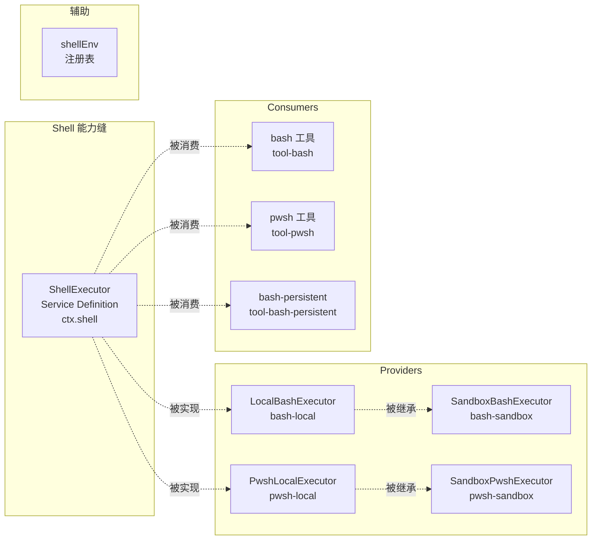
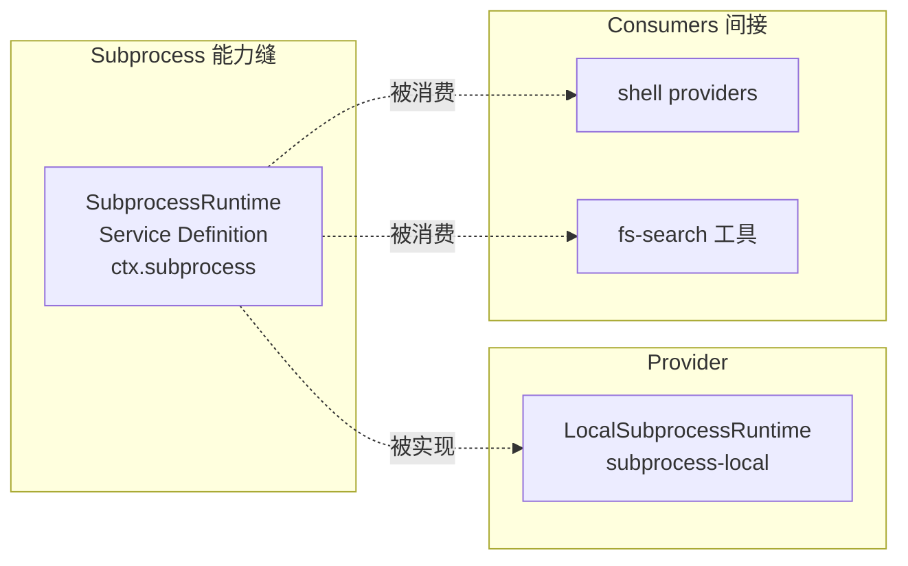

# 11 · Shell 与 Subprocess 能力

> **前置阅读**：[10 · LLM 能力与 DeepSeek 适配器](/10-llm-and-deepseek-adapter)
> **下一步**：[12 · FS 能力与策略](/12-fs-and-policy)

## 学习目标

1. 掌握 Shell Service Definition 的接口与 request/spec split
2. 理解 local bash/pwsh provider 的实现
3. 知道 sandbox provider 如何继承 local provider
4. 理解 Subprocess Service Definition 作为底层能力
5. 能配置 shell 工具的沙箱策略

---

## 一、Shell 能力缝概览



### 1.1 包列表（9 个）

| 包 | 角色 | 路径 |
|---|---|---|
| `dsh-shell` | Service Definition | `packages/shell/shell/` |
| `dsh-bash-local` | Provider（local bash） | `packages/shell/bash-local/` |
| `dsh-pwsh-local` | Provider（local pwsh） | `packages/shell/pwsh-local/` |
| `dsh-bash-sandbox` | Provider（sandbox bash） | `packages/shell/bash-sandbox/` |
| `dsh-pwsh-sandbox` | Provider（sandbox pwsh） | `packages/shell/pwsh-sandbox/` |
| `dsh-tool-bash` | Consumer（bash 工具） | `packages/shell/tool-bash/` |
| `dsh-tool-pwsh` | Consumer（pwsh 工具） | `packages/shell/tool-pwsh/` |
| `dsh-tool-bash-persistent` | Consumer 变体 | `packages/shell/tool-bash-persistent/` |
| `dsh-shell-env` | 辅助服务 | `packages/shell/shell-env/` |

---

## 二、Shell Service Definition

### 2.1 ShellExecutor 抽象类

**文件**：`packages/shell/shell/src/index.ts:65-101`

```typescript
export abstract class ShellExecutor extends Service {
  constructor(ctx: Context) { super(ctx, 'shell') }
  
  get sandboxMode(): SandboxMode | undefined { return undefined }
  
  abstract resolve(request: ShellExecRequest): ShellExecSpec   // 行 85
  abstract run(spec: ShellExecSpec): Promise<ShellRunResult>   // 行 93
  abstract start(spec: ShellExecSpec): ShellProcess            // 行 100
}
```

### 2.2 关键类型

**文件**：`packages/shell/shell/src/types.ts`

#### ShellExecRequest（行 38-79）

caller 的请求，**可选字段由 `resolve()` 填充**：

```typescript
interface ShellExecRequest {
  command: string
  workdir?: string
  timeoutMs?: number
  stdoutMaxBytes?: number
  signal?: AbortSignal
  stdin?: string
  env?: Record<string, string>
  dshEnv?: DshEnvironment
  sandboxPolicy?: SandboxExecutionPolicy
}
```

#### ShellExecSpec（行 86-110）

**完全解析后**的 spec，`workdir`/`timeoutMs`/`stdoutMaxBytes` 必填：

```typescript
interface ShellExecSpec {
  command: string
  workdir: string          // 必填
  timeoutMs: number        // 必填，已 cap
  stdoutMaxBytes: number   // 必填
  signal?: AbortSignal
  stdin?: string
  env?: Record<string, string>
  dshEnv?: DshEnvironment
  sandboxPolicy?: SandboxExecutionPolicy
}
```

#### ShellRunResult（行 113-138）

前台运行结果：

```typescript
interface ShellRunResult {
  exitCode: number
  signal?: string
  timedOut: boolean
  aborted: boolean         // 互斥
  timeoutMs: number
  stdout: CollectedOutput
  stderr: CollectedOutput
  sandbox?: ShellSandboxInfo
}
```

#### ShellProcess（行 161-183）

后台进程句柄：

```typescript
interface ShellProcess {
  status: 'running' | 'exited'
  exitCode?: number
  signal?: string
  done: Promise<ShellRunResult>
  readOutput(): { stdout: string; stderr: string }
  kill(): Promise<void>
}
```

---

## 三、Local Bash Provider

### 3.1 LocalBashExecutor

**文件**：`packages/shell/bash-local/src/index.ts:102-137`

```typescript
export class LocalBashExecutor extends ShellExecutor {
  static inject = ['subprocess']                              // 行 103
  static Config = z.object({                                  // 行 105-112
    cwd: z.string(),
    timeoutMs: z.number().default(120_000),
    maxTimeoutMs: z.number().default(600_000),
    maxOutputBytes: z.number().default(64_000),
    maxSpillBytes: z.number().default(DEFAULT_MAX_SPILL_BYTES),
    graceMs: z.number().default(DEFAULT_GRACE_MS),
  })
  
  // 实现 resolve()
  resolve(request: ShellExecRequest): ShellExecSpec { ... }
  
  // 实现 run()
  async run(spec: ShellExecSpec): Promise<ShellRunResult> { ... }
  
  // 实现 start()
  start(spec: ShellExecSpec): ShellProcess { ... }
}
```

### 3.2 resolve() — request/spec split 模板

**文件**：`packages/shell/bash-local/src/index.ts:146-171`

```typescript
resolve(request: ShellExecRequest): ShellExecSpec {
  const timeoutMs = clampTimeout(
    request.timeoutMs, 
    this.config.timeoutMs,       // 默认 120s
    this.config.maxTimeoutMs,    // 上限 600s
    'bash-local: request.timeoutMs'
  )
  const stdoutMaxBytes = request.stdoutMaxBytes ?? this.config.maxOutputBytes
  return {
    command: request.command,
    workdir: request.workdir ?? this.config.cwd ?? process.cwd(),  // 默认值
    timeoutMs,                                                      // 已 cap
    stdoutMaxBytes,
    ...request.signal ? { signal: request.signal } : {},
    ...request.stdin !== undefined ? { stdin: request.stdin } : {},
    ...request.env !== undefined ? { env: request.env } : {},
    ...request.dshEnv !== undefined ? { dshEnv: request.dshEnv } : {},
    sandboxPolicy: request.sandboxPolicy,  // 透传，local 不 confine
  }
}
```

**关键**：
- `timeoutMs` 被 `clampTimeout` 限制在 `[0, maxTimeoutMs]` 范围
- `workdir` 默认值链：`request.workdir` → `config.cwd` → `process.cwd()`
- `sandboxPolicy` 透传（local provider 不 confine）

### 3.3 run() 实现

```typescript
// 概念示意（实际在 packages/shell/bash-local/src/index.ts）
async run(spec: ShellExecSpec): Promise<ShellRunResult> {
  // 通过 ctx.subprocess.spawn() 启动 bash -c
  const handle = this.ctx.subprocess.spawn({
    argv: ['bash', '-c', spec.command],
    cwd: spec.workdir,
    stdio: { stdin: 'pipe', stdout: 'collect', stderr: 'collect' },
    // ...
  })
  
  // 用 deadline() 合并 timeout 和 cancellation
  const outcome = await handle.done
  // 组装 ShellRunResult
}
```

---

## 四、Local Pwsh Provider

### 4.1 PwshLocalExecutor

**文件**：`packages/shell/pwsh-local/src/index.ts:128`

与 bash-local **call-for-call 镜像**（`jscpd:ignore` 标注），差异：

| 差异点 | bash-local | pwsh-local |
|---|---|---|
| argv | `['bash', '-c', command]` | `[pwshPath, '-NoLogo', '-NoProfile', '-NonInteractive', '-Command', ENCODING_PREAMBLE + command]` |
| `ENV_OVERRIDES` | 含 `TERM=dumb` | 不含（POSIX 概念） |
| `ENCODING_PREAMBLE` | 无 | pin UTF-8 输出 |
| Config | 基础字段 | 额外 `pwshPath?` |

### 4.2 resolvePwshPath

**文件**：`packages/shell/pwsh-local/src/resolve.ts`

解析 pwsh 可执行文件路径。

---

## 五、Sandbox Providers

### 5.1 SandboxBashExecutor

**文件**：`packages/shell/bash-sandbox/src/index.ts:44`

```typescript
export class SandboxBashExecutor extends LocalBashExecutor {
  static override inject = ['subprocess', 'sandbox', 'sandboxPolicy']  // 行 45
  
  override get sandboxMode(): SandboxMode | undefined {
    return this.ctx.sandboxPolicy.defaultMode  // 行 75-77
  }
  
  override resolve(request: ShellExecRequest): ShellExecSpec {
    // stamp 默认 policy（行 84-86）
    return super.resolve({ ...request, sandboxPolicy: request.sandboxPolicy ?? this.ctx.sandboxPolicy.resolve() })
  }
  
  // run()/start() 通过 ctx.sandbox.confine() 包装 argv
  async run(spec: ShellExecSpec): Promise<ShellRunResult> {
    // danger-full-access 模式直接透传
    // 其他模式：ctx.sandbox.confine(['bash','-c',command], policy)
    // 分类 denial/runnerFailure
  }
}
```

### 5.2 SandboxPwshExecutor

**文件**：`packages/shell/pwsh-sandbox/src/index.ts:52`

同理，是 pwsh twin。

---

## 六、Shell Consumer

### 6.1 bash 工具

**文件**：`packages/shell/tool-bash/src/index.ts`

```typescript
export const inject = ['tools', 'shell', 'systemPrompt', 'shellEnv']  // 行 31

// 注册 bash 工具（行 242-393）
```

### 6.2 request/spec split 调用

```typescript
// packages/shell/tool-bash/src/index.ts:380-383
const result = await ctx.shell.run(ctx.shell.resolve({
  ...request,
  signal: exec.signal,
}))
```

**关键**：工具层先 `ctx.shell.resolve(request)` 得到 spec，再传给 `ctx.shell.run(spec)`。**工具层不直接传 raw request 给 run/start**。

### 6.3 沙箱升级流程

```typescript
// packages/shell/tool-bash/src/index.ts:213-233
// approveBashEscalation() 通过 ctx.approval 在执行前批准 sandbox_permissions
```

---

## 七、Subprocess 能力缝

### 7.1 概览



### 7.2 SubprocessRuntime 抽象类

**文件**：`packages/subprocess/subprocess/src/index.ts:102-140`

```typescript
export abstract class SubprocessRuntime extends Service {
  constructor(ctx: Context) { super(ctx, 'subprocess') }
  
  abstract resolveExecutable(command, env?, signal?): Promise<string>   // 行 118
  abstract spawn(spec: SubprocessSpawnSpec): SubprocessHandle            // 行 130
  abstract spawnTerminal(spec: SubprocessTerminalSpawnSpec): Promise<SubprocessTerminalHandle>  // 行 139
}
```

### 7.3 关键类型

**文件**：`packages/subprocess/subprocess/src/types.ts`

#### SubprocessSpawnSpec（行 75-104）

**完全指定的 spawn 请求，seam 不应用任何默认值**：

```typescript
interface SubprocessSpawnSpec {
  argv: string[]
  cwd: string
  stdio: SubprocessStdio
  graceMs: number
  signal?: AbortSignal
  env?: Record<string, string>
}
```

**注释**（行 70-73）：

> this seam applies no defaults... the `dsh-shell` request/spec split is the owning template

#### SubprocessStdio（行 63-67）

```typescript
interface SubprocessStdio {
  stdin: SubprocessStdinMode
  stdout: SubprocessOutputMode
  stderr: SubprocessOutputMode
}
```

#### SubprocessHandle（行 167-194）

```typescript
interface SubprocessHandle {
  pid: number
  stdin: WritableStream
  stdout: ReadableStream
  stderr: ReadableStream
  collected: { stdout: CollectedOutput; stderr: CollectedOutput }
  done: Promise<SubprocessOutcome>
  terminate(): Promise<void>
  waitForExit(signal?): Promise<SubprocessOutcome>
}
```

#### SubprocessOutcome（行 113-118）

```typescript
interface SubprocessOutcome {
  exitCode: number
  signal?: string
  // 不含 timeout/cancellation 分类（caller 拥有）
}
```

### 7.4 敏感环境变量剥离

```typescript
// packages/subprocess/subprocess/src/index.ts:44
export const SENSITIVE_ENV_PATTERN = /KEY|PASSWORD|SECRET|TOKEN/i

// 行 60-66
export function scrubbedParentEnv(): Record<string, string> {
  // 剥离 credential-shaped 和 DSH_* 环境变量
}
```

---

## 八、Local Process-Tree Provider

### 8.1 LocalSubprocessRuntime

**文件**：`packages/subprocess/subprocess-local/src/index.ts:37-45`

```typescript
export class LocalSubprocessRuntime extends SubprocessRuntime {
  private live = new Set<LocalSubprocessHandle>()    // 行 39
  private terminals = new Set<LocalTerminalHandle>() // 行 41
  internals: SpawnInternals = {}                     // 行 43，测试钩子
  terminalInspector: ProcessInspector | undefined    // 行 45
}
```

### 8.2 spawn()

```typescript
// packages/subprocess/subprocess-local/src/index.ts:146-157
spawn(spec: SubprocessSpawnSpec): SubprocessHandle {
  const handle = spawnSubprocess(spec, this.internals)  // 调用 spawn.ts
  this.live.add(handle)
  // done 后 waitForExit() 再释放——整棵树退出才释放，非直接子进程
  return handle
}
```

### 8.3 spawn.ts 核心机制

**文件**：`packages/subprocess/subprocess-local/src/spawn.ts`

#### childEnv()（行 37-47）

```typescript
function childEnv(extra?: Record<string, string>): Record<string, string> {
  return { ...scrubbedParentEnv(), ...extra }
  // Windows 大小写不敏感合并
}
```

#### OutputCollector（行 104-251）

bounded in-memory tail + spill file：

- `maxBytes`：内存中保留的最大字节数
- `spill.maxBytes`：溢出到文件的最大字节数
- `readFrom(offset)`：offset-based 非消费读

#### spawnSubprocess()（行 326-543）

```typescript
function spawnSubprocess(spec, internals): LocalSubprocessHandle {
  // 1. spawn() with detached: platform !== 'win32'（POSIX 进程组）
  // 2. signalTree()：POSIX 信号负 pid 组，Windows taskkill /T /F
  // 3. SIGTERM → graceMs → SIGKILL 升级（行 439-453）
}
```

### 8.4 disposal

```typescript
// packages/subprocess/subprocess-local/src/index.ts:49-60, 79-102
// ctx.effect() 注册 process.prependListener('exit', onHostExit)
// 正常 disposal：terminate() + waitForExit() 整棵树
// host exit：同步 terminateForHostExit()
```

### 8.5 resolveExecutable()

```typescript
// packages/subprocess/subprocess-local/src/index.ts:104-135
resolveExecutable(command, env?, signal?): Promise<string> {
  // 绝对路径验证 + bare name PATH 查找
  // 拒绝相对路径含分隔符（行 113-117）
}
```

---

## 九、Shell 与 Session 事件

### 9.1 不声明 SessionEventMap 事件

**Shell 和 Subprocess 包内没有 `SessionEventMap` 声明**。

Shell 能力不直接产生 session log 事件；它的输出通过 `tool/call` 和 `tool/result` 事件（由 `dsh-tools` 拥有）进入 session log。

### 9.2 模型可见输出


---

## 十、配置 Shell 工具

### 10.1 在 cordis.yml 中配置

```yaml
plugins:
  '@deepseek-ai/dsh-bash-local':
    config:
      cwd: /workspace
      timeoutMs: 120000
      maxTimeoutMs: 600000
      maxOutputBytes: 64000
  '@deepseek-ai/dsh-bash-sandbox':
    config:
      cwd: /workspace
      # sandbox policy 通过 sandboxPolicy capability 配置
```

### 10.2 沙箱模式

| 模式 | 行为 |
|---|---|
| `read-only` | 拒绝所有 mutation |
| `workspace-write` | 限制在 workspace root + temp area |
| `danger-full-access` | 不 fence |

---

## 实战练习

1. **追踪 request/spec split**：打开 `packages/shell/bash-local/src/index.ts:146-171`，列出 `resolve()` 填充的每个默认值和 cap。

2. **对比 bash 和 pwsh**：打开 `packages/shell/bash-local/src/index.ts` 和 `packages/shell/pwsh-local/src/index.ts`，找出所有差异点。

3. **理解 sandbox 继承**：打开 `packages/shell/bash-sandbox/src/index.ts`，说明 `SandboxBashExecutor` 如何继承 `LocalBashExecutor` 并添加沙箱逻辑。

4. **追踪进程树**：打开 `packages/subprocess/subprocess-local/src/spawn.ts`，说明 `signalTree()` 如何在 POSIX 和 Windows 上终止进程树。

---

## 关键源码定位

| 内容 | 位置 |
|---|---|
| ShellExecutor | `packages/shell/shell/src/index.ts:65-101` |
| ShellExecRequest | `packages/shell/shell/src/types.ts:38-79` |
| ShellExecSpec | `packages/shell/shell/src/types.ts:86-110` |
| ShellRunResult | `packages/shell/shell/src/types.ts:113-138` |
| ShellProcess | `packages/shell/shell/src/types.ts:161-183` |
| LocalBashExecutor | `packages/shell/bash-local/src/index.ts:102-137` |
| bash resolve 实现 | `packages/shell/bash-local/src/index.ts:146-171` |
| PwshLocalExecutor | `packages/shell/pwsh-local/src/index.ts:128` |
| resolvePwshPath | `packages/shell/pwsh-local/src/resolve.ts` |
| SandboxBashExecutor | `packages/shell/bash-sandbox/src/index.ts:44` |
| SandboxPwshExecutor | `packages/shell/pwsh-sandbox/src/index.ts:52` |
| bash 工具 Consumer | `packages/shell/tool-bash/src/index.ts` |
| bash 工具调用 | `packages/shell/tool-bash/src/index.ts:380-383` |
| SubprocessRuntime | `packages/subprocess/subprocess/src/index.ts:102-140` |
| SubprocessSpawnSpec | `packages/subprocess/subprocess/src/types.ts:75-104` |
| subprocess 引用 shell 模板 | `packages/subprocess/subprocess/src/types.ts:70-73` |
| SENSITIVE_ENV_PATTERN | `packages/subprocess/subprocess/src/index.ts:44` |
| scrubbedParentEnv | `packages/subprocess/subprocess/src/index.ts:60-66` |
| LocalSubprocessRuntime | `packages/subprocess/subprocess-local/src/index.ts:37-45` |
| spawnSubprocess | `packages/subprocess/subprocess-local/src/spawn.ts:326-543` |
| OutputCollector | `packages/subprocess/subprocess-local/src/spawn.ts:104-251` |
| childEnv | `packages/subprocess/subprocess-local/src/spawn.ts:37-47` |

---

## 下一步

本文理解了 Shell 与 Subprocess 能力。下一篇 [12 · FS 能力与策略](/12-fs-and-policy) 将讲解 FS 能力缝和两层权限模型。
