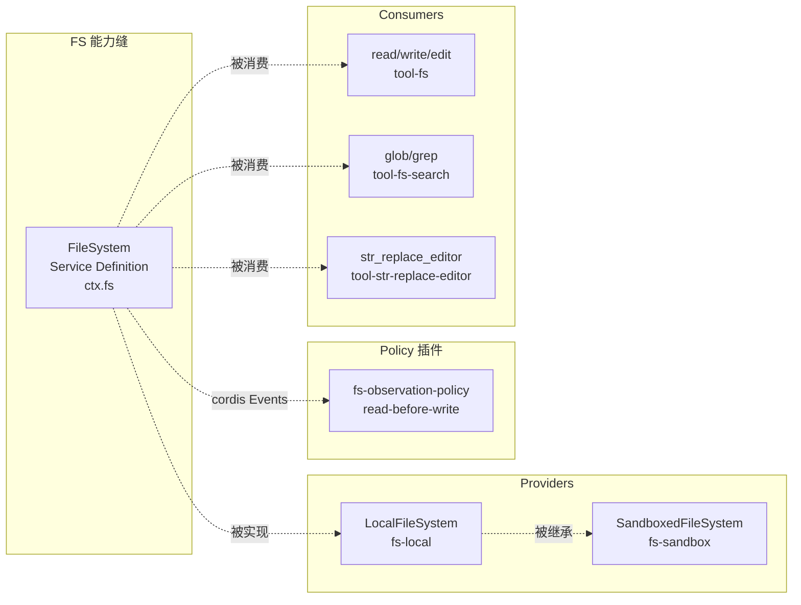
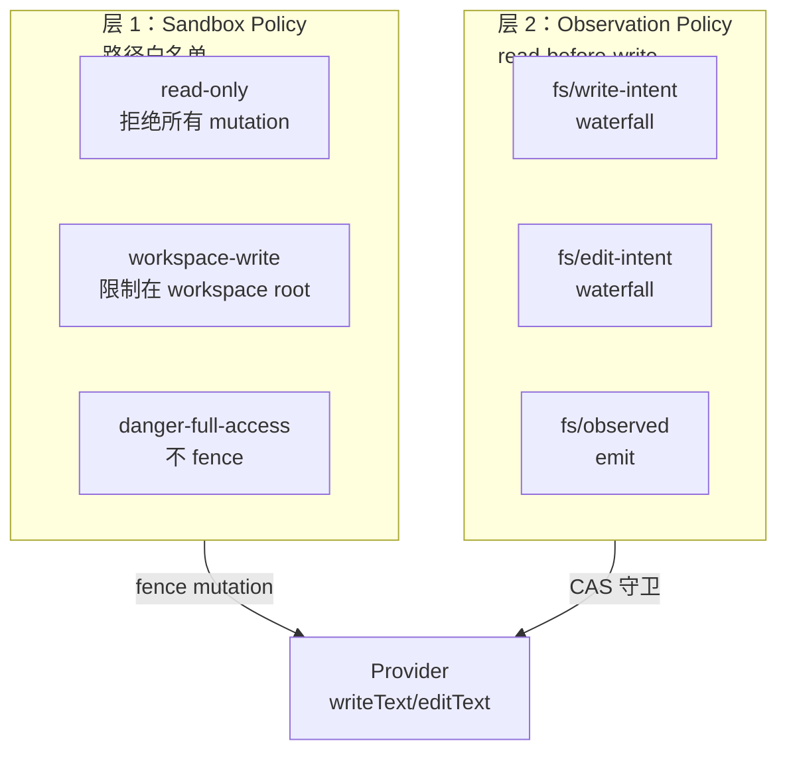
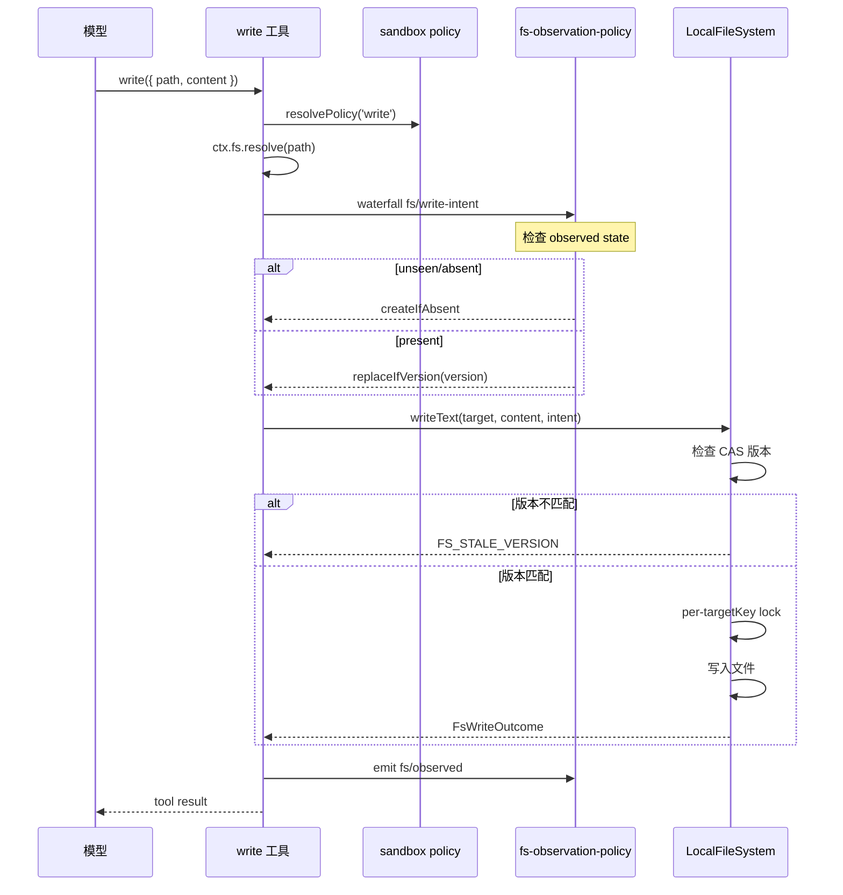

# 12 · FS 能力与策略

> **前置阅读**：[11 · Shell 与 Subprocess 能力](/11-shell-and-subprocess)
> **下一步**：[13 · Web 与 LSP 能力](/13-web-and-lsp)

## 学习目标

1. 掌握 FS Service Definition 的接口
2. 理解 FS 的两层权限模型（Sandbox Policy + Observation Policy）
3. 知道 `FsTarget`/`FsVersion` 的 opaque branded 设计
4. 理解 read-before-write 与 CAS 版本守卫
5. 能配置 FS 沙箱策略

---

## 一、FS 能力缝概览



### 1.1 包列表（7 个）

| 包 | 角色 | 路径 |
|---|---|---|
| `dsh-fs` | Service Definition | `packages/fs/fs/` |
| `dsh-fs-local` | Provider（host fs） | `packages/fs/fs-local/` |
| `dsh-fs-sandbox` | Provider（sandbox fs） | `packages/fs/fs-sandbox/` |
| `dsh-fs-observation-policy` | Policy 插件 | `packages/fs/fs-observation-policy/` |
| `dsh-tool-fs` | Consumer（read/write/edit） | `packages/fs/tool-fs/` |
| `dsh-tool-fs-search` | Consumer（glob/grep） | `packages/fs/tool-fs-search/` |
| `dsh-tool-str-replace-editor` | Consumer 变体 | `packages/fs/tool-str-replace-editor/` |

---

## 二、FS Service Definition

### 2.1 FileSystem 抽象类

**文件**：`packages/fs/fs/src/index.ts:86-250`

```typescript
export abstract class FileSystem extends Service {
  constructor(ctx: Context) { super(ctx, 'fs') }
  
  get sandboxMode(): SandboxMode | undefined { return undefined }  // 行 103
  
  abstract resolve(path, opts?): Promise<FsTarget>                 // 行 116
  abstract processPath(target): string                             // 行 126
  abstract fileUrl(target): string                                 // 行 135
  abstract contains(parent, child): boolean                        // 行 144
  abstract stat(target, signal?): Promise<FsInfo | undefined>      // 行 152
  abstract lstat(path, opts?, signal?): Promise<FsPathInfo | undefined>  // 行 168
  abstract readText(target, signal?): Promise<string>              // 行 176
  abstract streamText(target, signal?): Promise<AsyncIterable<string>>  // 行 187
  abstract readBytes(target, signal, maxBytes): Promise<Uint8Array>     // 行 199
  abstract listDir(target, signal?): Promise<FsDirEntry[]>        // 行 208
  abstract writeText(target, content, expected?, signal?, sandboxPolicy?): Promise<FsWriteOutcome>  // 行 222
  abstract editText(target, edit, expected?, signal?, sandboxPolicy?): Promise<FsEditOutcome>      // 行 243
}
```

### 2.2 关键类型

**文件**：`packages/fs/fs/src/types.ts`

#### Opaque Branded 类型

```typescript
// 行 16
type FsTargetKey = Branded<'FsTargetKey'>  // opaque，不可直接构造

// 行 35
type FsVersion = Branded<'FsVersion'>  // opaque freshness token
```

**AGENTS.md 规则**：

> **Opaque cross-boundary ids are branded** (`Branded<B>` from `dsh-brand`), never bare `string`.

#### FsTarget（行 60-68）

```typescript
interface FsTarget {
  targetKey: FsTargetKey   // opaque
  displayPath: string      // 给用户看的路径
}
```

#### FsInfo（行 76-83）

```typescript
interface FsInfo {
  version: FsVersion
  type: 'file' | 'directory' | 'other'
  size?: number
}
```

#### FsObservation（行 52-54）

```typescript
type FsObservation =
  | { kind: 'present'; version: FsVersion }
  | { kind: 'absent' }
```

#### FsWriteIntent（行 123-125）

```typescript
type FsWriteIntent =
  | { kind: 'createIfAbsent' }
  | { kind: 'replaceIfVersion'; version: FsVersion }
```

#### FsWriteOutcome（行 128-144）

```typescript
interface FsWriteOutcome {
  operation: 'create' | 'update'
  version: FsVersion
  before: string | null
  after: string
}
```

#### FsEditRequest（行 147-154）

```typescript
interface FsEditRequest {
  oldString: string
  newString: string
  replaceAll: boolean
}
```

#### FsErrorCode（行 175-188）

13 个稳定码：

| 码 | 含义 |
|---|---|
| `FS_SANDBOX_DENIED` | 沙箱拒绝 |
| `FS_STALE_VERSION` | CAS 版本不匹配 |
| `FS_NOT_OBSERVED` | 未先 read 就 write |
| `FS_NOT_FOUND` | 文件不存在 |
| ... | ... |

---

## 三、FS 权限模型 — 两层



### 3.1 层 1：Sandbox Policy

**文件**：`packages/fs/fs-sandbox/src/index.ts`

**类**：`SandboxedFileSystem extends LocalFileSystem`（行 59）

#### 三种模式

```typescript
// packages/fs/fs-sandbox/src/index.ts:126-148
private async checkedTarget(target: FsTarget, sandboxPolicy?: SandboxExecutionPolicy): Promise<FsTarget> {
  const policy = sandboxPolicy ?? this.ctx.sandboxPolicy.resolve()
  const { mode } = policy
  
  if (mode === 'danger-full-access') return target           // 不 fence
  
  if (mode === 'read-only') {
    throw new FsError(`... denied under read-only mode`, 'FS_SANDBOX_DENIED')
  }
  
  // workspace-write: 重新 canonicalize，要求 containment under writable root
  const fresh = await this.resolve(target.displayPath)       // 防 TOCTOU
  let contained = false
  for (const root of writableRoots(policy)) {
    if (await isPathUnder(fresh.targetKey, root)) { contained = true; break }
  }
  if (!contained) {
    throw new FsError(`... denied under workspace-write mode`, 'FS_SANDBOX_DENIED')
  }
  return fresh  // 返回 fresh target，check-here-write-there 无 TOCTOU
}
```

| 模式 | 行为 |
|---|---|
| `read-only` | 拒绝所有 mutation |
| `workspace-write` | target 必须 canonicalize 在 `writableRoots(policy)` 之下 |
| `danger-full-access` | 不 fence |

**关键**：**reads 永远不被 fence**（`index.ts:7-8` 注释），只 fence `writeText`/`editText`。

#### containment 实现

**文件**：`packages/fs/fs-sandbox/src/containment.ts`

```typescript
// 行 58-76
function isPathUnder(path, root, caseSensitive?): boolean {
  // lexical fast path + filesystem identity fallback
  // 处理 Windows 8.3/casing 别名
}
```

### 3.2 层 2：Observation Policy

**文件**：`packages/fs/fs-observation-policy/src/index.ts`

**这是事件驱动插件，不注册服务**（行 97-98：`name = 'fs-observation-policy'`，无 `inject`）。

#### 三个 cordis Events

```typescript
// packages/fs/fs/src/index.ts:49-77
interface Events {
  'fs/write-intent'(target, actor, next): Promise<FsWriteIntent | undefined>  // waterfall, 单槽
  'fs/edit-intent'(target, actor, next): Promise<{ version: FsVersion } | undefined>  // waterfall, 单槽
  'fs/observed'(target, observation, actor): void  // emit, 同步 recorder
}
```

#### ObservedStateGate

**文件**：`packages/fs/fs-observation-policy/src/index.ts:21-95`

```typescript
class ObservedStateGate {
  // WeakMap<object, Map<string, FsObservation>>（行 28）
  // owner = actor.agent.session（行 36-41）
  
  writeIntent(target, actor): FsWriteIntent | undefined {
    // unseen/absent ⇒ createIfAbsent
    // present ⇒ replaceIfVersion
  }
  
  editIntent(target, actor): { version: FsVersion } | undefined {
    // unseen ⇒ throw FS_NOT_OBSERVED
    // absent ⇒ throw FS_NOT_FOUND
    // present ⇒ { version }
  }
  
  observe(target, observation, actor): void {
    // 记录观察
  }
}
```

#### 注册

```typescript
// packages/fs/fs-observation-policy/src/index.ts:119-128
ctx.on('fs/write-intent', (target, actor) => Promise.resolve().then(() => gate.writeIntent(target, actor)))
ctx.on('fs/edit-intent', (target, actor) => Promise.resolve().then(() => gate.editIntent(target, actor)))
ctx.on('fs/observed', (target, observation, actor) => { gate.observe(target, observation, actor) })
```

**关键**：waterfall listener **不调用 `next()`**（行 116 注释），占据单槽决策。

---

## 四、Policy 在 Provider 中的应用

### 4.1 LocalFileSystem.writeText()

**文件**：`packages/fs/fs-local/src/index.ts:166-219`

```typescript
async writeText(target, content, expected?, signal?, sandboxPolicy?): Promise<FsWriteOutcome> {
  // expected 参数（FsWriteIntent）由 Consumer 通过 fs/write-intent waterfall 获得
  
  // replaceIfVersion：检查版本
  if (expected?.kind === 'replaceIfVersion') {
    const existing = await this.stat(target, signal)
    if (existing?.version !== expected.version) {
      throw new FsError('...', 'FS_STALE_VERSION')  // 行 181-183
    }
  }
  
  // createIfAbsent onto existing
  if (expected?.kind === 'createIfAbsent' && existing) {
    throw new FsError('...', 'FS_NOT_OBSERVED')  // 行 184-187
  }
  
  // per-targetKey lock（withLock 行 91-104）序列化 mutation
  // 使 read→guard→write 原子
}
```

### 4.2 SandboxedFileSystem 额外 fence

```typescript
// packages/fs/fs-sandbox/src/index.ts:84-113
// writeText/editText 先 checkedTarget()，再委托父类
```

---

## 五、FS Consumer

### 5.1 read 工具

**文件**：`packages/fs/tool-fs/src/read.ts:69-208`

```typescript
// packages/fs/tool-fs/src/read.ts:140-162
const { target, info } = await resolveRegularReadTarget(ctx, exec, input.filePath)
const chunks = info.size === undefined || info.size >= caps.streamMinSize
  ? await ctx.fs.streamText(target, exec.signal)
  : [await ctx.fs.readText(target, exec.signal)]
const window = await buildWindow(chunks, {...}, target.displayPath)

// 关键：emit fs/observed
ctx.emit('fs/observed', target, { kind: 'present', version: info.version }, exec)  // 行 162
```

### 5.2 write 工具

**文件**：`packages/fs/tool-fs/src/write.ts:102-129`

```typescript
// packages/fs/tool-fs/src/write.ts:107-122
const sandboxPolicy = await sandbox.resolvePolicy('write', args, exec)
const target = await ctx.fs.resolve(input.filePath, sessionResolveOptions(...))

// 关键：通过 waterfall 获取 write intent
const intent = await ctx.waterfall('fs/write-intent', target, exec, () => undefined)  // 行 111

outcome = await ctx.fs.writeText(target, input.content, intent, exec.signal, sandboxPolicy)  // 行 114

// 关键：emit fs/observed
ctx.emit('fs/observed', target, { kind: 'present', version: outcome.version }, exec)  // 行 122
```

### 5.3 edit 工具

**文件**：`packages/fs/tool-fs/src/edit.ts:112-147`

类似 write，用 `fs/edit-intent` waterfall。

### 5.4 fs-search 工具

**文件**：`packages/fs/tool-fs-search/src/index.ts`

```typescript
export const inject = ['tools', 'systemPrompt', 'subprocess']  // 行 70
// 注意：不注入 fs！通过 ctx.subprocess.spawn() 运行打包的 ripgrep
```

**关键**：`tool-fs-search` **不注入 `fs`**，通过 `ctx.subprocess.spawn()` 运行打包的 ripgrep。

---

## 六、FS 与 Session 事件

### 6.1 不声明 SessionEventMap 事件

**FS 包内没有 `SessionEventMap` 声明**。FS 能力使用 cordis `Events`（`fs/write-intent`、`fs/edit-intent`、`fs/observed`），这些是**进程内事件总线事件，不是 session log 事件**。

### 6.2 模型可见输出

FS 操作的 model-visible 输出通过 `tool/call`/`tool/result`（`dsh-tools` 拥有）进入 session log。

### 6.3 FS invariant

**文件**：`packages/fs/fs/src/invariant.ts:21-40`

验证 `fs/*` 事件的 target/observation 数据完整性（非 SessionEventMap）。

---

## 七、完整写入流程



---

## 八、配置 FS 沙箱

### 8.1 在 cordis.yml 中配置

```yaml
plugins:
  '@deepseek-ai/dsh-fs-local':
    config:
      # LocalFileSystem 的配置
  '@deepseek-ai/dsh-fs-sandbox':
    config:
      # SandboxedFileSystem 的配置
  '@deepseek-ai/dsh-fs-observation-policy':
    # 无 config，自动注册
```

### 8.2 沙箱模式选择

| 场景 | 推荐模式 |
|---|---|
| 只读分析 | `read-only` |
| 代码编辑 | `workspace-write` |
| 完全信任 | `danger-full-access` |

---

## 实战练习

1. **追踪写入流程**：打开 `packages/fs/tool-fs/src/write.ts`，列出从模型调用到文件写入的完整步骤。

2. **理解 CAS 守卫**：在 `packages/fs/fs-local/src/index.ts:166-219` 中，说明 `FS_STALE_VERSION` 何时触发。

3. **分析 observation policy**：打开 `packages/fs/fs-observation-policy/src/index.ts`，说明 `ObservedStateGate` 如何跟踪每个 session 的观察状态。

4. **理解 TOCTOU 防护**：在 `packages/fs/fs-sandbox/src/index.ts:126-148` 中，说明 `workspace-write` 模式如何防止 check-here-write-there 攻击。

---

## 关键源码定位

| 内容 | 位置 |
|---|---|
| FileSystem | `packages/fs/fs/src/index.ts:86-250` |
| FsTargetKey | `packages/fs/fs/src/types.ts:16` |
| FsVersion | `packages/fs/fs/src/types.ts:35` |
| FsTarget | `packages/fs/fs/src/types.ts:60-68` |
| FsInfo | `packages/fs/fs/src/types.ts:76-83` |
| FsObservation | `packages/fs/fs/src/types.ts:52-54` |
| FsWriteIntent | `packages/fs/fs/src/types.ts:123-125` |
| FsWriteOutcome | `packages/fs/fs/src/types.ts:128-144` |
| FsErrorCode | `packages/fs/fs/src/types.ts:175-188` |
| fs/* Events | `packages/fs/fs/src/index.ts:49-77` |
| LocalFileSystem | `packages/fs/fs-local/src/index.ts` |
| LocalFileSystem.writeText | `packages/fs/fs-local/src/index.ts:166-219` |
| SandboxedFileSystem | `packages/fs/fs-sandbox/src/index.ts:59` |
| checkedTarget | `packages/fs/fs-sandbox/src/index.ts:126-148` |
| isPathUnder | `packages/fs/fs-sandbox/src/containment.ts:58-76` |
| ObservedStateGate | `packages/fs/fs-observation-policy/src/index.ts:21-95` |
| observation policy 注册 | `packages/fs/fs-observation-policy/src/index.ts:119-128` |
| read 工具 | `packages/fs/tool-fs/src/read.ts:69-208` |
| write 工具 | `packages/fs/tool-fs/src/write.ts:102-129` |
| edit 工具 | `packages/fs/tool-fs/src/edit.ts:112-147` |
| fs-search 工具 | `packages/fs/tool-fs-search/src/index.ts` |
| FS invariant | `packages/fs/fs/src/invariant.ts:21-40` |

---

## 下一步

本文理解了 FS 能力与策略。下一篇 [13 · Web 与 LSP 能力](/13-web-and-lsp) 将讲解 web 和 lsp 能力缝。
