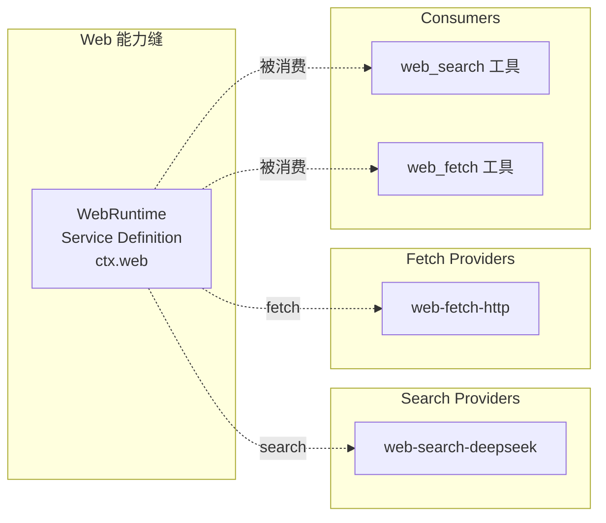
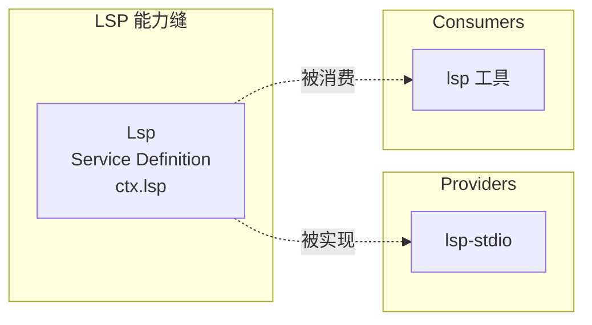

# 13 · Web 与 LSP 能力

> **前置阅读**：[12 · FS 能力与策略](/12-fs-and-policy)
> **下一步**：[14 · Compaction 与 Subagent 能力](/14-compaction-and-subagent)

## 学习目标

1. 掌握 Web Service Definition 的 search/fetch 双能力与 provider 选择语义
2. 理解 LSP Service Definition 的扩展名路由机制
3. 知道 Compaction Service Definition 的触发策略
4. 能注册自定义 web/lsp/compaction provider

---

## 一、Web 能力缝

### 1.1 概览



### 1.2 WebRuntime Service Definition

**文件**：`packages/web/web/src/index.ts:74-94`

```typescript
export class WebRuntime extends Service {
  static Config: z<WebRuntimeConfig> = z.object({
    searchProvider: z.string(),
    fetchProvider: z.string(),
  })
  
  private searchProviders = new Map<string, WebSearchProvider>()
  private fetchProviders = new Map<string, WebFetchProvider>()
  
  constructor(ctx: Context, config: WebRuntimeConfig = {}) {
    super(ctx, 'web')
    this.searchProviderId = config.searchProvider ?? process.env.DSH_WEB_SEARCH_PROVIDER
    this.fetchProviderId = config.fetchProvider ?? process.env.DSH_WEB_FETCH_PROVIDER
  }
}
```

### 1.3 Provider 选择语义

**文件**：`packages/web/web/src/index.ts:62-73`

选择在**执行时**解析，**永不依赖注册顺序**：

| 场景 | 结果 |
|---|---|
| 配置的 id 已注册且 `available()` | 该 provider |
| 配置的 id 未注册 | `WEB_PROVIDER_CONFIGURED_MISSING` |
| 配置的 id 已注册但不可用 | `WEB_PROVIDER_CONFIGURED_UNAVAILABLE` |
| 未配置 id，恰好一个可用 provider | 该 provider |
| 未配置 id，多个可用 provider | `WEB_PROVIDER_AMBIGUOUS` |
| 未配置 id，无可用 provider | `WEB_PROVIDER_UNAVAILABLE` |

### 1.4 关键类型

**文件**：`packages/web/web/src/types.ts`

```typescript
interface WebSearchRequest { ... }
interface WebSearchResult { ... }
interface WebFetchRequest { ... }
interface WebFetchResult { ... }
interface WebSearchProvider { id: string; available(): boolean; search(req): Promise<WebSearchResult> }
interface WebFetchProvider { id: string; available(): boolean; fetch(req): Promise<WebFetchResult> }
```

### 1.5 安全规则

**`packages/web/AGENTS.md`** 规定：

> **Reject redirects on credential-bearing provider requests.** Configure the HTTP client to fail before following any redirect response.

即：凭据请求必须拒绝重定向，防止凭据自动转发到其他 origin。

### 1.6 Web Consumer

**文件**：`packages/web/tool-web/src/index.ts`

注册 `web_search` 和 `web_fetch` 工具，通过 `ctx.web.search()` / `ctx.web.fetch()` 调用。

---

## 二、LSP 能力缝

### 2.1 概览



### 2.2 Lsp Service Definition

**文件**：`packages/lsp/lsp/src/index.ts:82-88`

```typescript
export class Lsp extends Service implements LspService {
  private readonly providerIds = new Set<LspProviderId>()
  private readonly routes = new Map<string, Route>()  // 扩展名 → 路由
  
  constructor(ctx: Context) { super(ctx, 'lsp') }
  
  registerProvider(provider: LspProvider): () => void { ... }
}
```

### 2.3 扩展名路由机制

**文件**：`packages/lsp/lsp/src/index.ts:60-76`

```typescript
// finalExtension：提取规范化扩展名
// Foo.TS → .ts
// foo.d.ts → .ts
// .bashrc → ''（无扩展名）
function finalExtension(filePath: string): string { ... }

// Route：provider + languageId
interface Route {
  readonly provider: LspProvider
  readonly languageId: string
}
```

**关键**：选择按文件的**最终扩展名**路由，**永不依赖注册顺序**。

### 2.4 四个操作

LSP seam 暴露**恰好四个操作**，无 JSON-RPC 逃逸口：

| 操作 | 说明 |
|---|---|
| `goToDefinition` | 跳转到定义 |
| `findReferences` | 查找引用 |
| `goToImplementation` | 跳转到实现 |
| `hover` | 悬停信息 |

### 2.5 原子注册

**文件**：`packages/lsp/lsp/src/index.ts:90-100`

```typescript
registerProvider(provider: LspProvider): () => void {
  // Validate and conflict-check everything BEFORE any mutation
  // 无效或冲突的注册不发布任何内容（fail-loud, all-or-nothing）
  const id = provider.id
  if (id.trim() === '') {
    throw new LspError('...', 'LSP_INVALID_PROVIDER')
  }
  if (this.providerIds.has(id)) {
    throw new LspError('...', 'LSP_CONFLICT')
  }
  // ...
}
```

### 2.6 关键类型

**文件**：`packages/lsp/lsp/src/types.ts`

```typescript
type LspOperation = 'goToDefinition' | 'findReferences' | 'goToImplementation' | 'hover'
interface LspQueryRequest { operation: LspOperation; filePath: string; position: LspPosition }
interface LspQueryResult { ... }
interface LspProvider {
  id: LspProviderId  // branded
  extensions: string[]  // 独占的扩展名集合
  languageId: string
  query(req): Promise<LspQueryResult>
}
```

### 2.7 LSP Consumer

**文件**：`packages/lsp/tool-lsp/src/index.ts`

注册 `lsp` 工具，通过 `ctx.lsp.query()` 调用。

---

## 三、Compaction 能力缝

### 3.1 概览

```mermaid
flowchart LR
    subgraph CompactionSeam[Compaction 能力缝]
        SD[CompactionEngine<br/>Service Definition<br/>ctx.compaction]
    end
    
    subgraph Providers[Providers]
        Basic[compaction-basic]
    end
    
    subgraph Consumers[Consumers]
        CompactCmd[/compact 命令]
    end
    
    SD -.->|被实现| Basic
    SD -.->|被消费| CompactCmd
```

### 3.2 CompactionEngine Service Definition

**文件**：`packages/compaction/compaction/src/index.ts:96-99`

```typescript
export abstract class CompactionEngine extends Service {
  constructor(ctx: Context) { super(ctx, 'compaction') }
  
  abstract compactIfNeeded(agent, trigger, signal): Promise<CompactionResult | null>
  // ... 更多方法
}
```

### 3.3 触发策略

**文件**：`packages/compaction/compaction/src/index.ts:25`

```typescript
type CompactionTrigger = 'pressure' | 'context-overflow'
```

| 触发 | 含义 |
|---|---|
| `pressure` | 正常压力策略，使用最新 durable routed request |
| `context-overflow` | provider 确认的上下文溢出，可能强制有用的平衡缩减 |

### 3.4 CompactionAgentContext

**文件**：`packages/compaction/compaction/src/index.ts:60-63`

```typescript
interface CompactionAgentContext {
  session: Session
  options: { provider?: string; model?: string }
}
```

### 3.5 ManualCompactionError

**文件**：`packages/compaction/compaction/src/index.ts:28-57`

```typescript
type ManualCompactionErrorCode = 'busy' | 'cancelled' | 'changed' | 'summary' | 'commit' | 'persistence'

class ManualCompactionError extends Error {
  constructor(readonly code: ManualCompactionErrorCode, message: string, options?: ErrorOptions) { ... }
}
```

### 3.6 SessionEventMap 事件

Compaction 声明以下 SessionEventMap 事件：

| 事件 | 说明 |
|---|---|
| `compaction/start` | 压缩开始 |
| `compaction/summary` | 压缩摘要 |
| `compaction/prune` | 压缩修剪 |
| `compaction/end` | 压缩结束 |

### 3.7 Compaction Consumer

**文件**：`packages/compaction/command-compact/src/index.ts`

注册 `/compact` 命令，通过 `ctx.compaction` 调用。

---

## 四、三能力对比

| 维度 | Web | LSP | Compaction |
|---|---|---|---|
| ctx 键 | `ctx.web` | `ctx.lsp` | `ctx.compaction` |
| 双能力 | search + fetch | 四操作 | compactIfNeeded + manual |
| Provider 选择 | 配置 id 或自动 | 扩展名路由 | 单 provider |
| SessionEventMap | 无 | 无 | `compaction/*` 事件 |
| 安全规则 | 拒绝重定向 | 原子注册 | 并发互斥 |

---

## 实战练习

1. **理解 web provider 选择**：在 `packages/web/web/src/index.ts:62-73` 中，列出所有选择场景和结果。

2. **理解 LSP 路由**：在 `packages/lsp/lsp/src/index.ts:60-76` 中，说明 `finalExtension` 如何处理 `.d.ts` 和 `.bashrc`。

3. **理解 compaction 触发**：在 `packages/compaction/compaction/src/index.ts:25` 中，说明 `pressure` 和 `context-overflow` 的区别。

---

## 关键源码定位

| 内容 | 位置 |
|---|---|
| WebRuntime | `packages/web/web/src/index.ts:74-94` |
| WebRuntimeConfig | `packages/web/web/src/index.ts:55-60` |
| Web provider 选择语义 | `packages/web/web/src/index.ts:62-73` |
| Web 安全规则 | `packages/web/AGENTS.md` |
| web-search-deepseek | `packages/web/web-search-deepseek/src/index.ts` |
| web-fetch-http | `packages/web/web-fetch-http/src/` |
| web Consumer | `packages/web/tool-web/src/index.ts` |
| Lsp | `packages/lsp/lsp/src/index.ts:82-88` |
| finalExtension | `packages/lsp/lsp/src/index.ts:60-67` |
| LSP 原子注册 | `packages/lsp/lsp/src/index.ts:90-100` |
| lsp-stdio | `packages/lsp/lsp-stdio/src/index.ts` |
| lsp Consumer | `packages/lsp/tool-lsp/src/index.ts` |
| CompactionEngine | `packages/compaction/compaction/src/index.ts:96-99` |
| CompactionTrigger | `packages/compaction/compaction/src/index.ts:25` |
| ManualCompactionError | `packages/compaction/compaction/src/index.ts:28-57` |
| compaction-basic | `packages/compaction/compaction-basic/src/index.ts` |
| compaction Consumer | `packages/compaction/command-compact/src/index.ts` |

---

## 下一步

本文理解了 Web、LSP、Compaction 能力。下一篇 [14 · Compaction 与 Subagent 能力](/14-compaction-and-subagent) 将深入讲解 Subagent 能力和子代理 scope 继承机制。
