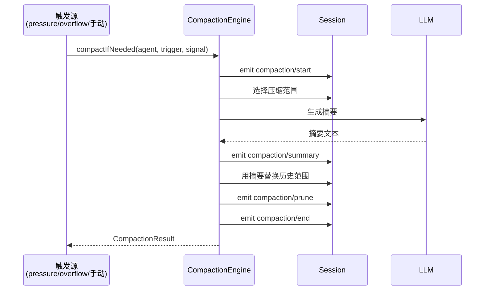
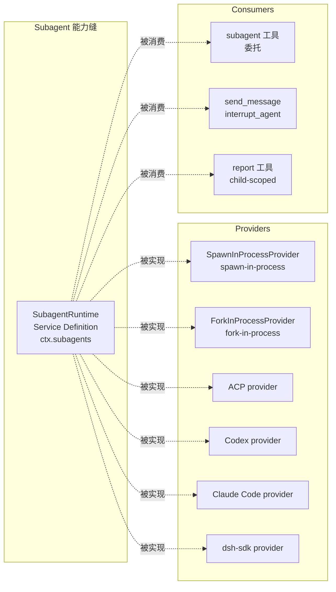
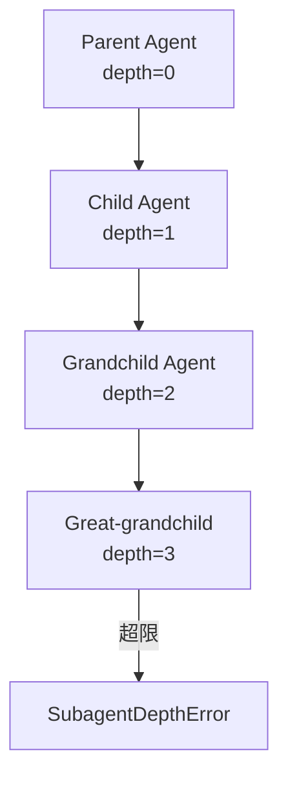
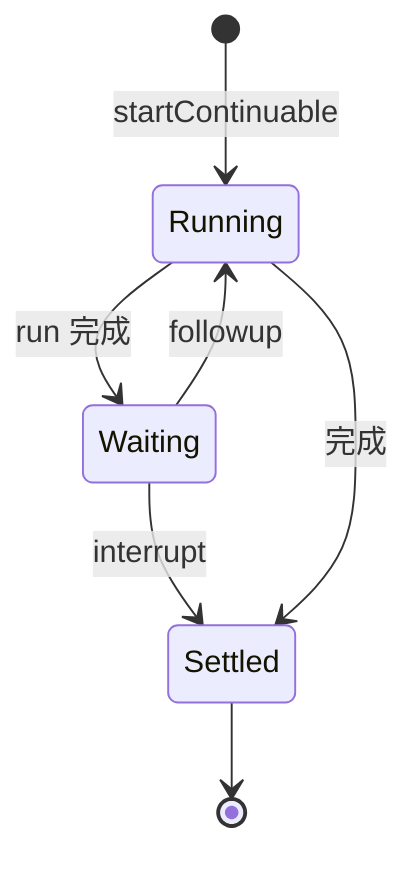

# 14 · Compaction 与 Subagent 能力

> **前置阅读**：[13 · Web 与 LSP 能力](/13-web-and-lsp)
> **下一步**：[15 · Workflow 与 Skill 能力](/15-workflow-and-skill)

## 学习目标

1. 深入理解 Compaction 的完整工作流程
2. 掌握 Subagent Service Definition 的接口
3. 理解子代理 scope 继承机制（depth + fork log 前缀）
4. 知道 continuable child 管理模式
5. 能配置子代理委托

---

## 一、Compaction 深入

### 1.1 工作流程



### 1.2 CompactionEngine 接口

**文件**：`packages/compaction/compaction/src/index.ts:96-172`

```typescript
export abstract class CompactionEngine extends Service {
  constructor(ctx: Context) { super(ctx, 'compaction') }
  
  // 自动压缩
  abstract compactIfNeeded(
    agent: CompactionAgentContext,
    trigger: CompactionTrigger,
    signal: AbortSignal,
  ): Promise<CompactionResult | null>
  
  // 手动压缩（显式空闲会话）
  // ... 更多方法
}
```

### 1.3 ManualCompactAgentContext

**文件**：`packages/compaction/compaction/src/index.ts:70-79`

```typescript
interface ManualCompactAgentContext extends CompactionAgentContext {
  /**
   * Run a non-turn maintenance operation only while the agent is idle.
   * @throws synchronously when the agent is already active.
   */
  runMaintenance<T>(task: (signal: AbortSignal) => Promise<T>): Promise<T>
}
```

**关键**：手动压缩只在 agent 空闲时运行，同步抛错如果 agent 已激活。

### 1.4 CompactionResult

**文件**：`packages/compaction/compaction/src/types.ts`

```typescript
interface CompactionResult {
  // 压缩结果
}
```

### 1.5 checkpoint source

**文件**：`packages/compaction/compaction/src/index.ts:21-22`

```typescript
export { compactCheckpointSource, isCompactCheckpointSource } from './checkpoint.ts'
export type { CompactionCheckpointSource } from './checkpoint.ts'
```

替换后的用户消息使用 `compactCheckpointSource` 携带事务身份，让消费者独立识别和关联。

### 1.6 tool pairing

**文件**：`packages/compaction/compaction/src/index.ts:17`

```typescript
export { toolPairingBalancedAfter, toolPairingBalancedBefore } from './tool-pairing.ts'
```

确保压缩范围前后的工具配对平衡（`tool/call` 和 `tool/result` 不被拆开）。

---

## 二、Subagent 能力缝概览



### 2.1 包列表

| 包 | 角色 | 路径 |
|---|---|---|
| `dsh-subagent` | Service Definition | `packages/subagent/subagent/` |
| `dsh-subagent-spawn-in-process` | Provider（spawn） | `packages/subagent/subagent-spawn-in-process/` |
| `dsh-subagent-fork-in-process` | Provider（fork） | `packages/subagent/subagent-fork-in-process/` |
| `dsh-subagent-in-process-driver` | 共享驱动器 | `packages/subagent/subagent-in-process-driver/` |
| `dsh-subagent-acp` | ACP provider | `packages/subagent/subagent-acp/` |
| `dsh-subagent-codex` | Codex provider | `packages/subagent/subagent-codex/` |
| `dsh-subagent-claude-code` | Claude Code provider | `packages/subagent/subagent-claude-code/` |
| `dsh-subagent-dsh-sdk` | dsh-sdk provider | `packages/subagent/subagent-dsh-sdk/` |
| `dsh-tool-subagent` | Consumer（委托） | `packages/subagent/tool-subagent/` |
| `dsh-tool-subagent-control` | Consumer（控制） | `packages/subagent/tool-subagent-control/` |
| `dsh-tool-subagent-report` | Consumer（报告） | `packages/subagent/tool-subagent-report/` |

---

## 三、SubagentRuntime Service Definition

### 3.1 核心接口

**文件**：`packages/subagent/subagent/src/index.ts`

```typescript
export abstract class SubagentRuntime extends Service {
  constructor(ctx: Context) { super(ctx, 'subagents') }
  
  // 一次性 run
  abstract start(request: SubagentRequest): SubagentRun
  
  // 建立 durable continuable child
  abstract startContinuable(request: SubagentRequest): Promise<SubagentRun>
  
  // 向 continuable child 投递后续内容
  abstract followup(childId, content, options): Promise<void>
  
  // 中断 continuable child
  abstract interrupt(childId, authority, options): Promise<void>
  
  // 列举
  abstract list(parent): readonly SubagentRunInfo[]
  abstract listProviders(): readonly string[]
}
```

### 3.2 关键类型

**文件**：`packages/subagent/subagent/src/types.ts`

```typescript
type SubagentRunId = Branded<'SubagentRunId'>

interface SubagentCapabilities {
  outputSchema?: JsonSchema
  depthLimit?: number
  toolFilter?: string[]
  persona?: string
  // ...
}

interface SubagentRequest { ... }
interface SubagentSpec { ... }
interface SubagentRun { ... }
interface SubagentRunInfo { ... }
interface SubagentRunEndInfo { ... }
interface SubagentResult { ... }
```

### 3.3 SessionEventMap 事件

**文件**：`packages/subagent/subagent/src/index.ts`

```typescript
declare module '@deepseek-ai/dsh-session/types' {
  interface SessionEventMap {
    'subagent/start': { ... }      // 一次性 run 启动
    'subagent/end': { ... }        // 一次性 run 结束
    'subagent/provider-added': { ... }   // provider 注册
    'subagent/provider-removed': { ... } // provider 注销
  }
}
```

**文件**：`packages/subagent/subagent/src/descriptor.ts:29`

```typescript
'subagent/descriptor': { ... }  // durable descriptor（lifecycle mode + composition）
```

---

## 四、子代理 Scope 继承

### 4.1 深度继承

**文件**：`packages/subagent/subagent/src/depth.ts`

```typescript
// delegationDepthOf(agent) = Math.max(
//   agent.session.header.delegationDepth ?? 0,
//   runtime ?? 0
// )
// child depth = parent depth + 1
// assertSubagentMaxDepth 在超限时抛 SubagentDepthError
```



### 4.2 Child Agent 组合

**文件**：`packages/subagent/subagent/src/child-agent.ts`

```typescript
// resolveChildAgentOptions(parent, request) — 解析 child agent options
// resolveChildDepth(parent) — 计算 child depth
// applyChildComposition(options, composition) — 应用 composition
// childSessionMeta — child session 元数据
// captureDelegatedPolicyOverrides / appendDelegatedPolicyOverrides — 策略覆盖委托
```

### 4.3 Fork 模式继承

**文件**：`packages/subagent/subagent-fork-in-process/src/index.ts`

Fork 模式继承 parent session log 前缀（到最后一个 `turn/end`）。

| 模式 | 特征 |
|---|---|
| **spawn** | fresh child，新 session |
| **fork** | 继承 parent log 前缀 |

---

## 五、Continuable Child 管理

### 5.1 概念

**文件**：`packages/subagent/subagent/src/continuation.ts`

Continuable child 是持久的子代理，可以接收后续消息。



### 5.2 Activation

**文件**：`packages/subagent/subagent/src/continuation.ts:191`

```typescript
interface Activation {
  // 一次 residency epoch，直接拥有 AgentHandle
}
```

### 5.3 ActivationState

**文件**：`packages/subagent/subagent/src/continuation.ts:159`

```typescript
type ActivationState = 'running' | 'waiting' | 'settled'
```

### 5.4 SubagentInterruptAuthority

**文件**：`packages/subagent/subagent/src/continuation.ts:139`

```typescript
type SubagentInterruptAuthority =
  | { kind: 'user'; parentSessionId: ... }
  | { kind: 'ancestor'; agent: Agent }  // live Agent
```

---

## 六、Subagent Consumers

### 6.1 委托工具

**文件**：`packages/subagent/tool-subagent/src/index.ts`

模型面向委托工具，通过 `ctx.subagents.start()` 调用。

### 6.2 控制工具

**文件**：`packages/subagent/tool-subagent-control/src/index.ts`

注册 `send_message` 和 `interrupt_agent` 工具，用于控制 continuable child。

### 6.3 报告工具

**文件**：`packages/subagent/tool-subagent-report/src/index.ts`

child-scoped `report` 工具，让子代理向父代理报告结果。

---

## 七、配置子代理

### 7.1 在 cordis.yml 中配置

```yaml
plugins:
  '@deepseek-ai/dsh-subagent-spawn-in-process':
    config:
      # spawn 模式配置
  '@deepseek-ai/dsh-tool-subagent':
    config:
      # 委托工具配置
```

### 7.2 委托示例

模型调用 `subagent` 工具时：

```typescript
{
  "name": "subagent",
  "arguments": {
    "prompt": "Analyze the authentication module",
    "capabilities": {
      "depthLimit": 2,
      "toolFilter": ["read", "grep", "glob"],
      "persona": "code-analyst"
    }
  }
}
```

---

## 实战练习

1. **追踪压缩流程**：打开 `packages/compaction/compaction/src/index.ts`，列出从触发到完成的完整事件序列。

2. **理解深度继承**：在 `packages/subagent/subagent/src/depth.ts` 中，说明 `delegationDepthOf` 如何计算深度。

3. **对比 spawn 和 fork**：打开 `packages/subagent/subagent-spawn-in-process/src/index.ts` 和 `packages/subagent/subagent-fork-in-process/src/index.ts`，说明两种模式的区别。

4. **理解 continuable child**：在 `packages/subagent/subagent/src/continuation.ts` 中，说明 `ActivationState` 的状态转换。

---

## 关键源码定位

| 内容 | 位置 |
|---|---|
| CompactionEngine | `packages/compaction/compaction/src/index.ts:96-172` |
| CompactionTrigger | `packages/compaction/compaction/src/index.ts:25` |
| ManualCompactionError | `packages/compaction/compaction/src/index.ts:28-57` |
| ManualCompactAgentContext | `packages/compaction/compaction/src/index.ts:70-79` |
| compactCheckpointSource | `packages/compaction/compaction/src/index.ts:21-22` |
| tool pairing | `packages/compaction/compaction/src/index.ts:17` |
| compaction-basic | `packages/compaction/compaction-basic/src/index.ts` |
| compaction Consumer | `packages/compaction/command-compact/src/index.ts` |
| SubagentRuntime | `packages/subagent/subagent/src/index.ts` |
| Subagent 类型 | `packages/subagent/subagent/src/types.ts` |
| subagent SessionEventMap | `packages/subagent/subagent/src/index.ts` |
| subagent/descriptor | `packages/subagent/subagent/src/descriptor.ts:29` |
| 深度继承 | `packages/subagent/subagent/src/depth.ts` |
| child agent 组合 | `packages/subagent/subagent/src/child-agent.ts` |
| continuable child | `packages/subagent/subagent/src/continuation.ts` |
| Activation | `packages/subagent/subagent/src/continuation.ts:191` |
| ActivationState | `packages/subagent/subagent/src/continuation.ts:159` |
| SubagentInterruptAuthority | `packages/subagent/subagent/src/continuation.ts:139` |
| SpawnInProcessProvider | `packages/subagent/subagent-spawn-in-process/src/index.ts` |
| ForkInProcessProvider | `packages/subagent/subagent-fork-in-process/src/index.ts` |
| 委托工具 | `packages/subagent/tool-subagent/src/index.ts` |
| 控制工具 | `packages/subagent/tool-subagent-control/src/index.ts` |
| 报告工具 | `packages/subagent/tool-subagent-report/src/index.ts` |

---

## 下一步

本文理解了 Compaction 与 Subagent 能力。下一篇 [15 · Workflow 与 Skill 能力](/15-workflow-and-skill) 将讲解 Workflow 引擎和 Skill 发现/加载机制。
