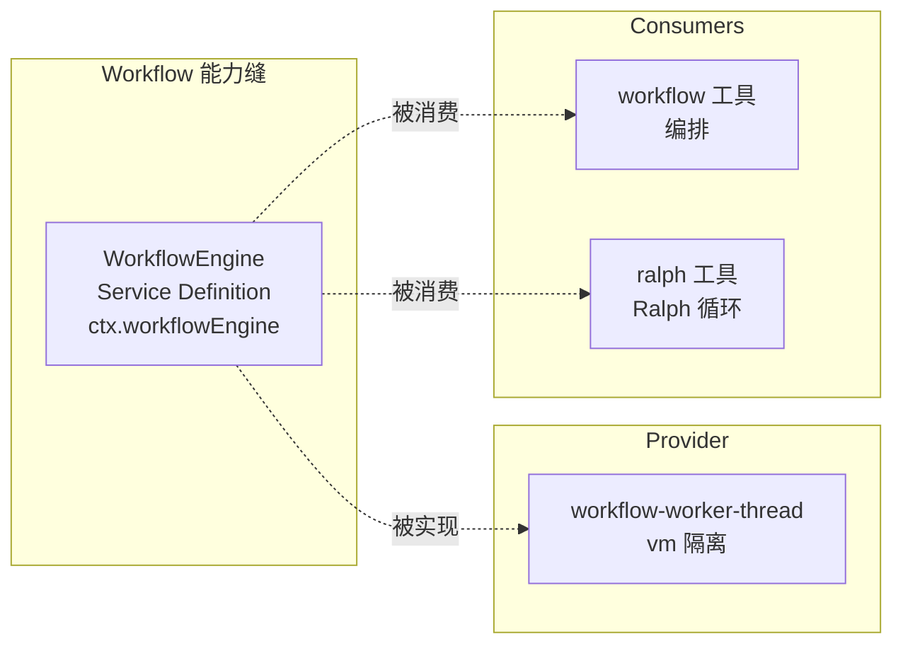
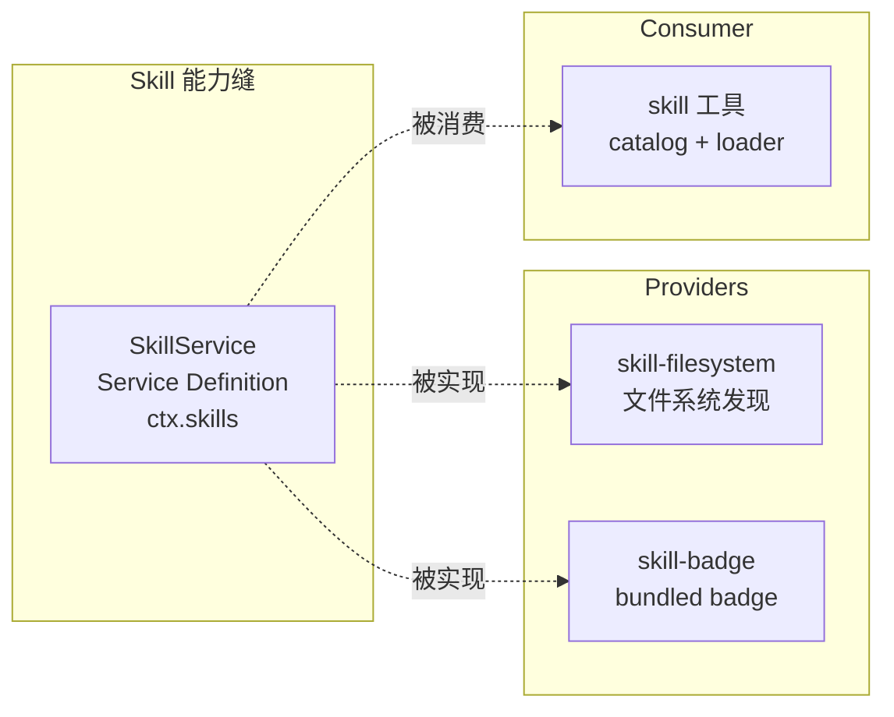

# 15 · Workflow 与 Skill 能力

> **前置阅读**：[14 · Compaction 与 Subagent 能力](/14-compaction-and-subagent)
> **下一步**：[16 · Session 持久化与投影](/16-session-persistence)

## 学习目标

1. 掌握 Workflow Service Definition 的接口与事件
2. 理解 worker-thread provider 的 vm 隔离机制
3. 知道 Skill Service Definition 的发现与加载机制
4. 理解 skill 的多 root 发现和 rank 排序
5. 能编写自定义 workflow 脚本和 skill

---

## 一、Workflow 能力缝概览



### 1.1 包列表

| 包 | 角色 | 路径 |
|---|---|---|
| `dsh-workflow` | Service Definition | `packages/workflow/workflow/` |
| `dsh-workflow-worker-thread` | Provider（worker-thread） | `packages/workflow/workflow-worker-thread/` |
| `dsh-tool-workflow` | Consumer（workflow 工具） | `packages/workflow/tool-workflow/` |
| `dsh-tool-ralph` | Consumer（Ralph 循环） | `packages/workflow/tool-ralph/` |

---

## 二、WorkflowEngine Service Definition

### 2.1 核心接口

**文件**：`packages/workflow/workflow/src/index.ts`

```typescript
export abstract class WorkflowEngine extends Service {
  constructor(ctx: Context) { super(ctx, 'workflowEngine') }
  // ...
}
```

### 2.2 关键类型

**文件**：`packages/workflow/workflow/src/types.ts`

```typescript
type WorkflowRunId = Branded<'WorkflowRunId'>
type WorkflowPhase = string  // phase 标题

interface WorkflowMeta {
  name: string
  description: string
  // ...
}

interface WorkflowResult { ... }  // 脚本返回值
interface WorkflowRunInfo { id: WorkflowRunId; meta: WorkflowMeta }
interface WorkflowAgentInfo { seq: number; label: string; phase: WorkflowPhase; childId: ... }
interface WorkflowAgentEndInfo extends WorkflowAgentInfo { outcome: WorkflowAgentOutcome }
interface WorkflowResultInfo { stopReason: WorkflowStopReason; error?: ...; agentsStarted: number }

type WorkflowStopReason = 'completed' | 'cancelled' | 'error' | ...
type WorkflowAgentOutcome = 'completed' | 'cancelled' | 'failed' | ...
```

### 2.3 WorkflowStartRequest

**文件**：`packages/workflow/workflow/src/runtime-types.ts`

```typescript
interface WorkflowStartRequest {
  script: string       // workflow 脚本
  meta: WorkflowMeta
  args: unknown        // 脚本参数
  parent: ...          // 父 agent
  signal: AbortSignal
}

interface WorkflowRun {
  id: WorkflowRunId
  meta: WorkflowMeta
  result: Promise<WorkflowResult>
  cancel(): Promise<void>
  dispose(): void
}
```

### 2.4 WorkflowErrorCode

**文件**：`packages/workflow/workflow/src/index.ts:108-119`

```typescript
type WorkflowErrorCode =
  | 'SCRIPT_PARSE' | 'META_INVALID' | 'INVALID_ARGUMENT' | 'UNSUPPORTED_OPTION'
  | 'UNSUPPORTED_SCHEMA' | 'AGENT_CAP' | 'ITEM_CAP' | 'AGENT_START'
  | 'AGENT_RESULT' | 'RESULT_UNSERIALIZABLE' | 'CANCELLED'
```

### 2.5 SessionEventMap 事件

**文件**：`packages/workflow/workflow/src/index.ts:36-90`

全部 `@mode emit`：

| 事件 | 行号 | 说明 |
|---|---|---|
| `workflow/start` | :43 | run 启动，配对 `workflow/end` |
| `workflow/phase` | :51 | `phase(title)` 调用，进度分组 |
| `workflow/log` | :58 | `log(message)` 调用，叙述行 |
| `workflow/agent-start` | :68 | `agent()` 调用建立 published child run |
| `workflow/agent-end` | :79 | `agent()` 调用结算 |
| `workflow/end` | :89 | run 结算，配对 `workflow/start`，**不含 result value** |

**关键**：每个 started `agent()` call 在每条 stop path 上恰好配对一个 `workflow/agent-end`（按 `agent.seq`）。

### 2.6 tool-workflow 事件

**文件**：`packages/workflow/tool-workflow/src/types.ts:42`

```typescript
declare module '@deepseek-ai/dsh-session/types' {
  interface SessionEventMap {
    'tool-workflow/run-start': { ... }
    'tool-workflow/agent-start': { ... }
    'tool-workflow/agent-end': { ... }
    'tool-workflow/run-end': { ... }
  }
}
```

---

## 三、Worker-Thread Provider

### 3.1 架构

```mermaid
flowchart TD
    subgraph Host[Host 进程]
        Engine[WorkflowEngine<br/>worker-thread provider]
        HostBridge[host.ts<br/>WorkerRun]
    end
    
    subgraph Worker[Worker 线程]
        Runtime[runtime.ts<br/>vm context]
        VmHooks[vm hooks]
        ChildRPC[child RPC]
    end
    
    Engine --> HostBridge
    HostBridge <-->|RPC| Runtime
    Runtime --> VmHooks
    Runtime --> ChildRPC
    ChildRPC -->|agent() 调用| HostBridge
    HostBridge -->|subagents.start| Subagents[ctx.subagents]
```

### 3.2 host.ts

**文件**：`packages/workflow/workflow-worker-thread/src/host.ts`

- `WorkerRun` — host 端 run 控制
- child RPC 桥接：每个 forwarded `workflow/agent-start` 恰好配对一个 `workflow/agent-end`（:555-556）
- `workflow/end` 后禁止创建工作或叙述（:524）

### 3.3 runtime.ts

**文件**：`packages/workflow/workflow-worker-thread/src/runtime.ts`

- vm context 隔离
- `agent()` 调用桥接到 host subagents
- concurrency / caps 强制

### 3.4 worker.ts

**文件**：`packages/workflow/workflow-worker-thread/src/worker.ts`

worker 入口。

---

## 四、Workflow 脚本示例

### 4.1 脚本 API

workflow 脚本在 vm context 中执行，可用的 API：

```typescript
// workflow 脚本示例
export async function run({ phase, log, agent, args }) {
  phase('Analysis')
  log('Starting analysis...')
  
  const result1 = await agent({
    label: 'explorer',
    prompt: 'Explore the codebase structure',
  })
  
  phase('Implementation')
  const result2 = await agent({
    label: 'implementer',
    prompt: `Based on: ${result1.output}, implement the feature`,
  })
  
  log('Workflow complete')
  return { analysis: result1.output, implementation: result2.output }
}
```

### 4.2 事件序列

```
workflow/start
  workflow/phase "Analysis"
  workflow/log "Starting analysis..."
  workflow/agent-start (seq=1, label="explorer")
  workflow/agent-end (seq=1, outcome="completed")
  workflow/phase "Implementation"
  workflow/agent-start (seq=2, label="implementer")
  workflow/agent-end (seq=2, outcome="completed")
  workflow/log "Workflow complete"
workflow/end
```

---

## 五、Skill 能力缝概览



### 5.1 包列表

| 包 | 角色 | 路径 |
|---|---|---|
| `dsh-skill` | Service Definition | `packages/skill/skill/` |
| `dsh-skill-filesystem` | Provider（文件系统） | `packages/skill/skill-filesystem/` |
| `dsh-skill-badge` | Provider（bundled badge） | `packages/skill/skill-badge/` |
| `dsh-tool-skill` | Consumer（catalog + loader） | `packages/skill/tool-skill/` |

---

## 六、SkillService Service Definition

### 6.1 核心接口

**文件**：`packages/skill/skill/src/index.ts:286`

```typescript
export abstract class SkillService extends Service {
  constructor(ctx: Context) { super(ctx, 'skills') }
  // ...
}
```

### 6.2 关键类型

```typescript
interface SkillSource { ... }      // skill 来源
interface SkillCandidate { ... }   // 候选 skill
interface SkillDefinition { ... }  // skill 定义
interface SkillProvider { ... }    // provider 接口
interface SkillLookupOptions { ... }  // 查找选项

interface SkillLayer { ... }       // 拥有层（:307）
interface IndexedCandidate {       // :301
  candidate: SkillCandidate
  provider: SkillProvider
  providerOrder: number
  localOrder: number
  layer: SkillLayer
}
interface RegisteredProvider {     // :311
  provider: SkillProvider
  order: number
}
```

### 6.3 Config

**文件**：`packages/skill/skill/src/index.ts:280-282`

```typescript
static Config = z.object({
  collectCacheMaxEntries: z.number(),
})
```

### 6.4 SessionEventMap 事件

**文件**：`packages/skill/skill/src/index.ts:289-298`

```typescript
'skills/change': {
  /** @mode emit */
  // unfiltered invalidation 通知
  // provider / runtime contribution / provider-backed catalog 可能变更时触发
  // listener 失败被隔离，不能否决 registry 变更
}
```

**发射点**（`skill/src/index.ts:650-657`）：

```typescript
this.ctx.events.dispatch('emit', ['skills/change'])
// listener 抛错 → warn('skills/change listener threw: ...')
// listener reject → warn('skills/change listener rejected: ...')
```

---

## 七、Skill 发现机制

### 7.1 Roots 与 Rank

**文件**：`packages/skill/skill-filesystem/src/index.ts`

| Root | Rank | 说明 |
|---|---|---|
| project-dsh | 100 | 项目 `.dsh/` 目录 |
| project-agents | 200 | 项目 `.agents/` 目录 |
| custom | 300 | 自定义路径 |
| user-dsh | 400 | 用户级 `.dsh/` |
| user-agents | 500 | 用户级 `.agents/` |
| bundled | 600 | 内置 skill |

**rank 越小优先级越高**。

### 7.2 两种 skill 格式

| 格式 | 说明 |
|---|---|
| **Directory-bundle** | 目录形式，含 `SKILL.md` 或类似入口 |
| **Flat Markdown** | 单个 Markdown 文件 |

### 7.3 YAML frontmatter

从 Markdown 文件头部提取 skill 元数据：

```markdown
---
name: my-skill
description: A useful skill
triggers:
  - keyword1
  - keyword2
---

# Skill Content
...
```

### 7.4 文件监听

使用 chokidar 监听文件变更，变更时触发 `skills/change`。

---

## 八、Skill 加载机制

### 8.1 collect()

```typescript
// packages/skill/tool-skill/src/index.ts
// ctx.skills.collect() — 合并所有 provider catalogs
// 按 providerOrder / localOrder / layer 排序
```

### 8.2 get()

```typescript
// ctx.skills.get() — 解析 winning skill
```

### 8.3 renderSkillContent

```typescript
// 渲染 skill body
```

### 8.4 Durable Session Skill Catalog

catalog 持久化到 session log，确保可重建。

---

## 九、配置 Skill

### 9.1 在 cordis.yml 中配置

```yaml
plugins:
  '@deepseek-ai/dsh-skill-filesystem':
    config:
      roots:
        - path: /workspace/.dsh/skills
          rank: 100
        - path: /workspace/.agents/skills
          rank: 200
```

### 9.2 创建自定义 Skill

在 `.agents/skills/my-skill/SKILL.md`：

```markdown
---
name: my-skill
description: My custom skill for code review
triggers:
  - code review
  - review PR
---

# My Skill

When asked to review code, follow these steps:
1. Read the diff
2. Check for common issues
3. Suggest improvements
```

---

## 实战练习

1. **追踪 workflow 事件**：在 `packages/workflow/workflow/src/index.ts:36-90` 中，列出所有事件及其配对关系。

2. **理解 vm 隔离**：在 `packages/workflow/workflow-worker-thread/src/runtime.ts` 中，说明 vm context 如何隔离 workflow 脚本。

3. **理解 skill rank**：在 `packages/skill/skill-filesystem/src/index.ts` 中，说明 6 个 root 的 rank 顺序和意义。

4. **创建自定义 skill**：在 `.agents/skills/` 下创建一个 skill，说明它的 frontmatter 格式。

---

## 关键源码定位

| 内容 | 位置 |
|---|---|
| WorkflowEngine | `packages/workflow/workflow/src/index.ts` |
| Workflow 类型 | `packages/workflow/workflow/src/types.ts` |
| WorkflowStartRequest | `packages/workflow/workflow/src/runtime-types.ts` |
| WorkflowErrorCode | `packages/workflow/workflow/src/index.ts:108-119` |
| workflow SessionEventMap | `packages/workflow/workflow/src/index.ts:36-90` |
| WorkflowEventName | `packages/workflow/workflow/src/index.ts:94-100` |
| tool-workflow 事件 | `packages/workflow/tool-workflow/src/types.ts:42` |
| worker-thread host | `packages/workflow/workflow-worker-thread/src/host.ts` |
| worker-thread runtime | `packages/workflow/workflow-worker-thread/src/runtime.ts` |
| worker 入口 | `packages/workflow/workflow-worker-thread/src/worker.ts` |
| workflow 工具 | `packages/workflow/tool-workflow/src/index.ts` |
| ralph 工具 | `packages/workflow/tool-ralph/src/index.ts` |
| SkillService | `packages/skill/skill/src/index.ts:286` |
| Skill Config | `packages/skill/skill/src/index.ts:280-282` |
| skills/change 事件 | `packages/skill/skill/src/index.ts:289-298` |
| skills/change 发射 | `packages/skill/skill/src/index.ts:650-657` |
| IndexedCandidate | `packages/skill/skill/src/index.ts:301` |
| RegisteredProvider | `packages/skill/skill/src/index.ts:311` |
| skill-filesystem | `packages/skill/skill-filesystem/src/index.ts` |
| skill-badge | `packages/skill/skill-badge/src/index.ts` |
| skill Consumer | `packages/skill/tool-skill/src/index.ts` |

---

## 下一步

本文理解了 Workflow 与 Skill 能力。下一篇 [16 · Session 持久化与投影](/16-session-persistence) 将深入讲解会话持久化机制。
