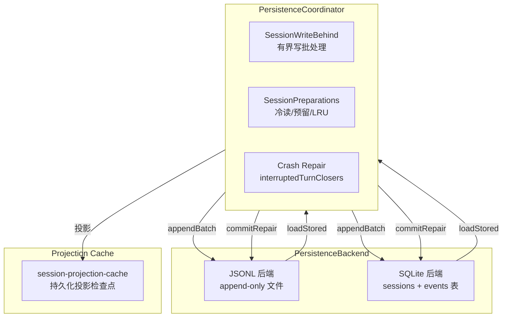
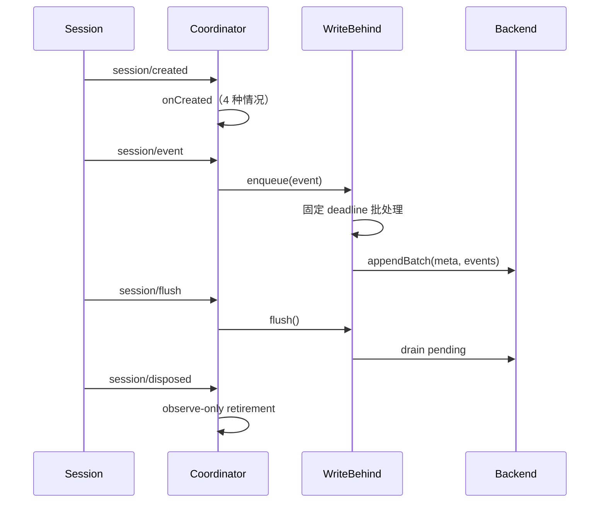
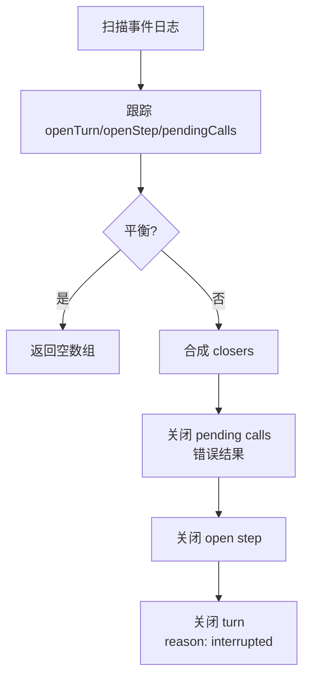

# 16 · Session 持久化与投影

> **前置阅读**：[15 · Workflow 与 Skill 能力](/15-workflow-and-skill)
> **下一步**：[17 · Preset 与 Profile 组合](/17-preset-and-profile)

## 学习目标

1. 掌握 Session 持久化的完整架构（coordinator + backend）
2. 理解 JSONL 和 SQLite 两种后端
3. 知道 SCHEMA_VERSION 和 SESSION_FORMAT_VERSION 的区别
4. 理解崩溃恢复机制（interruptedTurnClosers）
5. 掌握 Session 投影机制

---

## 一、持久化架构概览



---

## 二、版本控制

### 2.1 SCHEMA_VERSION（SQLite 磁盘表结构版本）

- **值**：`15`
- **定义**：`packages/session/session-persistence-sqlite/src/schema.ts:20`
- **用途**：SQLite 后端的磁盘表结构版本，仅在表布局发生破坏性变更时递增
- **APPLICATION_ID**：`0x44534850`（`schema.ts:23`），防止无关数据库被误写入

### 2.2 SESSION_FORMAT_VERSION（磁盘 session 格式版本）

- **值**：`0`
- **定义**：`packages/core/session/src/types.ts:56`
- **用途**：磁盘 session 格式版本，写入每个新 `SessionHeader`，加载时强制检查
- **当前状态**：pre-release，不兼容的日志直接拒绝，不提供迁移

### 2.3 两个版本的区别

| 版本 | 范围 | 递增时机 | 迁移 |
|---|---|---|---|
| `SCHEMA_VERSION` | SQLite 表结构 | 表布局破坏性变更 | SQLite 迁移逻辑 |
| `SESSION_FORMAT_VERSION` | session 事件格式 | 结构性格式变更 | 无（pre-release 拒绝） |

---

## 三、PersistenceCoordinator

### 3.1 核心职责

**文件**：`packages/session/session-persistence/src/coordinator.ts`

- 共享缓冲
- 序列化
- adoption
- repair
- disposal 编排

### 3.2 关键常量

```typescript
// coordinator.ts:27
DEFAULT_PREPARED_SESSION_CACHE_SIZE = 5

// coordinator.ts:29
DEFAULT_WRITE_BATCH_MAX_DELAY_MS = 200
```

### 3.3 写路径

**文件**：`coordinator.ts:1086-1137`



### 3.4 onCreated 四种情况

**文件**：`coordinator.ts:1236-1279`

| 情况 | 条件 | 行为 |
|---|---|---|
| 已 tracked | seed matches | no-op / claim / reclaim / reject collision |
| 未 tracked + artifact EXISTS at same cwd, seq-aligned PREFIX | | ADOPT |
| 未 tracked + artifact EXISTS at another cwd / NOT prefix | | REJECT (collision) |
| 未 tracked + NO artifact | | 真正新 session：register + persist seed |

---

## 四、PersistenceBackend 接口

### 4.1 接口定义

**文件**：`coordinator.ts:127-215`

```typescript
interface PersistenceBackend {
  loadStored(id, signal): Promise<StoredPrefix<TornMarker>>
  readStoredRevision(id, signal): Promise<SessionPersistenceRevision>
  loadStoredFrom?(id, fromSeq, signal): Promise<...>  // 可选，SQLite 实现
  appendBatch(meta, events, isMaterialized): Promise<void>
  commitRepair(meta, tornMarker, closers): Promise<void>
  list(signal): Promise<readonly SessionMeta[]>
  locate?(meta): Promise<SessionRawArtifact>
  close?(): Promise<void>
}
```

---

## 五、JSONL 后端

### 5.1 机制

**文件**：`packages/session/session-persistence-jsonl/src/index.ts`

每个 session 一个 append-only 文件，header + 连续事件。

### 5.2 格式

**文件**：`format.ts`

```typescript
// format.ts:33-44
interface HeaderLine {
  type: 'session'
  version: number       // SESSION_FORMAT_VERSION
  id: string
  createdAt: string
  cwd: string
  parentSession: string | null
  seedLength: number
  origin: string
  delegationDepth: number | null
  agentPreset: string | null
}

// format.ts:17
type JsonlCompression = 'zstd' | 'none'

// format.ts:24
logSuffix() → '.jsonl.zstd' 或 '.jsonl'
```

### 5.3 路径消毒

```typescript
// format.ts:121-136
encodeSegment(raw)  // 中和 ../、绝对路径、NUL、分隔符

// format.ts:147-167
projectKey(cwd)  // 为项目路径构建可读的目录键
```

### 5.4 commitRepair

```typescript
// index.ts:436-444
async commitRepair(meta, tornMarker, closers): Promise<void> {
  if (tornMarker !== undefined) await this.repair(meta, tornMarker.truncateTo)
  const repairedEvents = [...(tornMarker?.recoveredEvents ?? []), ...closers]
  if (repairedEvents.length > 0) await this.appendLines(meta, repairedEvents)
}

// index.ts:692-701 — repair 私有方法
private async repair(meta, offset): Promise<void> {
  const path = logPath(this.root, meta.cwd, meta.id, this.compression)
  await truncate(path, offset)
  const handle = await open(path, 'r+')
  try { await handle.sync() } finally { await handle.close() }
}
```

---

## 六、SQLite 后端

### 6.1 机制

**文件**：`packages/session/session-persistence-sqlite/src/index.ts`

header → `sessions` 表行，event → `events` 表行（1:1）。

### 6.2 Schema

**文件**：`schema.ts`

```typescript
// schema.ts:32+
interface SessionRow {
  id: string
  version: number
  created_at: string
  cwd: string
  parent_session: string | null
  seed_length: number
  origin: string
  incarnation: number
  revision: number
}
```

**行存在性 = 物化信号**（首次 `append` 时写入，lazy materialization）。

### 6.3 appendBatch — 原子事务

```typescript
// index.ts:284-302
async appendBatch(meta, events, isMaterialized): Promise<void> {
  this.db.exec('BEGIN')
  try {
    if (!isMaterialized) this.writeRow(meta)
    for (const event of events) {
      insertEvent.run(meta.id, event.seq, event.type, event.time, JSON.stringify(event.data), ...)
    }
    this.db.prepare('UPDATE sessions SET revision = revision + 1 WHERE id = ?').run(meta.id)
    this.db.exec('COMMIT')
  } catch (error) {
    this.db.exec('ROLLBACK')
    throw error
  }
}
```

### 6.4 commitRepair — 单事务

```typescript
// index.ts:309-338
async commitRepair(meta, tornMarker, closers): Promise<void> {
  this.db.exec('BEGIN')
  try {
    if (tornMarker !== undefined) {
      this.db.prepare('DELETE FROM events WHERE session_id = ? AND seq >= ?').run(meta.id, tornMarker)
    }
    if (closers.length > 0) {
      for (const event of closers) {
        insertEvent.run(meta.id, event.seq, event.type, event.time, JSON.stringify(event.data), ...)
      }
    }
    if (tornMarker !== undefined || closers.length > 0) {
      this.db.prepare('UPDATE sessions SET revision = revision + 1 WHERE id = ?').run(meta.id)
    }
    this.db.exec('COMMIT')
  } catch (error) {
    this.db.exec('ROLLBACK')
    throw error
  }
}
```

### 6.5 torn-tail 检测

**文件**：`schema.ts:240-269`

保留连续前缀，包括完整中断的 turn；之后的 holes 是 never-committed torn tail。

---

## 七、崩溃恢复

### 7.1 interruptedTurnClosers

**文件**：`packages/core/session/src/repair.ts:27-133`

返回关闭开放 tail turn 的**确定性合成事件**：



### 7.2 两种恢复代码

```typescript
// repair.ts:13
TOOL_NOT_STARTED  // 工具请求从未到达记录的 call start

// repair.ts:16
TOOL_OUTCOME_UNKNOWN  // 已记录的 tool call 的完成结果未持久记录
```

### 7.3 确定性

合成事件复用最后真实事件的 timestamp（保持确定性，不发明"未来"时间）。

### 7.4 Coordinator 中的 repair 编排

**文件**：`coordinator.ts:891-963`

```typescript
// prepareCore（coordinator.ts:892-931）
const closers = interruptedTurnClosers(storedEvents).map(adoptSessionEvent)
const balanced = [...storedEvents, ...closers]
const session = this.ctx.sessions.prepare(id, { seed: balanced, meta, seedSource: 'persistence' })

// commitPrepared（coordinator.ts:934-963）
if (source.tornMarker !== undefined || source.closers.length > 0) {
  await this.backend.commitRepair(source.inspection.meta, source.tornMarker, source.closers)
  return undefined  // repair changed durable revision, reload
}
```

### 7.5 HMR adoption 不 crash-repair

**文件**：`coordinator.ts:1276-1279`

HMR adoption 不路由通过冷准备——那会将 open turns crash-repair 为 interrupted，但对 HMR 是错误的，因为 live Session 仍是权威。

---

## 八、SessionWriteBehind

### 8.1 有界写批处理

**文件**：`packages/session/session-persistence/src/write-behind.ts:22-159`

```typescript
interface SessionWriteBehindOptions {
  maxDelayMs: number
  write(events): Promise<void>
  reportBackgroundFailure(error): void
}
```

### 8.2 关键方法

| 方法 | 作用 |
|---|---|
| `enqueue(event)` | 复制事件到持久化队列，启动固定 deadline |
| `flush()` | 取消批处理等待，持久 drain |
| `startWrite(background)` | 启动稳定 pending 前缀，durability 失败按序保留 |

---

## 九、Session 投影

### 9.1 ProjectionDefinition

**文件**：`packages/session/session-projection/src/index.ts:42-74`

```typescript
interface ProjectionDefinition<K extends keyof SessionProjectionMap> {
  key: K
  schema: ZodType<SessionProjectionMap[K]>
  init(): S                                    // 空日志初始状态
  apply(state, event): S                       // 纯转换
  view(state): SessionProjectionMap[K]         // 状态 → wire payload
  stateVersion: number                         // 持久化缓存失效版本
}
```

### 9.2 Whole-value event rule

**文件**：`index.ts:13-16`

> 状态承载日志事件必须携带完整后变更状态，非 bare delta。

### 9.3 SessionProjectionMap

**文件**：`types.ts:17`

```typescript
export interface SessionProjectionMap {}  // 域包通过 declaration merging 合并
```

### 9.4 投影缓存

**文件**：`packages/session/session-projection-cache/src/index.ts`

- 持久化投影检查点，每个 session 每个投影单元一条记录
- **fail-soft 写路径**：丢失的写只增加下次冷读的 tail replay
- 两个强制写点：`turn/end` 和 session disposal

```typescript
// index.ts:42-47
Config = z.object({
  writeEveryEvents: z.number(),
  writeIntervalMs: z.number(),
})
```

### 9.5 冷读阶梯

```
cached row → persistence readFrom tail → registry restore → durable write-back
```

---

## 十、Session Titles

### 10.1 SessionTitleService

**文件**：`packages/session/session-title/src/index.ts:261-790`

```typescript
type SessionTitleProviderId = Branded<'SessionTitleProviderId'>  // index.ts:28
type SessionTitleSource = 'fallback' | 'provider' | 'user'      // index.ts:48-58
type SessionTitleAutomaticMode = 'first-prompt' | 'all-prompts' // index.ts:123
```

### 10.2 title 投影单元

**文件**：`index.ts:308-317`

```typescript
ctx.sessionProjections.register<'title', string | null>({
  key: 'title',
  schema: zod.union([zod.string().min(1), zod.null()]),
  init: () => null,
  apply: (state, event) => (event.type === 'session/title' ? event.data.title : state),
  view: state => state,
  stateVersion: 1,
})
```

### 10.3 三个 LLM title 子包

| 包 | cadence |
|---|---|
| `session-title-llm` | 共享 route/framing/timeout |
| `session-title-first-prompt-llm` | first-prompt |
| `session-title-all-prompts-llm` | all-prompts |

---

## 十一、Session Telemetry

### 11.1 SessionTelemetryBackend

**文件**：`packages/session/session-telemetry/src/index.ts`

```typescript
type SessionTelemetrySeverity = 'info' | 'warn' | 'error'  // index.ts:55
type SessionTelemetryRecord = { channel: 'ledger' | 'ops'; ... }  // index.ts:64-87
```

### 11.2 OTel 后端

**文件**：`packages/session/session-telemetry-otel/src/index.ts`

```typescript
enum SessionTelemetryMode { FULL, FEEDBACK_ONLY, DISABLED }
DEFAULT_TELEMETRY_MODE = SessionTelemetryMode.DISABLED  // index.ts:51
DEFAULT_SHUTDOWN_TIMEOUT_MILLIS = 3_000                 // index.ts:128
```

---

## 十二、Session Stats

### 12.1 sessionStats 投影

**文件**：`packages/session/session-stats/src/projection.ts`

```typescript
interface SessionStatsTotals {  // projection.ts:31-48
  turns: number
  steps: number
  llmMs: number
  toolMs: number
  ttftMs: number
  ttftSteps: number
  decodeMs: number
  decodeTokens: number
}
```

**关键**：`step/end` 是 counted step event（非 `assistant/message`），因为它是 step lifecycle 权威。

---

## 实战练习

1. **追踪写路径**：在 `coordinator.ts:1086-1137` 中，列出从 `session/created` 到 `session/disposed` 的完整事件序列。

2. **理解崩溃恢复**：在 `repair.ts:27-133` 中，说明 `interruptedTurnClosers` 如何处理 mid-turn crash。

3. **对比后端**：对比 JSONL 和 SQLite 后端的 `appendBatch` 和 `commitRepair` 实现。

4. **理解投影**：在 `session-projection/src/index.ts:42-74` 中，说明 `ProjectionDefinition` 的四个函数职责。

---

## 关键源码定位

| 内容 | 位置 |
|---|---|
| SESSION_FORMAT_VERSION | `packages/core/session/src/types.ts:56` |
| interruptedTurnClosers | `packages/core/session/src/repair.ts:27-133` |
| TOOL_NOT_STARTED/TOOL_OUTCOME_UNKNOWN | `packages/core/session/src/repair.ts:13,16` |
| PersistenceBackend 接口 | `packages/session/session-persistence/src/coordinator.ts:127-215` |
| 写路径 | `packages/session/session-persistence/src/coordinator.ts:1086-1137` |
| onCreated 四种情况 | `packages/session/session-persistence/src/coordinator.ts:1236-1279` |
| SessionWriteBehind | `packages/session/session-persistence/src/write-behind.ts:22-159` |
| SCHEMA_VERSION | `packages/session/session-persistence-sqlite/src/schema.ts:20` |
| SQLite appendBatch | `packages/session/session-persistence-sqlite/src/index.ts:284-302` |
| SQLite commitRepair | `packages/session/session-persistence-sqlite/src/index.ts:309-338` |
| torn-tail 检测 | `packages/session/session-persistence-sqlite/src/schema.ts:240-269` |
| JSONL commitRepair | `packages/session/session-persistence-jsonl/src/index.ts:436-444` |
| JSONL repair | `packages/session/session-persistence-jsonl/src/index.ts:692-701` |
| HeaderLine | `packages/session/session-persistence-jsonl/src/format.ts:33-44` |
| encodeSegment | `packages/session/session-persistence-jsonl/src/format.ts:121-136` |
| ProjectionDefinition | `packages/session/session-projection/src/index.ts:42-74` |
| SessionProjectionMap | `packages/session/session-projection/src/types.ts:17` |
| 投影缓存 | `packages/session/session-projection-cache/src/index.ts` |
| SessionTitleService | `packages/session/session-title/src/index.ts:261-790` |
| title 投影单元 | `packages/session/session-title/src/index.ts:308-317` |
| SessionTelemetryBackend | `packages/session/session-telemetry/src/index.ts` |
| OTel 后端 | `packages/session/session-telemetry-otel/src/index.ts` |
| sessionStats 投影 | `packages/session/session-stats/src/projection.ts` |

---

## 下一步

本文理解了 Session 持久化与投影。下一篇 [17 · Preset 与 Profile 组合](/17-preset-and-profile) 将讲解 preset 机制和两平面设计。
