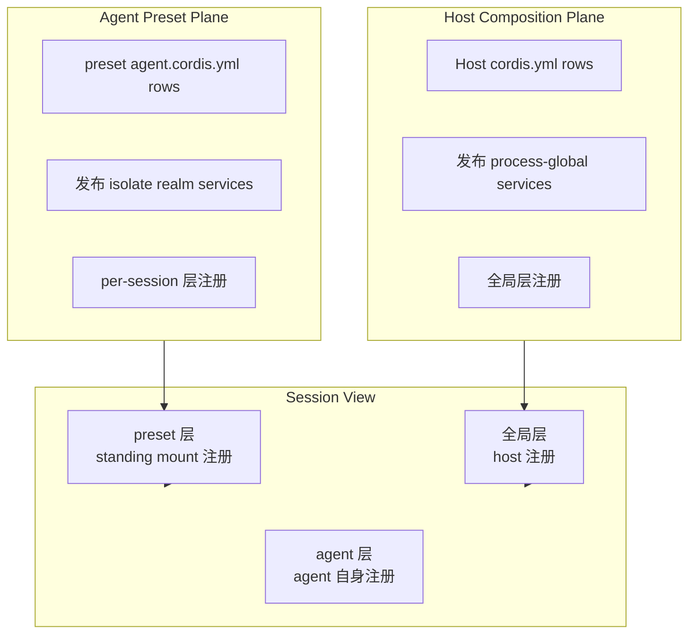
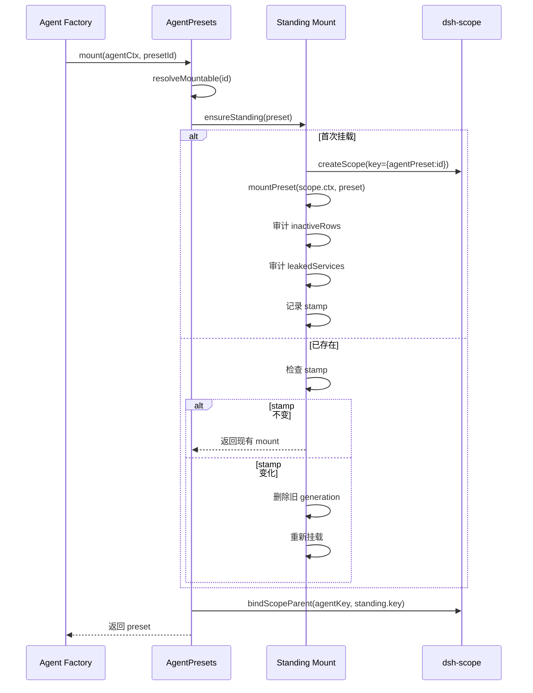
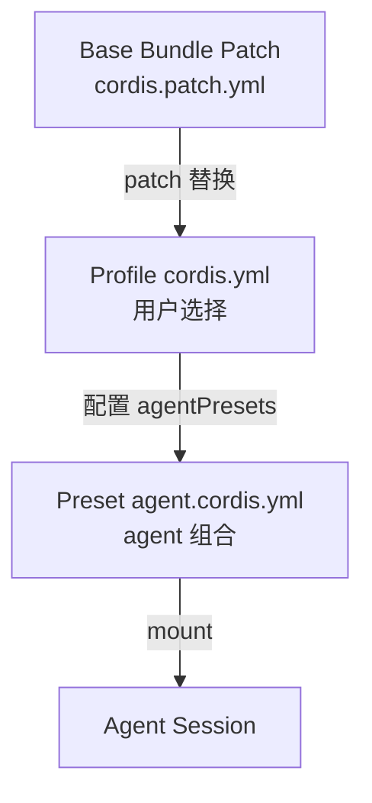

# 17 · Preset 与 Profile 组合

> **前置阅读**：[16 · Session 持久化与投影](/16-session-persistence)
> **下一步**：[18 · Bundle 与 Patch 层](/18-bundle-and-patch)

## 学习目标

1. 理解 Preset 机制：每个 session 从一个 preset `cordis.yml` 组合
2. 掌握两平面设计：host composition vs agent preset
3. 理解 standing mount：一个 preset 只组合一次，多个 agent 共享
4. 知道四个 shipped presets 的差异
5. 理解 Profile 组合：base bundle patch + preset + 用户配置

---

## 一、Preset 概念

### 1.1 什么是 Preset

**Preset** 是一个目录，包含 `agent.cordis.yml` 组合文件，定义 agent 的模型可见插件集（工具、提示段、技能目录、投影单元）。

**文件**：`packages/preset/agent-presets/src/discovery.ts:26`

```typescript
export const COMPOSITION_FILE = 'agent.cordis.yml'
```

### 1.2 Preset 目录结构

```
<root>/
  <preset-id>/
    agent.cordis.yml    # 组合文件（必需）
    metadata.yml        # 显示元数据（可选）
```

### 1.3 Preset ID 规则

**文件**：`packages/preset/agent-presets/src/preset.ts:18`

```typescript
export const PRESET_ID = /^[a-z0-9][a-z0-9-]*$/
```

ID 成为路径段，所以是**包含边界**：`..`、分隔符、绝对路径名都会把组合放到授权根之外。

### 1.4 两种信任级别

**文件**：`preset.ts:8`

```typescript
export type PresetTrust = 'system' | 'user'
```

| Trust | 含义 |
|---|---|
| `system` | 随部署发布，只读 |
| `user` | 本地编写，等同 shell 访问权限 |

---

## 二、两平面设计

### 2.1 核心架构



### 2.2 Host Composition Plane

- **职责**：发布 process-global services（如 `agentPresets`、`sessions`、`llm`）
- **位置**：`apps/cli/config/cordis.yml` 或 bundle patch 后的 config
- **特点**：services 在 ROOT realm，所有 session 共享

### 2.3 Agent Preset Plane

- **职责**：组合模型可见插件（工具、提示段、技能）
- **位置**：`<preset-id>/agent.cordis.yml`
- **特点**：services 必须在 `isolate` realm，per-session 隔离

### 2.4 为什么不能混

**文件**：`packages/preset/agent-presets/src/mount.ts:361-367`

```typescript
const leaked = leakedServices(agentCtx, fiber)
if (leaked.length > 0) {
  throw new Error(
    `row(s) published process-global service(s) [${leaked.join(', ')}]; `
    + 'a preset service must sit behind an `isolate` realm or move to the host composition',
  )
}
```

如果 preset 发布了 ROOT realm service，第二个 session 挂载同一 preset 会冲突。

---

## 三、Standing Mount 机制

### 3.1 核心思想

**一个 preset 只组合一次**，所有使用该 preset 的 agent 共享同一组插件实例、工具注册、提示段。

### 3.2 Standing Mount 流程



### 3.3 Scope 继承

**文件**：`packages/preset/agent-presets/src/index.ts:286`

```typescript
this.bindings.set(agentKey, bindScopeParent(agentKey, standing.key))
```

agent 的 scope key parented 到 preset 的 standing key，使：
- mount 的注册对 agent 的 views 可见
- mount 的 listeners 接收 agent 的事件

### 3.4 Generation 与文件编辑

**文件**：`index.ts:500-511`

```typescript
const current = await compositionStamp(preset.path)
if (current === undefined || sameStamp(mounted.stamp, current)) return mounted
// stamp 变化 → 删除旧 generation，重新挂载
if (this.standing.get(preset.id) === pending) this.standing.delete(preset.id)
return this.ensureStanding(preset)
```

- 文件编辑通过 `stat` 的 `mtimeMs` + `size` 检测
- 已 join 的 session 保持旧 generation
- 新 session 使用新 generation

### 3.5 Single-Flight

**文件**：`index.ts:492-493`

```typescript
const pending = this.standing.get(preset.id)
if (pending !== undefined) { ... }
```

两个 agent 同时首次使用同一 preset，共享一次挂载。

---

## 四、AgentPresets 服务

### 4.1 核心方法

**文件**：`packages/preset/agent-presets/src/index.ts:82`

```typescript
export class AgentPresets extends Service {
  static inject = ['loader']
  static Config = z.object({
    default: z.string().required(),
    roots: z.array(z.object({
      path: z.string().required(),
      trust: z.union(['system', 'user'] as const).default('user'),
    })).default([]),
    includeUserRoot: z.boolean().default(true),
  })
}
```

### 4.2 方法清单

| 方法 | 作用 |
|---|---|
| `list()` | 列出所有 preset（unmemoized，每次重读） |
| `resolve(id?)` | 解析 preset（broken 也返回） |
| `mount(agentCtx, id?)` | 组合 agent 到 preset |
| `composeFrom(agentCtx, parentCtx)` | 子 agent 继承父 agent 的 preset |
| `recompose(agentCtx, id)` | 重新链接 agent 到不同 preset |
| `copy(from, id, name?)` | 复制 preset（唯一 authoring 写） |
| `remove(id)` | 删除 user preset |
| `read(id)` | 读取 preset 组合文本 |
| `standingKeyFor(id?)` | 冷读用：获取 standing key |
| `serviceFor(agent, name)` | 读取 agent 的 preset service 实例 |

### 4.3 composeFrom — 子 agent 继承

**文件**：`index.ts:316-325`

```typescript
composeFrom(agentCtx: Context, parentCtx: Context): string | undefined {
  const standing = standingMountFor(parentCtx)
  if (standing === undefined) return undefined
  this.bindings.set(agentKey, bindScopeParent(agentKey, standing.key))
  return standing.presetId
}
```

子 agent 获得父 agent 的**确切实例**（同插件对象、同工具注册、同提示段），而非重新解析 preset id。

### 4.4 recompose — 切换 preset

**文件**：`index.ts:458-472`

```typescript
async recompose(agentCtx: Context, id: string): Promise<AgentPreset> {
  const preset = await this.resolveMountable(id)
  const standing = await this.ensureStanding(preset)
  const binding = this.bindings.get(agentKey)
  if (binding === undefined) {
    this.bindings.set(agentKey, bindScopeParent(agentKey, standing.key))
  } else {
    binding.rebind(standing.key)  // dsh-scope 唯一 re-link 能力
  }
  return preset
}
```

**约束**：只在 agent 未产出任何内容时有效（caller 负责检查）。

---

## 五、Mount 守卫

### 5.1 两个守卫

**文件**：`packages/preset/agent-presets/src/mount.ts:332-381`

```typescript
export async function mountPreset(agentCtx: Context, preset: AgentPreset): Promise<void> {
  // 守卫 1：必须有 scope
  const scope = scopeOf(agentCtx)
  if (scope === undefined) { throw new Error('refusing to mount into unscoped context') }
  
  // ... 挂载 ...
  
  // 守卫 2：所有 row 必须激活
  const unusable = inactiveRows(tree)
  if (unusable.length > 0) { throw new Error(`${unusable.length} row(s) did not activate`) }
  
  // 守卫 3：不能泄漏 ROOT service
  const leaked = leakedServices(agentCtx, fiber)
  if (leaked.length > 0) { throw new Error('row(s) published process-global service(s)') }
}
```

### 5.2 inactiveRows 检查

**文件**：`mount.ts:283-301`

```typescript
export function inactiveRows(tree: EntryTree): string[] {
  for (const entry of tree.entries()) {
    if (entry.disabled) continue
    const missing = Object.keys(fiber.inject).filter(name => fiber.ctx.get(name) === undefined)
    if (missing.length > 0) {
      lines.push(`${entry.options.id}: waiting for ${missing.join(', ')}`)
    }
  }
  return lines
}
```

### 5.3 leakedServices 检查

**文件**：`mount.ts:189-203`

```typescript
export function leakedServices(ctx: Context, mount: Fiber): string[] {
  const store = ctx.reflect.store
  const rootIsolate = ctx.root[Context.isolate]
  for (const key of Object.getOwnPropertySymbols(store)) {
    const impl = store[key]
    if (!withinFiber(impl.fiber, mount)) continue
    if (rootIsolate[impl.name] === key) leaked.push(impl.name)  // ROOT realm
  }
  return leaked.sort()
}
```

---

## 六、四个 Shipped Presets

### 6.1 位置

```
apps/cli/config/agent-presets/
  minimal/agent.cordis.yml
  standard/agent.cordis.yml
  code/agent.cordis.yml
  cordis/agent.cordis.yml
```

### 6.2 minimal

最小可用 agent，仅基础工具。

### 6.3 standard

标准 agent，包含完整工具集（shell、fs、web、subagent 等）。

### 6.4 code

Code Mode agent，包含代码执行能力。

### 6.5 cordis

自修改 agent，agent 可以修改自己的 runtime（`dsh-self-modification`）。

---

## 七、Profile 组合

### 7.1 Profile 层次



### 7.2 Base Bundle Patch

**文件**：`packages/bundle/web-app/cordis.patch.yml:410-422`

```yaml
- id: agent-presets
  name: '@deepseek-ai/dsh-agent-presets'
  config:
    default: standard
    roots:
      - path: config/agent-presets
        trust: system
    # includeUserRoot: true (默认)
```

### 7.3 Profile 示例

**文件**：`examples/headless-agent/cordis.yml`

```yaml
# Profile 选择 preset 和配置 host services
- id: agent-presets
  name: '@deepseek-ai/dsh-agent-presets'
  config:
    default: code  # 覆盖 base 的 default
```

### 7.4 用户 Root

**文件**：`packages/preset/agent-presets/src/discovery.ts:41`

```typescript
export const USER_PRESET_DIR = '.agent-presets'
```

用户 preset 存放在 `$DSH_HOME/.agent-presets/<id>/`。

---

## 八、Authoring（编写 Preset）

### 8.1 唯一写操作：copy

**文件**：`index.ts:380-393`

```typescript
async copy(from: string, id: string, name?: string): Promise<void> {
  const source = await this.resolve(from)
  if ((await this.list()).some(preset => preset.id === id)) {
    throw new PresetExistsError(id)
  }
  await copyComposition(this.resolvedRoots, source, id, name)
  this.standing.delete(id)  // 清除可能过时的 mount
}
```

### 8.2 删除

**文件**：`index.ts:400-416`

```typescript
async remove(id: string): Promise<void> {
  await deleteComposition(this.resolvedRoots, await this.resolve(id))
  this.standing.delete(id)
  // 如果删除的是当前 default，清除 settings 中的 default
  if (this.settings?.get().default !== id) return
  await this.settingsService?.mutate(...)
}
```

### 8.3 不可编辑 shipped preset

shipped preset（`system` trust）不可删除，只能 copy 后编辑副本。

---

## 九、Discovery 健康检查

### 9.1 Broken Preset

**文件**：`discovery.ts:139-170`

```typescript
export async function scanRoot(root: PresetRoot): Promise<AgentPreset[]> {
  for (const child of children) {
    if (!child.isDirectory() || !PRESET_ID.test(child.name)) continue
    const broken = await isFile(path)
      ? await compositionProblem(path)  // 检查 YAML 可加载性
      : `the composition file ${COMPOSITION_FILE} is missing`
    found.push({ id: child.name, ...metadata, ...broken === undefined ? {} : { broken } })
  }
}
```

### 9.2 为什么不跳过 broken

**文件**：`discovery.ts:8-13`

> 跳过的目录仍占用 id，copy 路径拒绝该名，但 UI 无显示可删除。

broken preset 留在 roster 上，但 mount 路径拒绝它。

---

## 十、Settings 集成

### 10.1 Default Preset

**文件**：`index.ts:40-51`

```typescript
export const SETTINGS_NAMESPACE = 'agent-presets'

export interface AgentPresetSettings {
  default?: string  // 用户选择的 default preset
}
```

### 10.2 优先级

```
settings.default  >  config.default
```

**文件**：`index.ts:191-193`

```typescript
get defaultId(): string {
  return this.settings?.get().default ?? this.config.default
}
```

---

## 实战练习

1. **创建自定义 preset**：在 `$DSH_HOME/.agent-presets/my-preset/agent.cordis.yml` 创建一个只包含 `dsh-todo` 工具的 preset。

2. **理解 standing mount**：在 `index.ts:491-534` 中，追踪 `ensureStanding` 如何实现 single-flight 和 generation 切换。

3. **对比 mount vs composeFrom**：说明 `mount` 和 `composeFrom` 的差异，以及为什么子 agent 用 `composeFrom`。

4. **审计守卫**：在 `mount.ts:332-381` 中，列出三个守卫的作用，以及为什么缺一不可。

---

## 关键源码定位

| 内容 | 位置 |
|---|---|
| COMPOSITION_FILE | `packages/preset/agent-presets/src/discovery.ts:26` |
| USER_PRESET_DIR | `packages/preset/agent-presets/src/discovery.ts:41` |
| PRESET_ID 正则 | `packages/preset/agent-presets/src/preset.ts:18` |
| PresetTrust | `packages/preset/agent-presets/src/preset.ts:8` |
| AgentPreset 接口 | `packages/preset/agent-presets/src/preset.ts:21-41` |
| Config | `packages/preset/agent-presets/src/preset.ts:52-62` |
| scanRoot | `packages/preset/agent-presets/src/discovery.ts:139-170` |
| discoverPresets | `packages/preset/agent-presets/src/discovery.ts:177-186` |
| compositionProblem | `packages/preset/agent-presets/src/discovery.ts:86-106` |
| mountPreset | `packages/preset/agent-presets/src/mount.ts:332-381` |
| inactiveRows | `packages/preset/agent-presets/src/mount.ts:283-301` |
| leakedServices | `packages/preset/agent-presets/src/mount.ts:189-203` |
| standingMountFor | `packages/preset/agent-presets/src/mount.ts:222-230` |
| serviceForAgent | `packages/preset/agent-presets/src/mount.ts:256-272` |
| AgentPresets 服务 | `packages/preset/agent-presets/src/index.ts:82-535` |
| mount 方法 | `packages/preset/agent-presets/src/index.ts:275-288` |
| composeFrom 方法 | `packages/preset/agent-presets/src/index.ts:316-325` |
| recompose 方法 | `packages/preset/agent-presets/src/index.ts:458-472` |
| ensureStanding | `packages/preset/agent-presets/src/index.ts:491-534` |
| compositionStamp | `packages/preset/agent-presets/src/index.ts:546-555` |
| copy 方法 | `packages/preset/agent-presets/src/index.ts:380-393` |
| remove 方法 | `packages/preset/agent-presets/src/index.ts:400-416` |
| Shipped presets | `apps/cli/config/agent-presets/{minimal,standard,code,cordis}/agent.cordis.yml` |
| Base bundle preset 配置 | `packages/bundle/web-app/cordis.patch.yml:410-422` |

---

## 下一步

本文理解了 Preset 机制和两平面设计。下一篇 [18 · Bundle 与 Patch 层](/18-bundle-and-patch) 将讲解 bundle 安装机制和 patch 替换语义。
