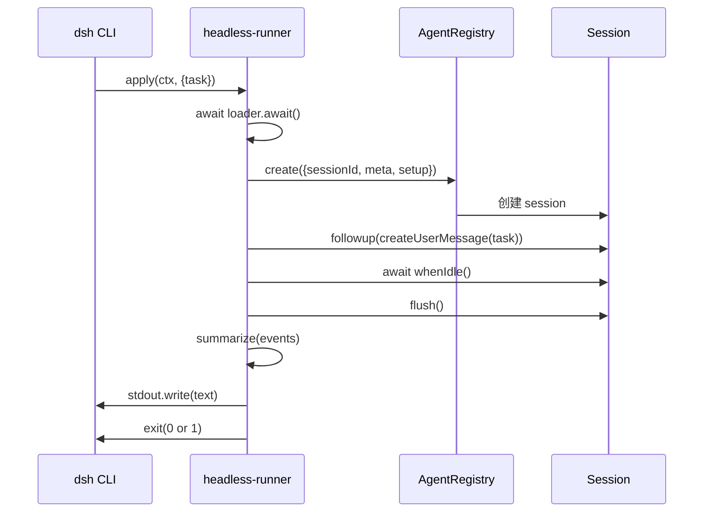
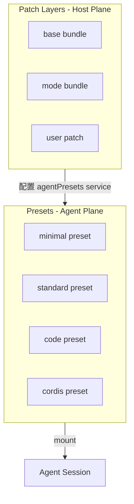

# 18 · Bundle 与 Patch 层

> **前置阅读**：[17 · Preset 与 Profile 组合](/17-preset-and-profile)
> **下一步**：[19 · Web GUI 与 ACP](/19-web-gui-and-acp)

## 学习目标

1. 理解 Bundle 机制：可安装的 dsh profile patch 层
2. 掌握 Patch 替换语义：替换整个 config，而非合并
3. 理解 Profile 组合：base bundle + mode bundle + 用户 patch
4. 知道三个 shipped bundles：base、headless、web-app
5. 理解 standing mount 与 patch 层的关系

---

## 一、Bundle 概念

### 1.1 什么是 Bundle

**Bundle** 是一个 npm 包，通过 `cordis.patch.yml` 声明一组 loader patch entries，作为 profile 的组合层。

**Manifest 字段**：`package.json` 中的 `dsh.bundle.patch`

```json
{
  "dsh": {
    "bundle": {
      "patch": "./cordis.patch.yml"
    }
  }
}
```

### 1.2 三个 Shipped Bundles

| Bundle | 包名 | 职责 |
|---|---|---|
| base | `@deepseek-ai/dsh-base` | 所有 profile 的共享核心 |
| headless | `@deepseek-ai/dsh-headless` | 一次性直接 Agent 驱动 |
| web-app | `@deepseek-ai/dsh-web-app` | 浏览器 surface |

---

## 二、Patch 替换语义

### 2.1 核心规则

**文件**：`packages/bundle/base/cordis.patch.yml:6-10`

> A patch replaces the targeted row's whole `config` rather than merging into it.

### 2.2 Patch 操作

```mermaid
flowchart TD
    Empty[Empty Root<br/>[]] -->|insert| BaseLayer[Base Layer<br/>dsh-base patches]
    BaseLayer -->|id-targeted replace| ModeLayer[Mode Layer<br/>dsh-web-app / dsh-headless]
    ModeLayer -->|id-targeted replace| UserLayer[User Layer<br/>profile cordis.patch.yml]
    UserLayer -->|id-targeted replace| FlagLayer[Flag Layer<br/>--patch]
```

### 2.3 Patch Entry 结构

```yaml
# 替换已存在 row 的 config
- id: system-prompt
  config:
    persona: "You are a coding agent..."

# 插入新 row
- insert:
    - id: code-runtime
      name: '@deepseek-ai/dsh-code-runtime-worker-thread'

# 禁用 row
- id: hmr
  disabled: true
```

### 2.4 Last Write Wins

**文件**：`packages/bundle/base/cordis.patch.yml:3-4`

> Later bundle patches and the user's profile cordis.patch.yml address these rows by id, with the last write winning per row.

后应用的 patch 覆盖先应用的 patch 的同 id row。

---

## 三、Base Bundle

### 3.1 职责

**文件**：`packages/bundle/base/cordis.patch.yml`

base bundle 是所有 profile 的共享核心，通过一次 `insert` 应用到空 profile root。

### 3.2 包含的 Rows

```yaml
- insert:
    - id: timer          # Cordis timer
    - id: hmr            # HMR
    - id: llm            # LLM Service Definition
    - id: session        # Session Service
    - id: typert         # Typert Registry
    - id: typert-loader  # Typert Loader
    - id: typert-gateway # API Gateway
    - id: session-title  # Session Title
    - id: agent          # Agent Registry
    - id: agent-default-model  # 默认模型
    - id: jobs           # 本地 jobs
    - id: llm-retry      # LLM 重试
    - id: settings       # 用户设置
    # ... 更多
```

### 3.3 中性默认值

**文件**：`cordis.patch.yml:7-10`

> Mode-specific rows appear below only with shared plugin identity and neutral defaults; each mode bundle restates its complete configuration.

base 只包含共享插件身份和中性默认值，mode-specific 配置由 mode bundle 完整重述。

---

## 四、Headless Bundle

### 4.1 职责

**文件**：`packages/bundle/headless/src/index.ts`

一次性直接 Agent 驱动：创建一个 Agent，驱动任务到 quiescence，flush Session，打印最终 assistant 文本，退出。

### 4.2 运行流程



### 4.3 无 Preset Roster

**文件**：`index.ts:107-109`

```typescript
// This bundle composes no preset roster, so the model-facing rows sit in the
// host plane and the agent reads them from the global layer.
```

headless bundle 不配置 preset roster，模型可见 rows 在 host plane。

---

## 五、Web-App Bundle

### 5.1 职责

**文件**：`packages/bundle/web-app/src/index.ts`

浏览器 surface bundle：解析构建好的前端 dist，挂载 `frontend-static`，注册提示段和 bash 变量。

### 5.2 Web Runtime 服务

**文件**：`index.ts:135-139`

```typescript
export function apply(ctx: Context, config: Config): void {
  const runtime = resolveLanTrust(ctx.webServer.host, config.trustedHosts)
  ctx.provide(WEB_RUNTIME_SERVICE, runtime)  // bind-dependent values
  ctx.plugin(FrontendStatic, { distIndex: internals.resolveDistIndex() })
}
```

### 5.3 Surface Prompt

**文件**：`index.ts:94-106`

```typescript
function webSurfacePrompt(webUrl: string): string {
  return `You are interacting with the user through the DeepSeek Harness Web GUI at ${webUrl}. `
    + 'When the user refers to "this page", "this GUI", or "this app" without naming another target, they mean this GUI. '
    + 'The browser provides no implicit DOM, route, or screenshot context. '
    // ... update contract, server replacement warnings
}
```

### 5.4 Web-App Patch 覆盖

**文件**：`packages/bundle/web-app/cordis.patch.yml:16-23`

```yaml
# 覆盖 base 的 system-prompt config
- id: system-prompt
  config:
    persona: >-
      You are a coding agent powered by the {{model}} model. Your working directory is {{cwd}}.

# 禁用 base 的 hmr
- id: hmr
  disabled: true
```

---

## 六、Profile 组合

### 6.1 Profile 结构

```
$DSH_HOME/profiles/<name>/
  package.json          # dsh.profile.bundles 声明
  cordis.patch.yml      # 用户 patch 层
```

### 6.2 Profile Manifest

**文件**：`packages/boot/app-boot/src/profile.ts:387`

```typescript
const bundles = manifest.dsh?.profile?.bundles ?? []
```

```json
{
  "dsh": {
    "profile": {
      "bundles": [
        "@deepseek-ai/dsh-base",
        "@deepseek-ai/dsh-web-app"
      ]
    }
  }
}
```

### 6.3 组合顺序

**文件**：`profile.ts:388-402`

```typescript
const layers = bundles.map((packageName): ProfileLayer => {
  const packageDir = resolveBundleDir(...)
  const declared = bundleManifest.dsh?.bundle?.patch
  const patchPath = join(packageDir, declared)
  return { packageName, packageDir, patchPath, patches: loadOverlayPatches(binName, patchPath) }
})
// 用户 patch 层最后
const patches = options.userLayer !== false && existsSync(patchPath)
  ? loadOverlayPatches(binName, patchPath)
  : []
```

组合顺序：
1. base bundle patches
2. mode bundle patches（如 web-app）
3. 用户 profile `cordis.patch.yml`
4. launcher `--patch` 层

### 6.4 composeEntries

**文件**：`profile.ts:413-420`

```typescript
export function composeEntries(
  layers: readonly PatchOptions[][], warn: (message: string) => void = () => {},
): EntryOptions[] {
  return applyEntryPatches([], structuredClone(layers.flat()), ...)
}
```

所有层 flatten 后一次 `applyEntryPatches` 调用，从空 root `[]` 开始。

---

## 七、Patch 层与 Preset 的关系

### 7.1 两个正交维度



### 7.2 Patch 层配置 Preset Roster

**文件**：`packages/bundle/web-app/cordis.patch.yml:410-422`

```yaml
- id: agent-presets
  name: '@deepseek-ai/dsh-agent-presets'
  config:
    default: standard
    roots:
      - path: config/agent-presets
        trust: system
```

Patch 层配置 `agentPresets` service（host plane），该 service 管理 preset roster（agent plane）。

### 7.3 Headless 不用 Preset

headless bundle 不配置 preset roster，模型可见 rows 直接在 host plane 的 patch 层。

---

## 八、用户 Patch 层

### 8.1 创建 Profile

**文件**：`profile.ts:146-165`

```typescript
export function initProfile(dir: string, template: ProfileTemplate): void {
  const patchPath = join(dir, PROFILE_PATCH_FILENAME)
  if (!existsSync(patchPath)) writeFileSync(patchPath, PROFILE_PATCH_TEMPLATE)
}
```

### 8.2 Patch 模板

**文件**：`profile.ts:127-128`

```typescript
const PROFILE_PATCH_TEMPLATE = `# Your patch layer for this dsh profile, applied after every bundle layer:
# a top-level YAML array of loader patch entries (id-targeted config
# replacements, `insert` blocks, and `disabled` flags). ...`
```

### 8.3 热重载

用户 patch 层在长期运行的 surface 上热重载，编辑后无需重启。

---

## 九、`--patch` Flag 层

### 9.1 命令行覆盖

```sh
dsh --profile web --patch ./my-overrides.yml "task"
```

`--patch` 文件作为最后的 patch 层应用，覆盖所有之前的层。

### 9.2 Flag 派生 patches

launcher 还可以从 flag 派生 patches（如 `--model` 覆盖 `agent-default-model` config）。

---

## 十、Bundle 安装

### 10.1 安装命令

```sh
dsh plugin --profile <name> add <package>
```

### 10.2 解析 Bundle 目录

**文件**：`profile.ts:388-396`

```typescript
const packageDir = resolveBundleDir(binName, packageName, installAnchor, dir)
const bundleManifest = JSON.parse(readFileSync(join(packageDir, 'package.json'), 'utf8'))
const declared = bundleManifest.dsh?.bundle?.patch
if (declared === undefined) {
  throw new Error(`${binName}: profile bundle ${JSON.stringify(packageName)} declares no dsh.bundle`)
}
```

### 10.3 失败 loud

**文件**：`profile.ts:392-394`

```typescript
if (declared === undefined) {
  throw new Error(`${binName}: profile bundle ${JSON.stringify(packageName)} declares no dsh.bundle in its package.json`)
}
```

命名一个无 bundle manifest 的包作为层是 misconfiguration，不是"无 patches"。

---

## 实战练习

1. **创建自定义 profile**：在 `$DSH_HOME/profiles/my-profile/` 创建一个基于 `dsh-base` + `dsh-headless` 的 profile，并在 `cordis.patch.yml` 中覆盖 `agent-default-model` 的 model 配置。

2. **理解 patch 替换**：对比 `dsh-base` 和 `dsh-web-app` 的 `system-prompt` row config，说明为什么 web-app 必须重述完整 config 而非部分覆盖。

3. **追踪组合顺序**：在 `profile.ts:371-402` 中，列出 `loadProfile` 的完整执行步骤。

4. **对比 bundle vs preset**：说明 bundle patch 层和 preset 的职责差异，以及为什么它们是正交的。

---

## 关键源码定位

| 内容 | 位置 |
|---|---|
| Base bundle patch | `packages/bundle/base/cordis.patch.yml` |
| Base bundle manifest | `packages/bundle/base/src/index.ts` |
| Headless bundle | `packages/bundle/headless/src/index.ts` |
| Headless 运行流程 | `packages/bundle/headless/src/index.ts:96-134` |
| Web-app bundle | `packages/bundle/web-app/src/index.ts` |
| Web-app apply | `packages/bundle/web-app/src/index.ts:135-185` |
| Web-app patch | `packages/bundle/web-app/cordis.patch.yml` |
| Web surface prompt | `packages/bundle/web-app/src/index.ts:94-106` |
| resolveLanTrust | `packages/bundle/web-app/src/index.ts:85-92` |
| PROFILE_PATCH_FILENAME | `packages/boot/app-boot/src/profile.ts:39` |
| PROFILE_PATCH_TEMPLATE | `packages/boot/app-boot/src/profile.ts:127-128` |
| loadProfile | `packages/boot/app-boot/src/profile.ts:371-402` |
| composeEntries | `packages/boot/app-boot/src/profile.ts:413-420` |
| initProfile | `packages/boot/app-boot/src/profile.ts:146-165` |
| resolveBundleDir | `packages/boot/app-boot/src/profile.ts:350-355` |
| Patch 替换语义注释 | `packages/bundle/base/cordis.patch.yml:6-10` |
| Preset roster 配置 | `packages/bundle/web-app/cordis.patch.yml:410-422` |

---

## 下一步

本文理解了 Bundle 与 Patch 层机制。下一篇 [19 · Web GUI 与 ACP](/19-web-gui-and-acp) 将讲解 Web GUI 四层架构和 ACP 协议。
