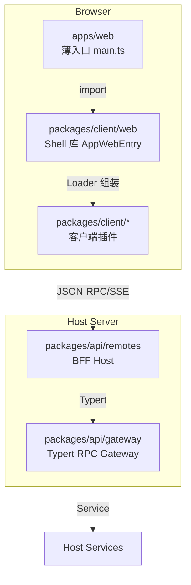
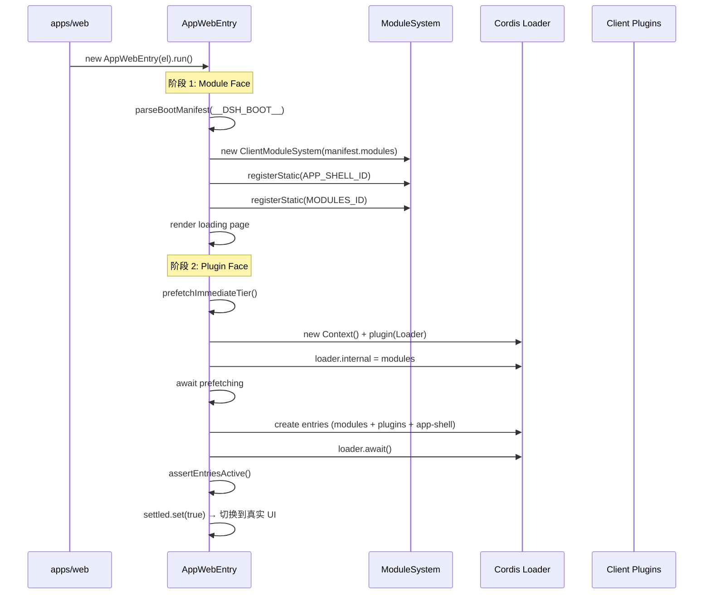
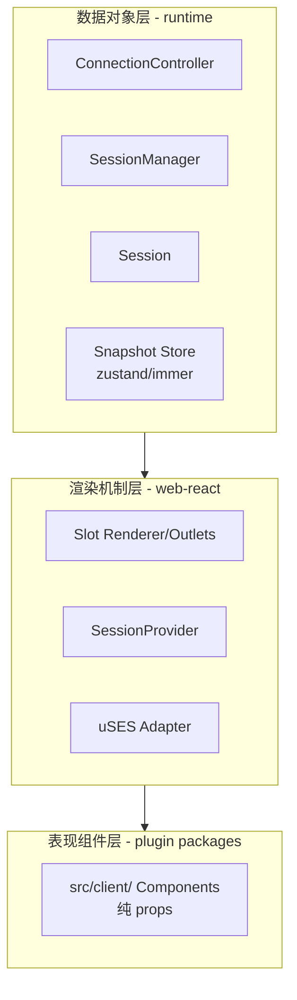

# 19 · Web GUI 与 ACP

> **前置阅读**：[18 · Bundle 与 Patch 层](/18-bundle-and-patch)
> **下一步**：[20 · SDK 与 JSON-RPC 协议](/20-sdk-and-json-rpc)

## 学习目标

1. 理解 Web GUI 四层架构：薄入口 → Shell 库 → BFF → Gateway
2. 掌握客户端 boot 流程：两阶段（module face + plugin face）
3. 理解 Slot 系统组合模型
4. 知道 ACP（Agent Client Protocol）automation-only 模式
5. 理解客户端三层分层：数据对象层 → 渲染机制层 → 表现组件层

---

## 一、Web GUI 四层架构



### 1.1 薄入口 — apps/web

**文件**：`apps/web/src/main.ts`

```typescript
import { AppWebEntry } from '@deepseek-ai/dsh-client-web'

const el = document.getElementById('root')
if (el === null) throw new Error('web app: missing #root')
void new AppWebEntry(el).run()
```

仅 10 行，只负责找到挂载点，所有逻辑在 Shell 库。

### 1.2 Shell 库 — packages/client/web

**文件**：`packages/client/web/src/boot.tsx`

`AppWebEntry` 类是 Web shell boot kernel，负责：
- 解析 `window.__DSH_BOOT__` 为 BootManifest
- 构建 module system
- 渲染 loading page
- prefetch immediately tier
- 挂载 vendored Cordis Loader
- 创建 loader entries
- 切换到真实 UI

### 1.3 BFF — packages/api/remotes

BFF（Backend For Frontend）Host，处理浏览器 RPC 请求。

### 1.4 Gateway — packages/api/gateway

Typert RPC Gateway，将 RPC 路由到 host services。

---

## 二、客户端 Boot 流程

### 2.1 两阶段 Boot



### 2.2 BootManifest

**文件**：`boot.tsx:98`

```typescript
this.manifest = parseBootManifest((globalThis as DshWindow).__DSH_BOOT__)
```

`__DSH_BOOT__` 由 `dsh web` 注入，包含两个视图：
- **modules view**：模块表
- **plugins view**：插件 rows

### 2.3 Immediately Tier Prefetch

**文件**：`boot.tsx:151-158`

```typescript
private async prefetchImmediateTier(): Promise<void> {
  await Promise.all(this.manifest.plugins
    .filter(row => row.immediately)
    .map(row => this.modules.prefetch(row.id).catch(() => {})))
}
```

`immediately: true` 的 rows 在 Loader 挂载前并行 prefetch，因为跨包同步 require edges 需要所有 immediately-tier factory 先注册。

### 2.4 internal 契约注入

**文件**：`boot.tsx:168`

```typescript
loader.internal = this.modules as never
```

在**任何 entry 创建前**注入 module system，否则 `tree.import` 会 fallback 到 bare dynamic import，在浏览器中必然失败。

### 2.5 Entry 创建

**文件**：`boot.tsx:189-204`

```typescript
const rows = [MODULES_ID, ...this.manifest.plugins.map(row => row.id).filter(id => id !== MODULES_ID), APP_SHELL_ID]
await Promise.all(rows.map(async (name) => {
  this.status.set(name, 'loading')
  const id = await loader.create({ name })
  if (loader.resolve(id).fiber === undefined) {
    this.status.set(name, 'failed')
  }
}))
```

modules entry 先创建（其 wrapper apply 提供 `ctx.modules`），然后 plugins，最后 app-shell assembly。

### 2.6 全 fiber 扫描

**文件**：`boot.tsx:216-237`

```typescript
private assertEntriesActive(): void {
  for (const entry of ctx.loader.entries()) {
    if (entry.fiber === undefined) {
      failures.push(`${name}: import failed`)
      continue
    }
    const state = STATE_LABELS[entry.fiber.state]
    if (state === 'active') continue
    if (state === 'pending') {
      const missing = Object.keys(entry.fiber.inject).filter(service => ctx.get(service) === undefined)
      failures.push(`${name}: pending (waiting for: ${missing.join(', ')})`)
    } else {
      failures.push(`${name}: ${state}`)
    }
  }
  if (failures.length > 0) throw new Error(`web boot: entries did not activate\n${failures.join('\n')}`)
}
```

cordis inject waiting 无超时，这个扫描是 fail-loud 补偿。

---

## 三、客户端三层分层

### 3.1 架构



### 3.2 数据对象层

- **零 React 导入**（grep 可验证）
- `ConnectionController` → `SessionManager` → `Session` 拥有所有业务状态
- Snapshot store engine（zustand/immer, `defineStore`, `shallowEqual`）
- Store products 是 bare observable sources，无 hook members

### 3.3 渲染机制层

- 所有 ctx-to-React 集成
- Slot renderer/outlets
- `SessionProvider`
- uSES adapter
- 每个 hook 在 binding site 从 bare sources 组合

### 3.4 表现组件层

- plugin packages 的 `src/client/`
- 纯 props，预期会被完全重写
- 业务逻辑不泄漏到这里
- 一切通过四个 props shares 到达

---

## 四、Slot 系统组合模型

### 4.1 唯一 API

```typescript
ctx.slots.register({ name, children?, store?, inject? }, Component)
```

- 无单独的 slot-definition 调用
- 无 whitelist face object
- 无 face-minting helper
- Shell 独自渲染 `'root'`

### 4.2 children = 声明 + 授权

- 组件渲染的 slots = register 调用 `children` 对象的 keys
- 渲染未声明的 slot 或声明他人的 slot → 加载时失败
- Slot 名镜像组合路径：`<domain>.<entry>.<hole>`（如 `'tool.call.toolview'`）

### 4.3 四个 Props Shares

| Share | 来源 |
|---|---|
| `PropsRuntime<K>` | SlotMap: owner params + `useSession`/`sessionId` + `useSessions`/`useWorkspaces` |
| `PropsRenderSlots<S>` | children keys |
| `PropsStore<H>` | store factory |
| inject face | apply closure 的 ctx |

### 4.4 五个 Standing Hooks

- `useSession`
- `useSessions`
- `useWorkspaces`
- `useStore`
- `renderSlot`

业务代码**永不**创建 hook 或 selector 作为 prop 值。

---

## 五、ACP（Agent Client Protocol）

### 5.1 概念

**文件**：`packages/acp/acp/src/index.ts:1-9`

ACP 是 automation-only 的 Agent Client Protocol server，通过 JSON-RPC stdio 暴露 fresh harness sessions 给可信的程序化客户端。

### 5.2 暴露的能力

| 能力 | 说明 |
|---|---|
| prompt text | 用户提示 |
| committed assistant text | 已提交的 assistant 文本 |
| cancellation | 取消 |
| one-shot permission decisions | 一次性权限决策 |

**不暴露**：presentation 和 human-interaction features（留在 harness UI modules）。

### 5.3 Plugin 结构

**文件**：`index.ts:42-44`

```typescript
export const name = 'acp'
export const inject = ['agents']  // bridge 创建并拥有 agents
```

### 5.4 配置

**文件**：`index.ts:69-82`

```typescript
export interface AcpConfig {
  provider?: string  // Provider route
  model?: string     // Model name
  stream?: Stream    // 测试用 transport override
}
```

### 5.5 Session 管理

**文件**：`index.ts:84-98`

```typescript
interface SessionRecord {
  agent: Agent
  dispose: () => Promise<void>
  inflight: {
    resolve: (reason: StopReason) => void
    reject: (error: Error) => void
    messageId: string
    turn: number | undefined
    endReason: TurnEndReason | undefined
  } | undefined
}
```

### 5.6 事件过滤

**文件**：`index.ts:152-155`

```typescript
// Emit only committed assistant text. Raw chunks, reasoning, tools, plans,
// titles, and retry markers are presentation or trace data and stay off the
// automation wire.
ctx.on('session/event', (session, event: SessionEvent) => { ... })
```

只发送已提交的 assistant text，raw chunks/reasoning/tools/plans/titles/retry markers 是 presentation 或 trace data，不进入 automation wire。

### 5.7 协议版本

**文件**：`index.ts:22`

```typescript
import { ..., PROTOCOL_VERSION, ... } from '@agentclientprotocol/sdk'
```

使用 `@agentclientprotocol/sdk` 的 `PROTOCOL_VERSION`。

---

## 六、客户端插件包结构

### 6.1 目录结构

```
packages/client/<name>/
  src/
    index.ts          # node-half apply（空）
    invariant.ts      # companion
    client/           # browser half
      apply.ts        # 单一跨域 assembly point
      <domain>/       # 域目录，不导入兄弟域
  tsconfig.json       # extends tsconfig.base.client.json
  tsdown.config.ts    # clientBundle(id, [...])
  package.json        # dsh.client manifest
```

### 6.2 dsh.client manifest

```json
{
  "dsh": {
    "client": {
      "platform": "web",
      "immediately": false,
      "inject": ["@deepseek-ai/dsh-client-xxx"]
    }
  }
}
```

- `platform: 'web'` 总是
- `immediately: true` 仅用于 stage-one-prefetch 基础设施 rows
- `inject` 是**信息性**的（preflight display, HMR diffing），不序列化 entry activation

### 6.3 三个必需的注册面

1. `tsconfig.client.json` aggregate `references` entry
2. `packages/bundle/web-app/cordis.patch.yml` 中的 `dsh.client` row
3. `packages/bundle/web-app/package.json` dependency

缺任何一个会在不同后期点失败。

---

## 七、Notifier 发布纪律

### 7.1 三种发布模式

| 模式 | 用途 |
|---|---|
| `notifyNow` | 用户手势的直接 echo |
| `markDirty` | 结构性更新（microtask-batched） |
| `markFrameDirty` | 可见 streaming chunks（cumulative） |

### 7.2 文件位置

`runtime/src/client/sessions/notifier.ts`

---

## 八、Conversation Node 纪律

### 8.1 注册方式

一个 Chat business feature 注册一个 `ConversationNodeDefinition` 和其 keyed `conversation.chat.node` renderer。

### 8.2 不添加到中央 dispatcher

不要将 event switch 或 fold 添加到 `Session`、`SessionManager` 或中央 built-in dispatcher。

### 8.3 match(event) 规则

- 只读当前 event
- 多 event Context 中的每个 event 携带或独立派生同一稳定 business id
- `update` 折叠一个 Match 到 State，保持按 log `seq` 确定性可重放

---

## 实战练习

1. **追踪 boot 流程**：在 `boot.tsx:97-143` 中，列出 `run()` 的完整步骤，说明为什么 entry 创建要等待 prefetching。

2. **理解 Slot 系统**：说明 `ctx.slots.register` 的 `children` 对象如何同时是声明和授权。

3. **对比三层分层**：说明数据对象层、渲染机制层、表现组件层各自的职责和依赖方向。

4. **理解 ACP 过滤**：在 `index.ts:152-155` 中，说明为什么 raw chunks 和 reasoning 不进入 automation wire。

---

## 关键源码定位

| 内容 | 位置 |
|---|---|
| Web 薄入口 | `apps/web/src/main.ts` |
| AppWebEntry | `packages/client/web/src/boot.tsx` |
| AppWebEntry.run | `packages/client/web/src/boot.tsx:97-143` |
| prefetchImmediateTier | `packages/client/web/src/boot.tsx:151-158` |
| runPluginBoot | `packages/client/web/src/boot.tsx:161-208` |
| assertEntriesActive | `packages/client/web/src/boot.tsx:216-237` |
| internal 契约注入 | `packages/client/web/src/boot.tsx:168` |
| AppRoot | `packages/client/web/src/AppRoot.tsx` |
| app-shell | `packages/client/web/src/app-shell.ts` |
| seed | `packages/client/web/src/seed.ts` |
| loader-status | `packages/client/web/src/loader-status.ts` |
| ACP server | `packages/acp/acp/src/index.ts` |
| ACP apply | `packages/acp/acp/src/index.ts:105-436` |
| ACP SessionRecord | `packages/acp/acp/src/index.ts:84-98` |
| ACP 事件过滤 | `packages/acp/acp/src/index.ts:152-155` |
| ACP codec | `packages/acp/acp/src/codec.ts` |
| BFF Host | `packages/api/remotes/src/index.ts` |
| Typert Gateway | `packages/api/gateway/` |
| 客户端 AGENTS.md | `packages/client/AGENTS.md` |

---

## 下一步

本文理解了 Web GUI 四层架构和 ACP 协议。下一篇 [20 · SDK 与 JSON-RPC 协议](/20-sdk-and-json-rpc) 将讲解 JSON-RPC 协议、server 实现和 TypeScript client。
