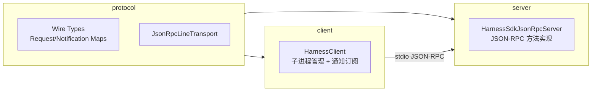
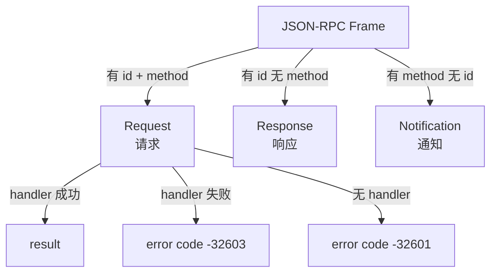
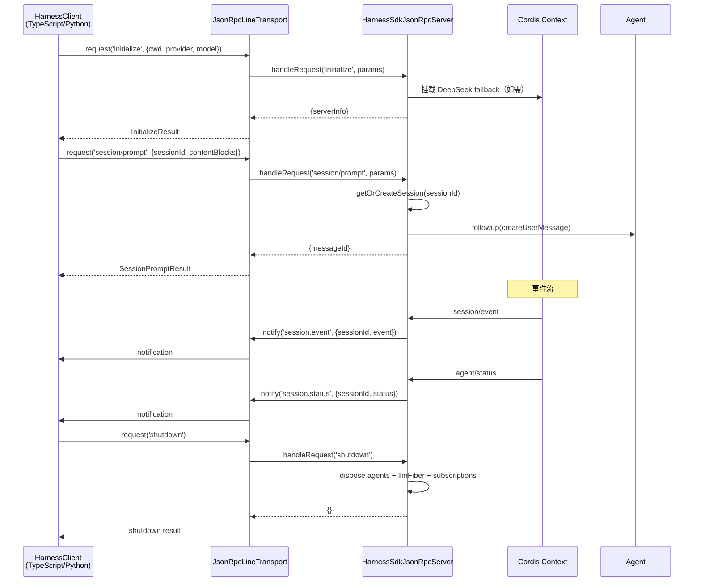

# 20 · SDK 与 JSON-RPC 协议

> **前置阅读**：[19 · Web GUI 与 ACP](/19-web-gui-and-acp)
> **下一步**：[21 · 添加新包与工具](/21-adding-package-and-tool)

## 学习目标

1. 理解 SDK 三包结构：protocol / server / client
2. 掌握 JSON-RPC 2.0 协议：三个请求 + 四个通知
3. 理解 newline-delimited JSON-RPC stdio transport
4. 知道 server 的事件订阅与转发
5. 理解 client 的子进程管理与通知订阅

---

## 一、SDK 三包结构



| 包 | 职责 |
|---|---|
| `@deepseek-ai/dsh-sdk-protocol` | Wire types + newline-delimited JSON-RPC transport |
| `@deepseek-ai/dsh-sdk-jsonrpc-server` | Server：JSON-RPC 方法实现 |
| `@deepseek-ai/dsh-sdk-client` | Client：子进程管理 + 通知订阅 |

---

## 二、Wire Protocol

### 2.1 三个请求

**文件**：`packages/sdk/protocol/src/types.ts:100-105`

```typescript
export interface HarnessSdkRequestMap {
  'initialize': { params: InitializeParams; result: InitializeResult }
  'session/prompt': { params: SessionPromptParams; result: SessionPromptResult }
  'shutdown': { params: undefined; result: Record<string, never> }
}
```

### 2.2 InitializeParams

**文件**：`types.ts:16-25`

```typescript
export interface InitializeParams {
  cwd: string          // 每个 SDK session header 记录的工作目录
  provider: string     // Provider route
  model: string        // Model name
  maxTokens?: number   // 可选正整数 output-token cap
}
```

### 2.3 InitializeResult

**文件**：`types.ts:28-31`

```typescript
export interface InitializeResult {
  serverInfo: { name: string; version: string }  // wire-stable: 'deepseek-harness-sdk-runtime'
}
```

### 2.4 SessionPromptParams

**文件**：`types.ts:34-39`

```typescript
export interface SessionPromptParams {
  sessionId: string       // 未知 id 懒创建 agent+session
  contentBlocks: ContentBlock[]  // 原样作为 user message 发送
}
```

### 2.5 SessionPromptResult

**文件**：`types.ts:42-45`

```typescript
export interface SessionPromptResult {
  messageId: string  // 排队 user message 的身份
}
```

### 2.6 四个通知

**文件**：`types.ts:92-98`

```typescript
export interface HarnessSdkNotificationMap {
  'session.event': SessionEventNotification
  'session.status': SessionStatusNotification
  'subagent.started': SubagentStartedNotification
  'subagent.finished': SubagentFinishedNotification
}
```

| 通知 | 触发 | 载荷 |
|---|---|---|
| `session.event` | session-log event 记录时 | sessionId + 完整 event envelope |
| `session.status` | agent 状态转换 | sessionId + `'idle'`/`'running'` |
| `subagent.started` | in-runtime child session 创建 | parentSessionId + childSessionId |
| `subagent.finished` | in-process subagent run 结束 | provider + agentId + parent/child + status + stopReason + lastAssistantMessage? |

---

## 三、JSON-RPC Line Transport

### 3.1 协议规则

**文件**：`packages/sdk/protocol/src/transport.ts:1-7`

> Newline-delimited JSON-RPC 2.0 over byte streams. Frames with `id` and `method` are requests, `id` alone is a response, and `method` alone is a notification.

### 3.2 帧类型



### 3.3 JsonRpcLineTransport 类

**文件**：`transport.ts:62-269`

```typescript
export class JsonRpcLineTransport implements JsonRpcTransportPeer {
  constructor(
    private readonly input: Readable,
    private readonly output: Writable,
  ) {}
  
  start(): void { /* 挂载 input listeners */ }
  close(): void { /* 分离 listeners, reject pending */ }
  onRequest(handler): void { /* 安装请求 handler */ }
  onNotification(handler): void { /* 安装通知 handler */ }
  request(method, params, signal?): Promise<unknown> { /* 发请求等响应 */ }
  notify(method, params?): void { /* 发通知 */ }
  flush(): Promise<void> { /* 等待写回调 */ }
}
```

### 3.4 错误码

| 错误码 | 含义 |
|---|---|
| `-32601` | method not found（无 handler） |
| `-32603` | internal error（handler 失败） |

### 3.5 AbortSignal 支持

**文件**：`transport.ts:121-156`

```typescript
request(method: string, params: object, signal?: AbortSignal): Promise<unknown> {
  // abort 时删除 pending entry，reject with signal.reason
  if (signal !== undefined) {
    if (signal.aborted) { reject(abortError(signal.reason)); return }
    const onAbort = (): void => {
      this.pending.delete(id)
      reject(abortError(signal.reason))
    }
    signal.addEventListener('abort', onAbort, { once: true })
  }
}
```

### 3.6 行解析

**文件**：`transport.ts:180-189`

```typescript
private drainLines(): void {
  for (;;) {
    const newline = this.buffer.indexOf('\n')
    if (newline < 0) break
    const line = this.buffer.slice(0, newline).trim()
    this.buffer = this.buffer.slice(newline + 1)
    if (!line) continue
    void this.handleLine(line)
  }
}
```

### 3.7 Malformed 行忽略

**文件**：`transport.ts:201-208`

```typescript
private async handleLine(line: string): Promise<void> {
  let message: unknown
  try {
    message = JSON.parse(line)
  } catch {
    return  // JSON 语法错误：忽略 malformed peer lines
  }
}
```

---

## 四、SDK Server

### 4.1 HarnessSdkJsonRpcServer

**文件**：`packages/sdk/server/src/server.ts:53-103`

```typescript
export class HarnessSdkJsonRpcServer {
  constructor(
    private readonly ctx: Context,
    private readonly transport: JsonRpcTransportPeer,
    private readonly options: HarnessSdkJsonRpcServerOptions = {},
  ) {
    // 订阅 4 个事件，转发为通知
    ctx.on('session/event', ...)        // → session.event
    ctx.on('agent/status', ...)         // → session.status
    ctx.on('session/created', ...)      // → subagent.started（有 parent 时）
    ctx.on('subagent/end', ...)         // → subagent.finished（local 时）
  }
}
```

### 4.2 initialize 方法

**文件**：`server.ts:111-125`

```typescript
async initialize(params: InitializeParams): Promise<InitializeResult> {
  this.cwd = resolve(params.cwd)
  this.provider = params.provider
  this.model = params.model
  this.maxTokens = params.maxTokens
  // 无 adapter 时挂载 DeepSeek fallback
  if (!this.hasAdapterFor(this.provider)) {
    if (this.provider !== 'deepseek-official') throw new Error(`no adapter registered`)
    this.llmFiber = await this.ctx.plugin(LlmDeepSeek, {})
  }
  return { serverInfo: { name: 'deepseek-harness-sdk-runtime', version: '0.0.1' } }
}
```

### 4.3 prompt 方法

**文件**：`server.ts:132-143`

```typescript
async prompt(params: SessionPromptParams): Promise<SessionPromptResult> {
  const rec = await this.getOrCreateSession(params.sessionId)
  // 验证 agent 仍在 registry（agent-loop reload 可能已 dispose）
  if (this.ctx.agents.get(rec.handle.agent.id) !== rec.handle.agent) {
    throw new Error(`session agent was disposed outside the server`)
  }
  const message = createUserMessage({ content: params.contentBlocks, source: { kind: 'user' } })
  rec.handle.agent.followup(message)
  return { messageId: message.id }
}
```

### 4.4 懒创建 Session

**文件**：`server.ts:203-216`

```typescript
private async getOrCreateSession(sessionId: string): Promise<SessionRecord> {
  if (this.shuttingDown) throw new Error('SDK server is shutting down')
  const existing = this.sessions.get(sessionId)
  if (existing) return existing
  const pending = this.sessionCreations.get(sessionId)
  if (pending) return pending  // single-flight
  const creation = this.createSession(sessionId)
  this.sessionCreations.set(sessionId, creation)
  return creation
}
```

### 4.5 shutdown 方法

**文件**：`server.ts:150-181`

```typescript
shutdown(): Promise<Record<string, never>> {
  this.shutdownTask ??= this.performShutdown()  // 幂等
  return this.shutdownTask
}

private async performShutdown(): Promise<Record<string, never>> {
  this.shuttingDown = true
  await Promise.allSettled([...this.sessionCreations.values()])  // 等待 pending 创建
  const records = [...this.sessions.values()]
  // 依次：dispose agents → dispose llmFiber → 移除 subscriptions
  const teardownResults = await Promise.allSettled([
    ...records.map(rec => rec.handle.dispose()),
    ...this.llmFiber ? [this.llmFiber.dispose()] : [],
  ])
  return {}
}
```

### 4.6 handleRequest 分发

**文件**：`server.ts:190-201`

```typescript
async handleRequest(method: string, params: Record<string, unknown> | undefined): Promise<unknown> {
  switch (method) {
    case 'initialize': return this.initialize(params as InitializeParams)
    case 'session/prompt': return this.prompt(params as SessionPromptParams)
    case 'shutdown': return this.shutdown()
    default: throw new Error(`unknown method: ${method}`)
  }
}
```

### 4.7 无 Preset 组合

**文件**：`server.ts:218-222`

```typescript
// No preset composition: this server's compositions keep the model-facing
// rows in the host plane, so this agent reads them from the global layer.
```

SDK server 不组合 preset，模型可见 rows 在 host plane。

---

## 五、SDK Client

### 5.1 HarnessClient

**文件**：`packages/sdk/client/src/client.ts:33-80`

```typescript
export class HarnessClient {
  // 拥有子进程：spawn runtime，通过 stdio 说 JSON-RPC
  // fan-out 通知到 subscriptions
  // 通过 EOF → SIGTERM → SIGKILL 梯度 teardown 子进程
}
```

### 5.2 错误类型

**文件**：`client.ts:38-65`

| 错误 | 含义 |
|---|---|
| `TransportClosedError` | runtime 子进程消失或不可用 |
| `RequestTimeoutError` | 请求超时 |
| `SdkProtocolError` | runtime 回答不符合协议 |

### 5.3 通知订阅

**文件**：`client.ts:74-80`

```typescript
export interface NotificationSubscription extends AsyncIterable<HarnessNotification> {
  // 等待下一个匹配通知
  // runtime 死后：drain 已交付通知，然后 reject
  // close 后：立即 reject（队列丢弃）
}
```

### 5.4 子进程管理

**文件**：`client.ts:15`

```typescript
import { spawn, type ChildProcess } from 'node:child_process'
```

Client 在 harness context 之外运行，直接 spawn 而非通过 `dsh-subprocess` service。

### 5.5 Teardown 梯度

**文件**：`client.ts:24`

```typescript
import { disposeRuntimeProcess } from './dispose.ts'
```

EOF → SIGTERM → SIGKILL 梯度关闭。

### 5.6 stderr 保留

**文件**：`client.ts:28`

```typescript
const STDERR_TAIL_LIMIT = 400  // 保留最近 400 行 stderr 用于诊断
```

---

## 六、Python SDK

### 6.1 设计孪生

**文件**：`client.ts:7-8`

> The design twin is the Python SDK's `HarnessClient` (`python/sdk`); both drive the same runtime protocol.

Python SDK 和 TypeScript SDK 驱动同一 runtime protocol。

### 6.2 位置

`python/sdk/` — Python SDK 和 bundled runtime。

---

## 七、完整通信流程



---

## 实战练习

1. **追踪请求生命周期**：在 `transport.ts:121-156` 中，说明一个 `request()` 从发送到收到响应的完整流程，包括 AbortSignal 处理。

2. **理解通知过滤**：在 `server.ts:87-103` 中，说明 `subagent/end` 通知为什么只转发 `info.local` 为 true 的情况。

3. **对比 server vs client**：说明 `HarnessSdkJsonRpcServer` 和 `HarnessClient` 的职责差异，以及为什么 client 在 harness context 之外运行。

4. **理解懒创建**：在 `server.ts:203-216` 中，说明 `getOrCreateSession` 的 single-flight 机制为什么需要 `sessionCreations` Map。

---

## 关键源码定位

| 内容 | 位置 |
|---|---|
| Wire types | `packages/sdk/protocol/src/types.ts` |
| HarnessSdkRequestMap | `packages/sdk/protocol/src/types.ts:100-105` |
| HarnessSdkNotificationMap | `packages/sdk/protocol/src/types.ts:92-98` |
| InitializeParams | `packages/sdk/protocol/src/types.ts:16-25` |
| SessionPromptParams | `packages/sdk/protocol/src/types.ts:34-39` |
| JsonRpcLineTransport | `packages/sdk/protocol/src/transport.ts:62-269` |
| request 方法 | `packages/sdk/protocol/src/transport.ts:121-156` |
| drainLines | `packages/sdk/protocol/src/transport.ts:180-189` |
| handleLine | `packages/sdk/protocol/src/transport.ts:201-224` |
| 错误码 -32601/-32603 | `packages/sdk/protocol/src/transport.ts:229,236` |
| JsonRpcResponseError | `packages/sdk/protocol/src/transport.ts:18-28` |
| HarnessSdkJsonRpcServer | `packages/sdk/server/src/server.ts:53-240` |
| initialize | `packages/sdk/server/src/server.ts:111-125` |
| prompt | `packages/sdk/server/src/server.ts:132-143` |
| shutdown | `packages/sdk/server/src/server.ts:150-181` |
| handleRequest | `packages/sdk/server/src/server.ts:190-201` |
| getOrCreateSession | `packages/sdk/server/src/server.ts:203-216` |
| 事件订阅 | `packages/sdk/server/src/server.ts:71-103` |
| HarnessClient | `packages/sdk/client/src/client.ts` |
| TransportClosedError | `packages/sdk/client/src/client.ts:38-44` |
| RequestTimeoutError | `packages/sdk/client/src/client.ts:47-53` |
| NotificationSubscription | `packages/sdk/client/src/client.ts:74-80` |
| disposeRuntimeProcess | `packages/sdk/client/src/dispose.ts` |
| Python SDK | `python/sdk/` |

---

## 下一步

本文理解了 SDK 与 JSON-RPC 协议。下一篇 [21 · 添加新包与工具](/21-adding-package-and-tool) 将进入扩展实战，讲解如何添加新包和工具。
