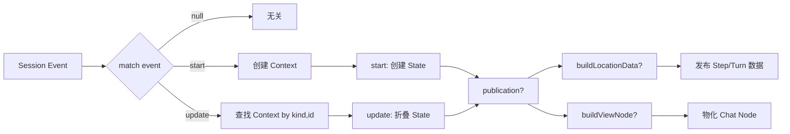

# 22 · 添加 LLM 适配器与 Chat 节点

> **前置阅读**：[21 · 添加新包与工具](/21-adding-package-and-tool)
> **下一步**：[23 · 测试与门禁](/23-testing-and-gates)

## 学习目标

1. 掌握 LLM 适配器开发：实现 `LlmAdapter` 抽象类
2. 理解 StreamChunk 协议与 BlockAssembler
3. 掌握 Conversation Node 开发：实现 `ConversationNodeDefinition`
4. 理解 Chat 节点的 match/start/update/buildViewNode 生命周期
5. 知道三种摄取路径的性能契约

---

## 一、LLM 适配器开发

### 1.1 LlmAdapter 抽象

**文件**：`packages/llm/llm/src/index.ts:1-7`

`LlmRuntime` 是 LLM service：adapter registry + waterfall-interceptable streaming call API。导出：
- `LlmRuntime`（默认导出，service class）
- `LlmAdapter`（抽象类，provider backends 实现）
- `BlockAssembler`（chunk assembly）

### 1.2 LlmRuntime ctx key

**文件**：`packages/llm/llm/src/index.ts:46-67`

```typescript
declare module '@deepseek-ai/cordis' {
  interface Context {
    llm: LlmRuntime
  }
  interface Events {
    /**
     * Waterfall around every streaming model call.
     * @mode waterfall
     */
    'llm/stream'(
      this: LlmRuntime,
      options: GenerateOptions,
      next: () => AsyncIterable<StreamChunk>,
    ): AsyncIterable<StreamChunk>
  }
}
```

LOOP-built 请求携带 `markAgentLoopRequest` 身份并 deep-frozen（mutation 抛出）。

### 1.3 DeepSeekAdapter 设计

**文件**：`packages/llm/llm-deepseek/src/adapter.ts:1-10`

`DeepSeekAdapter` 是 transport-only：fetch + SSE against DeepSeek (OpenAI-compatible) chat-completions endpoint，emit harness StreamChunks。

关键设计：
- 连接事实通过 thunk 解析（每操作一次）
- bearer token 通过 per-request resolver
- 注册 plugin 拥有 validation、layering、credential policy

### 1.4 DeepSeekConnectionOptions

**文件**：`packages/llm/llm-deepseek/src/adapter.ts:43-71`

```typescript
export interface DeepSeekConnectionOptions {
  baseURL: string                              // `/chat/completions` appended
  apiKeyEnv: CredentialRef                     // per-request resolved
  defaults: RequestDefaults                    // thinking mode, effort
  maxTokens: number                            // per-request output cap
  defaultContextWindow: number                 // when model has no exact value
  models: readonly DeepSeekCatalogModel[]      // advisory models
  streamIdleTimeoutMs: number                  // max provider idle time
  retryPolicy: ResolvedRetryPolicy             // provider-owned, resolved
}
```

**关键不变量**：`apiKeyEnv` 与 `baseURL` 一起旅行 — 请求永远不会将一个 generation 的 URL 与另一个 generation 的 secret 配对。

### 1.5 DeepSeekAdapterOptions

**文件**：`packages/llm/llm-deepseek/src/adapter.ts:73-86`

```typescript
export interface DeepSeekAdapterOptions {
  options: () => DeepSeekConnectionOptions     // current validated facts, once per op
  resolveApiKey: (connection: DeepSeekConnectionOptions) => Promise<string>
  resolveUserId: () => AnonymousUserId
}
```

`resolveApiKey` 接收 snapshot（never re-read），所以 key 只能来自与 endpoint 相同的 resolution。无 key 时抛 `LlmError` `MISSING_CREDENTIAL`。

### 1.6 默认常量

**文件**：`packages/llm/llm-deepseek/src/adapter.ts:88-93`

| 常量 | 值 | 说明 |
|---|---|---|
| `DEFAULT_STREAM_IDLE_TIMEOUT_MS` | 300_000 | 默认最大 idle interval |
| `DEFAULT_CONTEXT_WINDOW` | 1_000_000 | 默认 combined context capacity |
| `DEFAULT_MAX_TOKENS` | 256_000 | 默认 per-request output cap |

### 1.7 Reasoning Effort

**文件**：`packages/llm/llm-deepseek/src/adapter.ts:94-100`

```typescript
const OFF_REASONING_EFFORT = ReasoningEffortId('off')
const HIGH_REASONING_EFFORT = ReasoningEffortId('high')
const MAX_REASONING_EFFORT = ReasoningEffortId('max')
```

`ReasoningEffortId` 是 branded type。

### 1.8 实现新适配器步骤

1. **创建包**：`packages/llm/llm-<provider>/`，按 [21 · 添加新包](/21-adding-package-and-tool) 流程
2. **实现 `LlmAdapter`**：继承抽象类，实现 stream 方法
3. **实现 StreamChunk 转换**：将 provider 响应转为 7 种 StreamChunk 类型
4. **实现 `mapUsage`**：从 provider usage 映射到 harness usage（注意 disjoint 分解）
5. **实现错误归一化**：使用 `normalizeLlmFailure`
6. **注册 plugin**：在 `apply()` 中 `ctx.llm.registerAdapter()`
7. **配置 credential**：通过 `CredentialRef` 引用，不直接持有 key

### 1.9 StreamChunk 协议

7 种 StreamChunk 类型（详见 [10 · LLM 与 DeepSeek 适配器](/10-llm-and-deepseek-adapter)）：

| 类型 | 用途 |
|---|---|
| `text-delta` | 文本增量 |
| `reasoning-delta` | 推理增量 |
| `tool-call-delta` | 工具调用增量 |
| `usage` | token 使用统计 |
| `finish` | 完成信号 |
| `error` | 错误 |
| `metadata` | 元数据 |

`BlockAssembler` 是 agent-loop 唯一组装算法，将 StreamChunk 流组装为最终 Message。

### 1.10 mapUsage 不变量

**文件**：`packages/llm/llm-deepseek/src/adapter.ts`（mapUsage 实现）

DeepSeek provider 的 `mapUsage` 需从 `prompt_tokens` 减去 `cacheRead` 得到 disjoint `inputTokens`：

```typescript
inputTokens = prompt_tokens - cacheRead
cacheCreationTokens = cacheCreationTokens (separate)
cacheReadTokens = cacheRead (separate)
outputTokens = completion_tokens
```

确保四个字段 disjoint（不重复计数）。

---

## 二、Conversation Node 开发

### 2.1 ConversationNodeDefinition 接口

**文件**：`packages/client/runtime/src/client/contract/conversation.ts:170-228`

```typescript
export interface ConversationNodeDefinition<State = unknown> {
  readonly kind: string                                    // 唯一标识
  readonly target?: string                                 // view target，省略表示 state-only Context
  match(event: SessionEvent): ConversationMatchResult | null  // 身份提取
  start(context, match, reader): State                     // 从唯一 start Match 创建 State
  update(context, match): State                            // 应用 post-start update Match
  publication?(match: ConversationMatch): ConversationPublication  // 发布节奏
  buildLocationData?(context, scope): ConversationLocationData | null  // 发布 Step/Turn 数据
  buildViewNode?(context): ConversationViewNode | null     // 物化最终 Node
}
```

### 2.2 生命周期



### 2.3 match() 契约

**文件**：`docs/cookbook/adding-a-conversation-node.md:196`

`match(event)` 是**身份提取器**，不是 fold：
- 只接收当前 event
- 返回 Definition-local id 和 lifecycle role
- 不访问 Context 或 history

```typescript
match: (event) => {
  if (event.type === 'review/start') {
    return { id: String(event.data.reviewId), role: 'start' }
  }
  if (event.type === 'review/progress' || event.type === 'review/end') {
    return { id: String(event.data.reviewId), role: 'update' }
  }
  return null
}
```

### 2.4 start() 与 update()

**文件**：`docs/cookbook/adding-a-conversation-node.md:196`

- `start` 调用一次，从唯一 start Match 创建 State
- `update` 用当前 State 调用，折叠一个 Match
- 两者返回 engine 采用的 State
- 返回新 immutable value 优先，但 mutate-and-return-same-object 有相同 adoption 语义

```typescript
start: (_context, match) => ({
  turn: match.event.data.turn,
  step: match.event.data.step,
  title: match.event.data.title,
  completed: 0,
  status: 'running',
}),
update: (context, match) => {
  if (match.event.type === 'review/progress') {
    return { ...context.state, completed: match.event.data.completed }
  }
  if (match.event.type === 'review/end') {
    return { ...context.state, completed: 100, status: 'completed', summary: match.event.data.summary }
  }
  return context.state
},
```

### 2.5 publication() 节奏

**文件**：`docs/cookbook/adding-a-conversation-node.md:220`

```typescript
publication: match => match.event.type === 'review/progress'
  ? 'animation-frame'
  : 'immediate'
```

| 值 | 用途 |
|---|---|
| `immediate` | 结构性或终止性变更 |
| `animation-frame` | 高频可见 delta |
| `none` | State 变更只 feed 后续 publication |

engine 仍按 log 顺序应用每个 update；cadence 只 coalesce view publication。

### 2.6 buildLocationData() 发布

**文件**：`docs/cookbook/adding-a-conversation-node.md:198`

```typescript
buildLocationData: (context, scope) => {
  if (scope !== 'step' || context.state === undefined) return null
  return {
    kind: 'step',
    turn: context.state.turn,
    step: context.state.step,
    key: 'review-job',
    value: viewData(context.state),
  }
}
```

通过 declaration merging 给每个 key 精确值类型。同 Location 的另一个 Node 可通过 constrained slot hook（如 `useTurnData(key)`）消费，无需接收 Session 或扫描 `snapshot.chat.nodes`。

### 2.7 buildViewNode() 物化

**文件**：`docs/cookbook/adding-a-conversation-node.md:200`

```typescript
buildViewNode: (context) => {
  if (context.state === undefined) return null
  return {
    key: context.key,
    kind: 'review-job',
    id: context.id,
    target: 'chat',
    anchorSeq: context.start?.event.seq ?? context.matches[0]?.event.seq ?? 0,
    location: locationOf(context),
    visibility: 'visible',
    data: viewData(context.state),
  }
}
```

规则：
- `target` 和 `buildViewNode` 必须一起声明
- 保留 `context.key` 作为 React-facing identity
- 从 durable ordering evidence 选择 `anchorSeq`
- 只返回 renderer-ready data
- Node 发布后保持相同 key；需要临时离开用 `visibility: 'hidden'`，不用 `null`

### 2.8 注册 Definition

**文件**：`docs/cookbook/adding-a-conversation-node.md:185-193`

```typescript
export const inject = ['conversationEvents', 'slots']

export function apply(ctx: ClientContext): void {
  ctx.conversationEvents.register(reviewDefinition)
  ctx.slots.inject('conversation.chat.node', () => ctx.slots.register({
    name: 'conversation.chat.node',
    key: 'review-job',
  }, ReviewNodeView))
}
```

### 2.9 ChatNodeDataMap 类型扩展

**文件**：`docs/cookbook/adding-a-conversation-node.md:91-95`

```typescript
declare module '@deepseek-ai/dsh-client-ui-conversation/client' {
  interface ChatNodeDataMap {
    'review-job': ReviewChatData
  }
}
```

通过 declaration merging 给每个 Node kind 精确的 data 类型。

### 2.10 ConversationStepDataMap 扩展

**文件**：`docs/cookbook/adding-a-conversation-node.md:97-101`

```typescript
declare module '@deepseek-ai/dsh-client-runtime/client' {
  interface ConversationStepDataMap {
    'review-job': ReviewChatData
  }
}
```

给 Location data key 精确类型。

### 2.11 SessionEventMap 扩展

**文件**：`docs/cookbook/adding-a-conversation-node.md:61-82`

```typescript
declare module '@deepseek-ai/dsh-session/types' {
  interface SessionEventMap {
    /** @mode emit */
    'review/start': ReviewStartData
    /** @mode emit */
    'review/progress': ReviewProgressData
    /** @mode emit */
    'review/end': ReviewEndData
  }
}
```

每个事件需要 `@mode emit` JSDoc。

---

## 三、三种摄取路径

### 3.1 路径对比

**文件**：`docs/cookbook/adding-a-conversation-node.md:212-217`

| 路径 | Engine 工作 | Definition 可见行为 |
|---|---|---|
| Replace（open/resync/gap repair） | 重建 loaded window，每个 Definition match 每个 event 一次，replay 每个 started Context | `start` + 升序 `seq` updates；pending update-only Contexts 无 State |
| Prepend older page | 只 match 新 older events，按 `(kind, id)` merge，保留 keyed nodes，replay 受影响 Contexts 和 dependencies | 新发现的 start 激活其 collected updates；changed Location 或 predecessor 可能 rerun Context |
| Append live event | 每个 Definition `match` 一次，按 key 查找 Context，只更新该 Context | 一个 `update` + 一个 requested publication；无 existing Context scan |

### 3.2 性能契约

**文件**：`docs/cookbook/adding-a-conversation-node.md:218`

D 个 registered Definitions，一个 incoming event 执行 D 个 current-event matches + match 后 constant-time Context-key lookup。

**Definition 代码必须保持此属性**：
- 不遍历完整 event window
- 不遍历每个 Context
- 不遍历 `context.matches`
- 不遍历 rendered Node collection

使用：
- State 累积事实
- Location data 共享 same-Turn/Step
- `reader.previous()` 索引 predecessor 依赖

---

## 四、ConversationContextReader

### 4.1 previous() 查询

**文件**：`packages/client/runtime/src/client/contract/conversation.ts:153-162`

```typescript
export interface ConversationContextReader {
  previous<State>(kind: string): ConversationPreviousContext<State> | undefined
}
```

在 `start` 中查询另一个 business kind 的最新 earlier State：

```typescript
start: (context, match, reader) => {
  const prev = reader.previous<OtherState>('other-kind')
  // 使用 prev 的 State
  return { ... }
}
```

### 4.2 依赖追踪

**文件**：`docs/cookbook/adding-a-conversation-node.md:206`

assembler 记录该依赖。如果 older prepend 后提供更近的 predecessor、关闭未知 window gap、或修订 predecessor State，它会从 `start` rerun dependent Context 并按升序 `seq` replay 其 updates。

queried Definition 仍负责写有用 State；reader 暴露无 business-specific query methods，授予无 mutation authority。

---

## 五、注册表实现

### 5.1 ConversationDefinitionRegistry

**文件**：`packages/client/runtime/src/client/conversation/definition-registry.ts:4-59`

抽象基类，提供：
- `entries()` — reference-stable Definitions in registration order
- `subscribe(listener)` — 观察 low-frequency registry changes
- `registerDefinition(key, definition, duplicateMessage, effectName)` — 注册唯一 keyed Definition

### 5.2 ConversationEventRegistry

**文件**：`packages/client/runtime/src/client/conversation/event-registry.ts:6-59`

具体 registry：
- `register(definition)` — 注册普通 Definition
- `registerFallback(definition)` — 注册 sole fallback（无普通 Definition 匹配时使用）
- `fallbackEntry()` — 返回当前 fallback

### 5.3 target 与 buildViewNode 一致性

**文件**：`packages/client/runtime/src/client/conversation/event-registry.ts:61-66`

```typescript
function assertDefinitionTarget(definition: ConversationNodeDefinition): void {
  if ((definition.target === undefined) !== (definition.buildViewNode === undefined)) {
    throw new Error(`conversation Definition "${definition.kind}" must declare target and buildViewNode together`)
  }
}
```

`target` 和 `buildViewNode` 必须同时声明或同时省略。

---

## 六、完整示例：Goal Command Input

### 6.1 简单 Definition

**文件**：`packages/client/ui-goal/src/client/goal-command-input.ts:36-71`

```typescript
export const goalCommandInputDefinition: ConversationNodeDefinition<GoalCommandInputState> = {
  kind: 'goal-command-input',
  target: 'chat',
  match: event => event.type === 'command/run' && event.data.name === 'goal'
    ? { id: String(event.data.commandId), role: 'start' }
    : null,
  start: (_context, match) => {
    if (match.event.type !== 'command/run') {
      throw new Error('goal-command-input start requires command/run')
    }
    return {
      commandId: match.event.data.commandId,
      seq: match.event.seq,
      time: match.event.time,
      text: goalCommandText(match.event),
    }
  },
  update: context => context.state,
  buildViewNode: (context) => {
    if (context.state === undefined) return null
    return {
      key: context.key,
      kind: 'command-input',
      id: context.id,
      target: 'chat',
      anchorSeq: context.state.seq - 0.1,
      location: context.start?.location ?? { kind: 'unresolved' },
      visibility: 'visible',
      data: {
        commandId: context.state.commandId,
        text: context.state.text,
        time: context.state.time,
      },
    }
  },
}
```

### 6.2 特点

- 单事件 business（`command/run`），使用 `event.data.commandId` 作为 id
- `update` 直接返回 state（无后续 update）
- `anchorSeq` 使用 `state.seq - 0.1` 让 command input 排在 message 之前

---

## 七、验证

### 7.1 测试要求

**文件**：`docs/cookbook/adding-a-conversation-node.md:222-232`

1. 完整 window 通过 replace 产生预期 final State、Location data、Node payload、`anchorSeq`
2. update-only tail 保持 pending；prepend 唯一 start 产生与完整 replace 相同结果
3. 初始 history + live append 产生与 replay 组合 window 相同结果
4. prepend older page 添加 earlier rows，不替换 data 未变的 keyed Node values
5. 重复可见 delta 保留 `context.key`，按 animation frame 至多发布一次
6. keyed renderer 只消费 `node.data` 和 constrained Location hooks；不扫描 Session event window、Contexts、Chat Nodes

### 7.2 参考实现

- `packages/client/ui-conversation/src/client/conversation-nodes/assistant.ts` — streaming 和 interruption
- `packages/client/ui-conversation/src/client/conversation-nodes/inbox.ts` + `message.ts` — predecessor queries
- `packages/client/ui-deliverables` — 发布 Turn data 但不创建自己的 Node

---

## 实战练习

1. **实现 OpenAI 适配器**：参考 `DeepSeekAdapter`，创建 `packages/llm/llm-openai/`，实现 OpenAI chat-completions 适配器。

2. **实现 Review Job Node**：按 cookbook 完整实现 review job Conversation Node，包括 `SessionEventMap` 扩展、Definition、Chat renderer。

3. **测试三种摄取路径**：为 review job Node 编写测试，覆盖 replace、prepend、append 三种路径。

4. **性能验证**：证明你的 Definition 在 append 路径上不扫描完整 window。

---

## 关键源码定位

| 内容 | 位置 |
|---|---|
| LlmRuntime service | `packages/llm/llm/src/index.ts:1-67` |
| LlmAdapter 抽象 | `packages/llm/llm/src/index.ts` |
| DeepSeekAdapter | `packages/llm/llm-deepseek/src/adapter.ts:1-100` |
| DeepSeekConnectionOptions | `packages/llm/llm-deepseek/src/adapter.ts:43-71` |
| DeepSeekAdapterOptions | `packages/llm/llm-deepseek/src/adapter.ts:73-86` |
| 默认常量 | `packages/llm/llm-deepseek/src/adapter.ts:88-93` |
| BlockAssembler | `packages/llm/llm/src/assembler.ts` |
| StreamChunk 类型 | `packages/llm/llm/src/types.ts` |
| ConversationNodeDefinition | `packages/client/runtime/src/client/contract/conversation.ts:170-228` |
| ConversationContextReader | `packages/client/runtime/src/client/contract/conversation.ts:153-162` |
| ConversationDefinitionRegistry | `packages/client/runtime/src/client/conversation/definition-registry.ts` |
| ConversationEventRegistry | `packages/client/runtime/src/client/conversation/event-registry.ts` |
| Goal Command Input 示例 | `packages/client/ui-goal/src/client/goal-command-input.ts` |
| 添加 Conversation Node cookbook | `docs/cookbook/adding-a-conversation-node.md` |
| 三种摄取路径 | `docs/cookbook/adding-a-conversation-node.md:212-217` |
| 性能契约 | `docs/cookbook/adding-a-conversation-node.md:218` |
| 验证要求 | `docs/cookbook/adding-a-conversation-node.md:222-232` |

---

## 下一步

本文理解了 LLM 适配器和 Conversation Node 开发。下一篇 [23 · 测试与门禁](/23-testing-and-gates) 将讲解测试体系和 CI 门禁。
