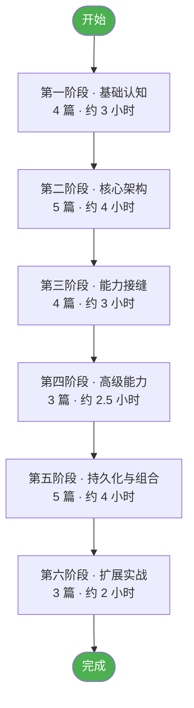

# 学习指南导读

本学习站是基于 [DeepSeek Harness](https://github.com/deepseek-ai/deepseek-harness) 源码整理的**渐进式二次开发学习文档**，共 24 篇正文 + 2 篇附录，按 6 个阶段组织。

## 文档结构约定

每篇文档遵循统一结构：

| 段落 | 作用 |
|---|---|
| **前置阅读** | 链接前序文档，明确依赖关系 |
| **学习目标** | 3-5 条可检验目标 |
| **概念讲解** | 配 Mermaid 架构图/时序图 |
| **代码示例** | 完整可运行，带中文注释，标注源码位置 `file_path:line` |
| **实战练习** | 2-3 个动手任务 |
| **关键源码定位** | 绝对路径 + 行号 |
| **下一步** | 链接后续文档 |

## 推荐学习路径

### 路径 A：系统学习（推荐）

按阶段顺序学习，每篇约 30-60 分钟：



### 路径 B：按目标速查

| 你的目标 | 直接阅读 |
|---|---|
| 理解项目整体 | [00 · 项目总览](/00-overview) → [03 · 启动与组合](/03-boot-and-composition) |
| 开发自定义工具 | [07 · 工具注册表](/07-tool-registry-and-pipeline) → [21 · 添加新包与工具](/21-adding-package-and-tool) |
| 接入新 LLM | [10 · LLM 与 DeepSeek 适配器](/10-llm-and-deepseek-adapter) → [22 · 添加 LLM 适配器与 Chat 节点](/22-adding-llm-and-node) |
| 扩展 Web UI | [19 · Web GUI 与 ACP](/19-web-gui-and-acp) → [22 · 添加 LLM 适配器与 Chat 节点](/22-adding-llm-and-node) |
| 定制会话持久化 | [04 · 事件溯源](/04-session-event-sourcing) → [16 · Session 持久化与投影](/16-session-persistence) |
| 理解 Agent 循环 | [05 · Agent 与循环](/05-agent-and-loop) → [08 · Code Mode](/08-code-mode) |
| 配置 Profile/Preset | [03 · 启动与组合](/03-boot-and-composition) → [17 · Preset 与 Profile 组合](/17-preset-and-profile) |

## 环境准备

学习前请准备：

```sh
# 1. 克隆主仓
git clone https://github.com/deepseek-ai/deepseek-harness.git
cd deepseek-harness

# 2. 安装依赖（需要 Node.js 22.19+ 或 24+，Corepack 启用 pnpm）
pnpm install

# 3. 验证环境
pnpm run typecheck

# 4. 可选：配置 DeepSeek API Key 用于真实 API 演示
echo "DEEPSEEK_API_KEY=sk-..." > .env
```

## 本地预览学习站

```sh
# 在 study-docs 目录下
pnpm install --ignore-workspace
pnpm dev
# 打开 http://127.0.0.1:5180
```

## 文档清单

### 第一阶段 · 基础认知

- [00 · 项目总览](/00-overview) — 定位、技术栈、目录结构、核心概念速览
- [01 · Cordis 框架基础](/01-cordis-foundation) — 插件/服务/事件/效果五大思想
- [02 · 仓库布局与构建体系](/02-project-layout) — pnpm workspace、Host/Client 双聚合
- [03 · 启动与组合体系](/03-boot-and-composition) — CLI 入口、profile/bundle/patch 分层

### 第二阶段 · 核心架构

- [04 · 会话事件溯源](/04-session-event-sourcing) — SessionEvent、声明合并、durable vs live
- [05 · Agent 与循环](/05-agent-and-loop) — Agent 接口、turn/step 流程、initiator scope
- [06 · 系统提示装配](/06-system-prompt-assembly) — sections/contexts/tools/variables
- [07 · 工具注册表与执行管道](/07-tool-registry-and-pipeline) — defineTool DSL、管道阶段
- [08 · Code Mode 机制](/08-code-mode) — run_code transport、SDK codegen

### 第三阶段 · 能力接缝

- [09 · 能力接缝模式](/09-capability-seams-pattern) — 三角色模型、解耦机制
- [10 · LLM 与 DeepSeek 适配器](/10-llm-and-deepseek-adapter) — LlmAdapter、StreamChunk 协议
- [11 · Shell 与 Subprocess 能力](/11-shell-and-subprocess) — shell/subprocess 能力缝
- [12 · FS 能力与策略](/12-fs-and-policy) — FS 能力、Sandbox/Observation 策略

### 第四阶段 · 高级能力

- [13 · Web 与 LSP 能力](/13-web-and-lsp) — web/lsp 能力缝
- [14 · Compaction 与 Subagent 能力](/14-compaction-and-subagent) — compaction/subagent 能力缝
- [15 · Workflow 与 Skill 能力](/15-workflow-and-skill) — workflow/skill 能力缝

### 第五阶段 · 持久化与组合

- [16 · Session 持久化与投影](/16-session-persistence) — JSONL/SQLite 后端、投影缓存
- [17 · Preset 与 Profile 组合](/17-preset-and-profile) — agent preset、standing mount
- [18 · Bundle 与 Patch 层](/18-bundle-and-patch) — bundle 框架、patch 组合顺序
- [19 · Web GUI 与 ACP](/19-web-gui-and-acp) — 四层架构、ACP automation-only
- [20 · SDK 与 JSON-RPC 协议](/20-sdk-and-json-rpc) — wire protocol、transport

### 第六阶段 · 扩展实战

- [21 · 添加新包与工具](/21-adding-package-and-tool) — 包骨架、defineTool、UI 呈现
- [22 · 添加 LLM 适配器与 Chat 节点](/22-adding-llm-and-node) — LlmAdapter、ConversationNodeDefinition
- [23 · 测试与门禁](/23-testing-and-gates) — 测试策略、snapshot、CI 门禁

### 附录

- [术语表](/appendix-glossary) — 核心术语中英对照与释义
- [源码速查](/appendix-source-map) — 关键源码文件路径索引

## 反馈与贡献

本学习站独立于主仓，如发现文档错误请直接修改 `study-docs/` 下的 Markdown 文件。主仓相关问题请到 [GitHub Discussions](https://github.com/deepseek-ai/deepseek-harness/discussions) 反馈。
